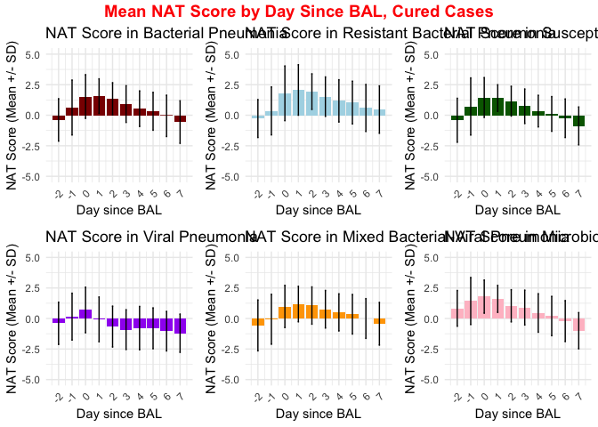

MZ_abx_deescalation_redacted_0819
================
2024-08-20

# Input dataset

Replace all indeterminate entries as culture negative

``` r
library(ggplot2)
library(ggpubr)
library(ggrepel)
library(ggsci)
library(ggsignif)
library(knitr)
library(rmarkdown)
library(dplyr)
```

    ## 
    ## Attaching package: 'dplyr'

    ## The following objects are masked from 'package:stats':
    ## 
    ##     filter, lag

    ## The following objects are masked from 'package:base':
    ## 
    ##     intersect, setdiff, setequal, union

``` r
library(tidyr)
library(rstatix)
```

    ## 
    ## Attaching package: 'rstatix'

    ## The following object is masked from 'package:stats':
    ## 
    ##     filter

``` r
library(table1)
```

    ## 
    ## Attaching package: 'table1'

    ## The following objects are masked from 'package:base':
    ## 
    ##     units, units<-

``` r
library(jsonlite)

bal.pna.nat = read.csv(
  "04_internal_new.csv"
  )

bal.pna.nat$Episode_etiology[bal.pna.nat$Episode_etiology == "Indeterminate"] = "Culture-negative"

bal.pna.nat = filter(bal.pna.nat, !patient %in% dropped.patient)
```

## Redefining PNA episode column (introducing pna.episode work)

Currently only Bacterial PNA and culture-negative PNA episodes have
adjudicated episode durations

For simplicity of coding, we manually define the PNA duration for all
pneumonia episodes: lump all the consecutive sick days into one PNA
episode until another PNA episode begins. This new PNA episode is coded
with a new column called pna.episode.work. The new dataframe with the
new column is renamed bal.pna.nat.newid

``` r
pna.episode.work = bal.pna.nat$Episode_id

for (n in 1:nrow(bal.pna.nat)) {
  if (bal.pna.nat$Episode_category[n] != "" & is.na(bal.pna.nat$Episode_duration[n])){
    while (bal.pna.nat$patient[n+1] == bal.pna.nat$patient[n] &
           bal.pna.nat$ICU_day[n+1] == bal.pna.nat$ICU_day[n] + 1 &
           bal.pna.nat$Episode_category[n+1] == "") {
      pna.episode.work[n+1] = pna.episode.work[n]
      n = n + 1
    }
  }
}

for (m in 3:nrow(bal.pna.nat)){
  if (pna.episode.work[m] == ""){#if this row is technically not a pneumonia day
    if (bal.pna.nat$patient[m] == bal.pna.nat$patient[m-1] &
        bal.pna.nat$ICU_day[m] == bal.pna.nat$ICU_day[m-1] + 1 &
        bal.pna.nat$ICU_stay[m] == bal.pna.nat$ICU_stay[m-1] &
        bal.pna.nat$Episode_category[m] == ""){
      pna.episode.work[m] = pna.episode.work[m-1]
    }
  }
}

#bal.pna.nat.newid is the dataframe also including the new column

bal.pna.nat.newid = cbind(bal.pna.nat, pna.episode.work)

total.patient.number = length(unique(bal.pna.nat.newid$patient))

print(paste("Total number of patients enrolled in study is", total.patient.number))
```

    ## [1] "Total number of patients enrolled in study is 686"

``` r
total.episode.number = length(unique(bal.pna.nat.newid$pna.episode.work)) - 1 #manually removing 1 entry representing empty string

print(paste("Total number of pneumonia episodes is", total.episode.number))
```

    ## [1] "Total number of pneumonia episodes is 927"

Similarly, for every consecutive sick day lumped into the same pneumonia
episode, we make sure each row is populated with the presumed pneumonia
category and etiology.

``` r
bal.pna.nat.newid$Episode_category_fill = bal.pna.nat.newid$Episode_category
for (i in 1:(nrow(bal.pna.nat.newid) - 1)){
  if (bal.pna.nat.newid$Episode_category_fill[i + 1] == "" & 
      bal.pna.nat.newid$pna.episode.work[i + 1] == bal.pna.nat.newid$pna.episode.work[i]){
    bal.pna.nat.newid$Episode_category_fill[i + 1] = bal.pna.nat.newid$Episode_category_fill[i]
  }
}

bal.pna.nat.newid$Episode_etiology_fill = bal.pna.nat.newid$Episode_etiology
for (i in 1:(nrow(bal.pna.nat.newid) - 1)){
  if (bal.pna.nat.newid$Episode_etiology_fill[i + 1] == "" & 
      bal.pna.nat.newid$pna.episode.work[i + 1] == bal.pna.nat.newid$pna.episode.work[i]){
    bal.pna.nat.newid$Episode_etiology_fill[i + 1] = bal.pna.nat.newid$Episode_etiology_fill[i]
  }
}
```

# Coding NAT scores from episode day -2 to 7 \##Finding day 0 and coding day -2 through the end of the consecutive sickness period

``` r
#Create a new bal_days column for this dataset, default value set to -3 since we need to work with -2 and -1
#Create a new column that is supposed to be days from the first BAL, with day of BAL being day 0
bal.pna.nat.newid$bal_days_new <- -3

#Find the first BAL of each episode (use the row with defined pneumonia category)
flag_bal = FALSE
for (i in 1:nrow(bal.pna.nat.newid)){
  if (i>=2){
    if (bal.pna.nat.newid$pna.episode.work[i] != bal.pna.nat.newid$pna.episode.work[i-1]){
      flag_bal = FALSE
    }
  }
  if (bal.pna.nat.newid$Episode_category[i] != ""){
    if (flag_bal == FALSE){
      bal.pna.nat.newid$bal_days_new[i] = 0
      flag_bal = TRUE
    }
  }
}
#Code subsequent days into consecutive integers until another pneumonia episode begins
for (i in 1:(nrow(bal.pna.nat.newid) - 1)){
  if (bal.pna.nat.newid$bal_days_new[i] == 0){
    while (i < (nrow(bal.pna.nat.newid) - 1) & 
           bal.pna.nat.newid$pna.episode.work[i+1] == bal.pna.nat.newid$pna.episode.work[i] &
           bal.pna.nat.newid$patient[i+1] == bal.pna.nat.newid$patient[i] &
           bal.pna.nat.newid$ICU_day[i+1] == bal.pna.nat.newid$ICU_day[i] + 1){
      bal.pna.nat.newid$bal_days_new[i + 1] = bal.pna.nat.newid$bal_days_new[i] + 1
      i = i + 1
    }
  }
}
#Fixing a corner case manually
bal.pna.nat.newid$bal_days_new[nrow(bal.pna.nat.newid)] = bal.pna.nat.newid$bal_days_new[nrow(bal.pna.nat.newid) - 1] + 1

#Now backtrack and fill in bal_day_new -1 and -2, if applicable
#Will only fill in bal_day_new -1 and -2 if those days do not interfere with the plotting of another pneumonia episode (e.g. either current bal_day_new variable is -3 or >7)
for (i in 3:nrow(bal.pna.nat.newid)){
  if (bal.pna.nat.newid$bal_days_new[i] == 0){
    if (bal.pna.nat.newid$patient[i-1] == bal.pna.nat.newid$patient[i] &
        bal.pna.nat.newid$ICU_day[i-1] == bal.pna.nat.newid$ICU_day[i] - 1 &
        (bal.pna.nat.newid$bal_days_new[i-1] == -3 | bal.pna.nat.newid$bal_days_new[i-1] > 7)){
      bal.pna.nat.newid$bal_days_new[i - 1] = -1
      bal.pna.nat.newid$pna.episode.work[i - 1] = bal.pna.nat.newid$pna.episode.work[i] 
      bal.pna.nat.newid$Episode_etiology_fill[i - 1] = bal.pna.nat.newid$Episode_etiology_fill[i]
      bal.pna.nat.newid$Episode_category_fill[i - 1] = bal.pna.nat.newid$Episode_category_fill[i]
    }
    if (bal.pna.nat.newid$patient[i-2] == bal.pna.nat.newid$patient[i] &
        bal.pna.nat.newid$ICU_day[i-2] == bal.pna.nat.newid$ICU_day[i] - 2 &
        (bal.pna.nat.newid$bal_days_new[i-2] == -3 | bal.pna.nat.newid$bal_days_new[i-2] > 7)){
      bal.pna.nat.newid$bal_days_new[i - 2] = -2
      bal.pna.nat.newid$pna.episode.work[i - 2] = bal.pna.nat.newid$pna.episode.work[i]
      bal.pna.nat.newid$Episode_etiology_fill[i - 2] = bal.pna.nat.newid$Episode_etiology_fill[i]
      bal.pna.nat.newid$Episode_category_fill[i - 2] = bal.pna.nat.newid$Episode_category_fill[i]
    }
  }
}

select = bal.pna.nat.newid %>% select(Episode_etiology, Episode_category, bal_days_new)

select0 = subset(select, select$Episode_category!= "")

select[1:100,] #print selected columns of data structure as an example
```

    ##     Episode_etiology Episode_category bal_days_new
    ## 1                                               -2
    ## 2                                               -1
    ## 3          Bacterial              HAP            0
    ## 4                                                1
    ## 5                                                2
    ## 6                                                3
    ## 7                                                4
    ## 8                                                5
    ## 9                                                6
    ## 10                                              -3
    ## 11                                              -3
    ## 12                                              -3
    ## 13                                              -1
    ## 14         Bacterial              HAP            0
    ## 15                                               1
    ## 16                                               2
    ## 17                                               3
    ## 18                                               4
    ## 19                                               5
    ## 20                                               6
    ## 21                                               7
    ## 22                                               8
    ## 23                                               9
    ## 24                                              10
    ## 25                                              11
    ## 26                                              12
    ## 27                                              13
    ## 28                                              14
    ## 29                                              15
    ## 30                                              -3
    ## 31                                              -1
    ## 32  Culture-negative              HAP            0
    ## 33                                               1
    ## 34                                               2
    ## 35                                               3
    ## 36                                               4
    ## 37                                               5
    ## 38                                               6
    ## 39                                               7
    ## 40                                               8
    ## 41                                               9
    ## 42                                              10
    ## 43                                              11
    ## 44                                              -3
    ## 45                                              -3
    ## 46                                              -2
    ## 47                                              -1
    ## 48         Bacterial              VAP            0
    ## 49                                               1
    ## 50                                               2
    ## 51                                               3
    ## 52                                               4
    ## 53                                               5
    ## 54                                               6
    ## 55                                               7
    ## 56                                               8
    ## 57                                               9
    ## 58                                              10
    ## 59                                              11
    ## 60                                              -3
    ## 61                                              -3
    ## 62                                              -1
    ## 63                                NPC            0
    ## 64                                               1
    ## 65                                              -3
    ## 66                                              -3
    ## 67                                              -3
    ## 68  Culture-negative              HAP            0
    ## 69                                               1
    ## 70                                               2
    ## 71                                               3
    ## 72                                               4
    ## 73                                               5
    ## 74                                               6
    ## 75                                               7
    ## 76                                               8
    ## 77                                               9
    ## 78                                              10
    ## 79                                              11
    ## 80                                              12
    ## 81                                              13
    ## 82                                              -1
    ## 83         Bacterial              HAP            0
    ## 84                                               1
    ## 85                                               2
    ## 86                                               3
    ## 87                                               4
    ## 88                                               5
    ## 89                                              -3
    ## 90                                              -2
    ## 91                                              -1
    ## 92  Culture-negative              HAP            0
    ## 93                                               1
    ## 94                                               2
    ## 95                                               3
    ## 96                                               4
    ## 97                                               5
    ## 98                                               6
    ## 99                                               7
    ## 100                                              8

Add column that indicates the PMN of episode-defining BAL sample (aka
when BAL day = 0)

``` r
bal.pna.nat.newid$bal_pmn = -1
for (i in 1:nrow(bal.pna.nat.newid)) {
  if (bal.pna.nat.newid$Episode_category[i] != ""){
    episode = bal.pna.nat.newid$Episode_id[i]
    j = i 
    while (j < nrow(bal.pna.nat.newid) & bal.pna.nat.newid$Episode_id[j] == episode){
      if (bal.pna.nat.newid$bal_days_new[j] == 0){
        bal.pna.nat.newid$bal_pmn[i] = bal.pna.nat.newid$BAL_pct_neutrophils[j]
      }
      j = j + 1
    }
  }
}
bal.pna.nat.newid$bal_pmn = as.numeric(bal.pna.nat.newid$bal_pmn)

select.example.pmn = select = bal.pna.nat.newid %>% select(Episode_etiology, Episode_category, bal_days_new, bal_pmn)
select.example.pmn[1:100,] #Print example of dataset with new column indicating PMN% on BAL sample. 
```

    ##     Episode_etiology Episode_category bal_days_new bal_pmn
    ## 1                                               -2      -1
    ## 2                                               -1      -1
    ## 3          Bacterial              HAP            0      80
    ## 4                                                1      -1
    ## 5                                                2      -1
    ## 6                                                3      -1
    ## 7                                                4      -1
    ## 8                                                5      -1
    ## 9                                                6      -1
    ## 10                                              -3      -1
    ## 11                                              -3      -1
    ## 12                                              -3      -1
    ## 13                                              -1      -1
    ## 14         Bacterial              HAP            0      99
    ## 15                                               1      -1
    ## 16                                               2      -1
    ## 17                                               3      -1
    ## 18                                               4      -1
    ## 19                                               5      -1
    ## 20                                               6      -1
    ## 21                                               7      -1
    ## 22                                               8      -1
    ## 23                                               9      -1
    ## 24                                              10      -1
    ## 25                                              11      -1
    ## 26                                              12      -1
    ## 27                                              13      -1
    ## 28                                              14      -1
    ## 29                                              15      -1
    ## 30                                              -3      -1
    ## 31                                              -1      -1
    ## 32  Culture-negative              HAP            0      12
    ## 33                                               1      -1
    ## 34                                               2      -1
    ## 35                                               3      -1
    ## 36                                               4      -1
    ## 37                                               5      -1
    ## 38                                               6      -1
    ## 39                                               7      -1
    ## 40                                               8      -1
    ## 41                                               9      -1
    ## 42                                              10      -1
    ## 43                                              11      -1
    ## 44                                              -3      -1
    ## 45                                              -3      -1
    ## 46                                              -2      -1
    ## 47                                              -1      -1
    ## 48         Bacterial              VAP            0      NA
    ## 49                                               1      -1
    ## 50                                               2      -1
    ## 51                                               3      -1
    ## 52                                               4      -1
    ## 53                                               5      -1
    ## 54                                               6      -1
    ## 55                                               7      -1
    ## 56                                               8      -1
    ## 57                                               9      -1
    ## 58                                              10      -1
    ## 59                                              11      -1
    ## 60                                              -3      -1
    ## 61                                              -3      -1
    ## 62                                              -1      -1
    ## 63                                NPC            0      56
    ## 64                                               1      -1
    ## 65                                              -3      -1
    ## 66                                              -3      -1
    ## 67                                              -3      -1
    ## 68  Culture-negative              HAP            0      77
    ## 69                                               1      -1
    ## 70                                               2      -1
    ## 71                                               3      -1
    ## 72                                               4      -1
    ## 73                                               5      -1
    ## 74                                               6      -1
    ## 75                                               7      -1
    ## 76                                               8      -1
    ## 77                                               9      -1
    ## 78                                              10      -1
    ## 79                                              11      -1
    ## 80                                              12      -1
    ## 81                                              13      -1
    ## 82                                              -1      -1
    ## 83         Bacterial              HAP            0      67
    ## 84                                               1      -1
    ## 85                                               2      -1
    ## 86                                               3      -1
    ## 87                                               4      -1
    ## 88                                               5      -1
    ## 89                                              -3      -1
    ## 90                                              -2      -1
    ## 91                                              -1      -1
    ## 92  Culture-negative              HAP            0      69
    ## 93                                               1      -1
    ## 94                                               2      -1
    ## 95                                               3      -1
    ## 96                                               4      -1
    ## 97                                               5      -1
    ## 98                                               6      -1
    ## 99                                               7      -1
    ## 100                                              8      -1

## Clinical Cure on day 7

For every consecutive sick day lumped into the same pneumonia episode,
fill each row with the same clinical impression on day 7

``` r
bal.pna.nat.newid$Episode_clinical_impression_d7_fill = bal.pna.nat.newid$Episode_clinical_impression_d7
i = 1
while (i <= nrow(bal.pna.nat.newid)){
  if (bal.pna.nat.newid$Episode_clinical_impression_d7[i] != ""){
    episode = bal.pna.nat.newid$pna.episode.work[i]
    bal.pna.nat.newid$Episode_clinical_impression_d7_fill[bal.pna.nat.newid$pna.episode.work == episode] = bal.pna.nat.newid$Episode_clinical_impression_d7[i] 
  }
  i = i + 1
}
```

## Extra-pulmonary infection status

For every consecutive sick day lumped into the same pneumonia episode,
create a new variable denoting extra-pulmonary infection status

``` r
bal.pna.nat.newid$extra = rep("", nrow(bal.pna.nat.newid))
i = 1
while (i <= nrow(bal.pna.nat.newid)){
  if (grepl("Extra", bal.pna.nat.newid$Episode_clinical_impression_d7_fill[i], fixed = TRUE)){
    bal.pna.nat.newid$extra[i] = "present"
  }
  i = i + 1
}

#Clarify the non_pneu_infection column for NPC entries
bal.pna.nat.newid$non_pneu_fill = bal.pna.nat.newid$non_pneu_infection
i = 1
while (i <= nrow(bal.pna.nat.newid)){
  if (bal.pna.nat.newid$non_pneu_infection[i] != ""){
    episode = bal.pna.nat.newid$pna.episode.work[i]
    bal.pna.nat.newid$non_pneu_fill[bal.pna.nat.newid$pna.episode.work == episode] = bal.pna.nat.newid$non_pneu_infection[i] 
  }
  i = i + 1
}

i = 1
while (i <= nrow(bal.pna.nat.newid)){
  if (bal.pna.nat.newid$non_pneu_fill[i] != "")
      {
    bal.pna.nat.newid$extra[i] = "present"
  }
  i = i + 1
}
```

Clarify the extra-pulmonary infection status of viral episodes (the raw
data was not adjudicated into the final column in the cleaned up
dataset)

``` r
#Import raw dataset with adjudicated extra-pulmonary infection status

extra.pulm.raw = read.csv("redcap_4339_pneumonia_episode_outcome.csv")

extra.pulm.row.viral.extra = subset(extra.pulm.raw, extra.pulm.raw$viral_ep_infection != "")

viral.episodes.extra = select(extra.pulm.row.viral.extra, pt_study_id, pneu_episode_out_num_2)

#Filter through patient ID
viral.episodes.filter.patient = subset(bal.pna.nat.newid, bal.pna.nat.newid$patient %in% viral.episodes.extra$pt_study_id)

#Clean bal_collection_date
viral.episodes.filter.patient$day_bucket_clean = as.Date(viral.episodes.filter.patient$day_bucket_starts, "%Y-%m-%d")

#Find patient ID + BAL date combination consistent with viral episodes with adjudicated extra-pulmonary infection

#Create new column that reflects the adjudicated viral episode extra-pulm infection status

viral.episodes.filter.patient$viral_extra_pulm = rep("", nrow(viral.episodes.filter.patient))

i = 1

while (i <= nrow(viral.episodes.extra)) {
  viral.episodes.filter.patient$viral_extra_pulm[
    viral.episodes.filter.patient$patient == viral.episodes.extra$pt_study_id[i] &
      viral.episodes.filter.patient$day_bucket_clean ==
      viral.episodes.extra$pneu_episode_out_num_2[i]
  ]  = "present"
  i = i + 1
}

#Store all the viral pneumonia episode ID with +extra-pulm infection in the following string, 22 total episodes
viral.episodes.with.extra.pulm.infection = viral.episodes.filter.patient$pna.episode.work[viral.episodes.filter.patient$viral_extra_pulm == "present"]
```

If the Episode_clinical_impression_d7_fill column is not coded, use the
global cure value instead. However, the global cure value does not
include information regarding presence or absence of extra-pulmonary
infection. So for these entries, code the extra-pulm infection column
with “indeterminate”.

``` r
i = 1
while (i <= nrow(bal.pna.nat.newid)){
  if (bal.pna.nat.newid$Episode_clinical_impression_d7_fill[i] == ""){
    if (bal.pna.nat.newid$Episode_is_cured[i] != ""){
          episode = bal.pna.nat.newid$pna.episode.work[i]
          bal.pna.nat.newid$Episode_clinical_impression_d7_fill[bal.pna.nat.newid$pna.episode.work == episode] = bal.pna.nat.newid$Episode_is_cured[i]
          bal.pna.nat.newid$extra[bal.pna.nat.newid$pna.episode.work == episode] = "indeterminate"
    }
  }
  i = i + 1
}

# print example columns of cure status and extra-pulm infection
select.example.cure_extra = bal.pna.nat.newid %>% select(Episode_etiology, Episode_category, bal_days_new, bal_pmn, extra, Episode_clinical_impression_d7_fill)

select.example.cure_extra[1:100,]
```

    ##     Episode_etiology Episode_category bal_days_new bal_pmn         extra
    ## 1                                               -2      -1              
    ## 2                                               -1      -1              
    ## 3          Bacterial              HAP            0      80              
    ## 4                                                1      -1              
    ## 5                                                2      -1              
    ## 6                                                3      -1              
    ## 7                                                4      -1              
    ## 8                                                5      -1              
    ## 9                                                6      -1              
    ## 10                                              -3      -1              
    ## 11                                              -3      -1              
    ## 12                                              -3      -1              
    ## 13                                              -1      -1       present
    ## 14         Bacterial              HAP            0      99       present
    ## 15                                               1      -1       present
    ## 16                                               2      -1       present
    ## 17                                               3      -1       present
    ## 18                                               4      -1       present
    ## 19                                               5      -1       present
    ## 20                                               6      -1       present
    ## 21                                               7      -1       present
    ## 22                                               8      -1       present
    ## 23                                               9      -1       present
    ## 24                                              10      -1       present
    ## 25                                              11      -1       present
    ## 26                                              12      -1       present
    ## 27                                              13      -1       present
    ## 28                                              14      -1       present
    ## 29                                              15      -1       present
    ## 30                                              -3      -1              
    ## 31                                              -1      -1              
    ## 32  Culture-negative              HAP            0      12              
    ## 33                                               1      -1              
    ## 34                                               2      -1              
    ## 35                                               3      -1              
    ## 36                                               4      -1              
    ## 37                                               5      -1              
    ## 38                                               6      -1              
    ## 39                                               7      -1              
    ## 40                                               8      -1              
    ## 41                                               9      -1              
    ## 42                                              10      -1              
    ## 43                                              11      -1              
    ## 44                                              -3      -1              
    ## 45                                              -3      -1              
    ## 46                                              -2      -1              
    ## 47                                              -1      -1              
    ## 48         Bacterial              VAP            0      NA              
    ## 49                                               1      -1              
    ## 50                                               2      -1              
    ## 51                                               3      -1              
    ## 52                                               4      -1              
    ## 53                                               5      -1              
    ## 54                                               6      -1              
    ## 55                                               7      -1              
    ## 56                                               8      -1              
    ## 57                                               9      -1              
    ## 58                                              10      -1              
    ## 59                                              11      -1              
    ## 60                                              -3      -1              
    ## 61                                              -3      -1              
    ## 62                                              -1      -1       present
    ## 63                                NPC            0      56       present
    ## 64                                               1      -1       present
    ## 65                                              -3      -1              
    ## 66                                              -3      -1              
    ## 67                                              -3      -1              
    ## 68  Culture-negative              HAP            0      77              
    ## 69                                               1      -1              
    ## 70                                               2      -1              
    ## 71                                               3      -1              
    ## 72                                               4      -1              
    ## 73                                               5      -1              
    ## 74                                               6      -1              
    ## 75                                               7      -1              
    ## 76                                               8      -1              
    ## 77                                               9      -1              
    ## 78                                              10      -1              
    ## 79                                              11      -1              
    ## 80                                              12      -1              
    ## 81                                              13      -1              
    ## 82                                              -1      -1 indeterminate
    ## 83         Bacterial              HAP            0      67 indeterminate
    ## 84                                               1      -1 indeterminate
    ## 85                                               2      -1 indeterminate
    ## 86                                               3      -1 indeterminate
    ## 87                                               4      -1 indeterminate
    ## 88                                               5      -1 indeterminate
    ## 89                                              -3      -1              
    ## 90                                              -2      -1              
    ## 91                                              -1      -1              
    ## 92  Culture-negative              HAP            0      69              
    ## 93                                               1      -1              
    ## 94                                               2      -1              
    ## 95                                               3      -1              
    ## 96                                               4      -1              
    ## 97                                               5      -1              
    ## 98                                               6      -1              
    ## 99                                               7      -1              
    ## 100                                              8      -1              
    ##     Episode_clinical_impression_d7_fill
    ## 1                                  Cure
    ## 2                                  Cure
    ## 3                                  Cure
    ## 4                                  Cure
    ## 5                                  Cure
    ## 6                                  Cure
    ## 7                                  Cure
    ## 8                                  Cure
    ## 9                                  Cure
    ## 10                                     
    ## 11                                     
    ## 12                                     
    ## 13                           Cure,Extra
    ## 14                           Cure,Extra
    ## 15                           Cure,Extra
    ## 16                           Cure,Extra
    ## 17                           Cure,Extra
    ## 18                           Cure,Extra
    ## 19                           Cure,Extra
    ## 20                           Cure,Extra
    ## 21                           Cure,Extra
    ## 22                           Cure,Extra
    ## 23                           Cure,Extra
    ## 24                           Cure,Extra
    ## 25                           Cure,Extra
    ## 26                           Cure,Extra
    ## 27                           Cure,Extra
    ## 28                           Cure,Extra
    ## 29                           Cure,Extra
    ## 30                                     
    ## 31                        Indeterminate
    ## 32                        Indeterminate
    ## 33                        Indeterminate
    ## 34                        Indeterminate
    ## 35                        Indeterminate
    ## 36                        Indeterminate
    ## 37                        Indeterminate
    ## 38                        Indeterminate
    ## 39                        Indeterminate
    ## 40                        Indeterminate
    ## 41                        Indeterminate
    ## 42                        Indeterminate
    ## 43                        Indeterminate
    ## 44                                     
    ## 45                                     
    ## 46                        Indeterminate
    ## 47                        Indeterminate
    ## 48                        Indeterminate
    ## 49                        Indeterminate
    ## 50                        Indeterminate
    ## 51                        Indeterminate
    ## 52                        Indeterminate
    ## 53                        Indeterminate
    ## 54                        Indeterminate
    ## 55                        Indeterminate
    ## 56                        Indeterminate
    ## 57                        Indeterminate
    ## 58                        Indeterminate
    ## 59                        Indeterminate
    ## 60                                     
    ## 61                                     
    ## 62                                     
    ## 63                                     
    ## 64                                     
    ## 65                                     
    ## 66                                     
    ## 67                                     
    ## 68                                 Cure
    ## 69                                 Cure
    ## 70                                 Cure
    ## 71                                 Cure
    ## 72                                 Cure
    ## 73                                 Cure
    ## 74                                 Cure
    ## 75                                 Cure
    ## 76                                 Cure
    ## 77                                 Cure
    ## 78                                 Cure
    ## 79                                 Cure
    ## 80                                 Cure
    ## 81                                 Cure
    ## 82                            Not cured
    ## 83                            Not cured
    ## 84                            Not cured
    ## 85                            Not cured
    ## 86                            Not cured
    ## 87                            Not cured
    ## 88                            Not cured
    ## 89                                     
    ## 90                        Indeterminate
    ## 91                        Indeterminate
    ## 92                        Indeterminate
    ## 93                        Indeterminate
    ## 94                        Indeterminate
    ## 95                        Indeterminate
    ## 96                        Indeterminate
    ## 97                        Indeterminate
    ## 98                        Indeterminate
    ## 99                        Indeterminate
    ## 100                       Indeterminate

## NAT score with full clinical dates (including when patient has left the ICU for floor)

``` r
bal.full.dates = read.csv("SCRIPT Daily NAT Score.csv")

#Create new column in new dataset for bal_days
bal.full.dates$bal_days_new = -3

#Create new column in new dataset for PNA episodes
bal.full.dates$pna.episode.work = ""
bal.full.dates$Episode_etiology_fill = ""
bal.full.dates$Episode_category_fill = ""
bal.full.dates$extra = ""
bal.full.dates$Episode_clinical_impression_d7_fill = ""
bal.full.dates$pathogen_resistance = rep(NA, nrow(bal.full.dates))

#Map bal_days_new = 0 columns between old and new dataset
#Can search by patient ID and date
#New dataset: patient study ID is equivalent to old dataset column patient

bal.pna.nat.newid.row0 = subset(bal.pna.nat.newid, bal.pna.nat.newid$bal_days_new == 0 & bal.pna.nat.newid$pna.episode.work != "")

bal.pna.nat.newid.row0$day_bucket_starts_new = as.Date(bal.pna.nat.newid.row0$day_bucket_starts, "%Y-%m-%d")
bal.full.dates$day_bucket_starts_new = as.Date(bal.full.dates$day_bucket_starts1, "%m/%d/%Y")

#Mapping BAL day 0 and PNA episode to new dataset
for (i in 1:nrow(bal.pna.nat.newid.row0)){
  date.bucket = bal.pna.nat.newid.row0$day_bucket_starts_new[i]
  patient = bal.pna.nat.newid.row0$patient[i]
  bal.full.dates$pna.episode.work[bal.full.dates$pt_study_id == patient & bal.full.dates$day_bucket_starts_new == date.bucket] = bal.pna.nat.newid.row0$pna.episode.work[i]
  bal.full.dates$Episode_category_fill[bal.full.dates$pt_study_id == patient & bal.full.dates$day_bucket_starts_new == date.bucket] = bal.pna.nat.newid.row0$Episode_category_fill[i]
  bal.full.dates$Episode_etiology_fill[bal.full.dates$pt_study_id == patient & bal.full.dates$day_bucket_starts_new == date.bucket] = bal.pna.nat.newid.row0$Episode_etiology_fill[i]
  bal.full.dates$extra[bal.full.dates$pt_study_id == patient & bal.full.dates$day_bucket_starts_new == date.bucket] = bal.pna.nat.newid.row0$extra[i]
  bal.full.dates$Episode_clinical_impression_d7_fill[bal.full.dates$pt_study_id == patient & bal.full.dates$day_bucket_starts_new == date.bucket] = bal.pna.nat.newid.row0$Episode_clinical_impression_d7_fill[i]
  bal.full.dates$pathogen_resistance[bal.full.dates$pt_study_id == patient & bal.full.dates$day_bucket_starts_new == date.bucket] = bal.pna.nat.newid.row0$Pathogen_resistance_detected[i]
  bal.full.dates$bal_days_new[bal.full.dates$pt_study_id == patient & bal.full.dates$day_bucket_starts_new == date.bucket] = 0
}

#Extend the rest of BAL days
#Code subsequent days into consecutive integers until another pneumonia episode begins
for (i in 1:(nrow(bal.full.dates) - 1)){
  if (bal.full.dates$bal_days_new[i] == 0){
    while (i < (nrow(bal.full.dates) - 1) & 
           bal.full.dates$bal_days_new[i + 1] != 0 &
           bal.full.dates$pt_study_id[i+1] == bal.full.dates$pt_study_id[i] &
           bal.full.dates$day_bucket_starts_new[i+1] == bal.full.dates$day_bucket_starts_new[i] + 1){
      bal.full.dates$bal_days_new[i + 1] = bal.full.dates$bal_days_new[i] + 1
      bal.full.dates$pna.episode.work[i + 1] = bal.full.dates$pna.episode.work[i]
      bal.full.dates$Episode_etiology_fill[i + 1] = bal.full.dates$Episode_etiology_fill[i]
      bal.full.dates$Episode_category_fill[i + 1] = bal.full.dates$Episode_category_fill[i]
      bal.full.dates$extra[i + 1] = bal.full.dates$extra[i]
      bal.full.dates$Episode_clinical_impression_d7_fill[i + 1] = bal.full.dates$Episode_clinical_impression_d7_fill[i]
      bal.full.dates$pathogen_resistance[i + 1] = bal.full.dates$pathogen_resistance[i]
      i = i + 1
    }
  }
}

#Backtrack day -1 and -2
for (i in 3:nrow(bal.full.dates)){
  if (bal.full.dates$bal_days_new[i] == 0){
    if (bal.full.dates$pt_study_id[i-1] == bal.full.dates$pt_study_id[i] &
        bal.full.dates$day_bucket_starts_new[i-1] == bal.full.dates$day_bucket_starts_new[i] - 1 &
        bal.full.dates$bal_days_new[i-1] == -3){
      bal.full.dates$bal_days_new[i - 1] = -1
      bal.full.dates$pna.episode.work[i - 1] = bal.full.dates$pna.episode.work[i] 
      bal.full.dates$Episode_etiology_fill[i - 1] = bal.full.dates$Episode_etiology_fill[i]
      bal.full.dates$Episode_category_fill[i - 1] = bal.full.dates$Episode_category_fill[i]
      bal.full.dates$extra[i - 1] = bal.full.dates$extra[i]
      bal.full.dates$Episode_clinical_impression_d7_fill[i - 1] = bal.full.dates$Episode_clinical_impression_d7_fill[i]
      bal.full.dates$pathogen_resistance[i - 1] = bal.full.dates$pathogen_resistance[i]
    }
    if (bal.full.dates$pt_study_id[i-2] == bal.full.dates$pt_study_id[i] &
        bal.full.dates$day_bucket_starts_new[i-2] == bal.full.dates$day_bucket_starts_new[i] - 2 &
        bal.full.dates$bal_days_new[i-2] == -3){
      bal.full.dates$bal_days_new[i - 2] = -2
      bal.full.dates$pna.episode.work[i - 2] = bal.full.dates$pna.episode.work[i] 
      bal.full.dates$Episode_etiology_fill[i - 2] = bal.full.dates$Episode_etiology_fill[i]
      bal.full.dates$Episode_category_fill[i - 2] = bal.full.dates$Episode_category_fill[i]
      bal.full.dates$extra[i - 2] = bal.full.dates$extra[i]
      bal.full.dates$Episode_clinical_impression_d7_fill[i - 2] = bal.full.dates$Episode_clinical_impression_d7_fill[i]
      bal.full.dates$pathogen_resistance[i - 2] = bal.full.dates$pathogen_resistance[i]
    }
  }
}

#Print sample columns of new datasets including post-ICU hospital days
bal.full.dates.example = bal.full.dates %>% select(Episode_etiology_fill, Episode_category_fill, Hosp_day, NAT_Score, bal_days_new)

bal.full.dates.example[1:100,]
```

    ##     Episode_etiology_fill Episode_category_fill Hosp_day NAT_Score bal_days_new
    ## 1               Bacterial                   VAP        1         2           -2
    ## 2               Bacterial                   VAP        2        11           -1
    ## 3               Bacterial                   VAP        3         7            0
    ## 4               Bacterial                   VAP        4         4            1
    ## 5               Bacterial                   VAP        5         4            2
    ## 6               Bacterial                   VAP        6         4            3
    ## 7               Bacterial                   VAP        7         4            4
    ## 8               Bacterial                   VAP        8         4            5
    ## 9               Bacterial                   VAP        9         4            6
    ## 10              Bacterial                   VAP       10         4            7
    ## 11              Bacterial                   VAP       11         4            8
    ## 12              Bacterial                   CAP        1         2           -1
    ## 13              Bacterial                   CAP        2         3            0
    ## 14              Bacterial                   CAP        3         2            1
    ## 15              Bacterial                   CAP        4         2            2
    ## 16              Bacterial                   CAP        5         2            3
    ## 17              Bacterial                   CAP        6         1            4
    ## 18              Bacterial                   CAP        7        -1            5
    ## 19              Bacterial                   CAP        8        -1            6
    ## 20                                                     1         2           -3
    ## 21                                                     2         2           -3
    ## 22                                                     3         3           -3
    ## 23                                                     4         2           -3
    ## 24                                                     5         2           -3
    ## 25                                                     6         1           -3
    ## 26                                                     7         1           -3
    ## 27                                                     8         1           -3
    ## 28                                                     9         3           -3
    ## 29                                                    10         2           -3
    ## 30                                                    11         2           -3
    ## 31                                                    12         2           -3
    ## 32                                                    13         2           -3
    ## 33                                                    14         2           -3
    ## 34                                                    15         2           -3
    ## 35                                                    16         2           -3
    ## 36                                                    17         3           -3
    ## 37                                                    18         3           -3
    ## 38                                                    19         3           -3
    ## 39                                                    20         2           -3
    ## 40                                                    21        -2           -3
    ## 41                                                    22         1           -3
    ## 42                                                    23         1           -3
    ## 43                                                    24         5           -3
    ## 44                                                     1        -2           -3
    ## 45                                                     2         1           -3
    ## 46                                                     3         0           -3
    ## 47                                                     4         1           -3
    ## 48                                                     5         0           -3
    ## 49                                                     6         1           -3
    ## 50                                                     7         0           -3
    ## 51                                                     8         0           -3
    ## 52        Bacterial/viral                   HAP        9         1           -2
    ## 53        Bacterial/viral                   HAP       10         0           -1
    ## 54        Bacterial/viral                   HAP       11        -1            0
    ## 55        Bacterial/viral                   HAP       12         1            1
    ## 56        Bacterial/viral                   HAP       13         2            2
    ## 57        Bacterial/viral                   HAP       14         2            3
    ## 58        Bacterial/viral                   HAP       15         1            4
    ## 59        Bacterial/viral                   HAP       16         1            5
    ## 60        Bacterial/viral                   HAP       17         3            6
    ## 61                                                     1         1           -3
    ## 62                                                     2         2           -3
    ## 63                                                     3         1           -3
    ## 64                                                     4         1           -3
    ## 65                                                     5         1           -3
    ## 66                                                     6        -2           -3
    ## 67                                                     7        -2           -3
    ## 68                                                     8        -2           -3
    ## 69                                                     9        -2           -3
    ## 70                                                    10         1           -3
    ## 71                                                    11         1           -3
    ## 72                                                    12         1           -3
    ## 73                                                    13         1           -3
    ## 74                                                    14         1           -3
    ## 75                                                    15         1           -3
    ## 76                                                    16         1           -3
    ## 77                                                    17         1           -3
    ## 78                  Viral                   VAP       18        -2           -2
    ## 79                  Viral                   VAP       19         2           -1
    ## 80                  Viral                   VAP       20         2            0
    ## 81                  Viral                   VAP       21         1            1
    ## 82                  Viral                   VAP       22         1            2
    ## 83                  Viral                   VAP       23         1            3
    ## 84                  Viral                   VAP       24        -2            4
    ## 85                  Viral                   VAP       25        -2            5
    ## 86                  Viral                   VAP       26        -2            6
    ## 87                  Viral                   VAP       27        -2            7
    ## 88                  Viral                   VAP       28        -2            8
    ## 89                  Viral                   VAP       29         1            9
    ## 90                                                     1         1           -3
    ## 91                                                     2         2           -3
    ## 92                                                     3         2           -3
    ## 93       Culture-negative                   HAP        4         1           -2
    ## 94       Culture-negative                   HAP        5         4           -1
    ## 95       Culture-negative                   HAP        6         3            0
    ## 96       Culture-negative                   HAP        7         3            1
    ## 97       Culture-negative                   HAP        8         3            2
    ## 98       Culture-negative                   HAP        9         3            3
    ## 99       Culture-negative                   HAP       10         3            4
    ## 100      Culture-negative                   HAP       11         3            5

\##Detect episodes that only have NAT score charted till \< 7 days
post-BAL

``` r
#Split bal.full.dates dataframe by PNA episode
bal.full.dates.clean = subset(bal.full.dates, bal.full.dates$pna.episode.work != "")
split_by_episode = split(bal.full.dates.clean, bal.full.dates.clean$pna.episode.work)

#Write function that detects max bal_days_new
max_value <- function(sub_df) {
  max(sub_df$bal_days_new, na.rm = TRUE) # na.rm = TRUE to handle any NA values
}

max_dates <- lapply(split_by_episode, max_value)

#Print the maximum dates in a readable format
bal_day_max_df = data.frame(
  Episode = names(max_dates),
  Max_bal = unlist(max_dates)
)

bal_day_max_df_less = subset(bal_day_max_df, bal_day_max_df$Max_bal < 7)

total.number.episodes.less.than.seven.days = nrow(bal_day_max_df_less)

print(paste("Out of 927 total episodes, only", total.number.episodes.less.than.seven.days, "episodes last less than 7 days after episode-defining BAL"))
```

    ## [1] "Out of 927 total episodes, only 189 episodes last less than 7 days after episode-defining BAL"

Now clean off the unassigned columns without proper episode ID

``` r
bal.nat.bal9d = subset(bal.full.dates.clean, bal.full.dates.clean$bal_days_new %in% -2:7)
```

Split this dataset based on PNA etiology

``` r
bal.nat.bacterial = subset(bal.nat.bal9d, bal.nat.bal9d$Episode_etiology_fill == "Bacterial")
bal.nat.viral = subset(bal.nat.bal9d, bal.nat.bal9d$Episode_etiology_fill == "Viral")
bal.nat.mixed = subset(bal.nat.bal9d, bal.nat.bal9d$Episode_etiology_fill == "Bacterial/viral")
bal.nat.cxneg = subset(bal.nat.bal9d, bal.nat.bal9d$Episode_etiology_fill == "Culture-negative")
bal.nat.nonpna = subset(bal.nat.bal9d, bal.nat.bal9d$Episode_category_fill == "NPC")
```

Split bacterial pneumonia episodes into resistant and nonresistant

``` r
row.res = which(bal.nat.bacterial$bal_days == 0 & bal.nat.bacterial$pathogen_resistance == "True")
row.sus = which(bal.nat.bacterial$bal_days == 0 & bal.nat.bacterial$pathogen_resistance == "False")

pna.episode.res = bal.nat.bacterial$pna.episode.work[row.res]
pna.episode.sus = bal.nat.bacterial$pna.episode.work[row.sus]

bal.nat.bacterial.res = subset(bal.nat.bacterial, bal.nat.bacterial$pna.episode.work %in% pna.episode.res)
bal.nat.bacterial.sus = subset(bal.nat.bacterial, bal.nat.bacterial$pna.episode.work %in% pna.episode.sus)

#Print example of resistant and susceptible PNA subsets
bal.nat.bacterial.res.example = bal.nat.bacterial.res %>% select(Episode_etiology_fill, Episode_category_fill, pathogen_resistance, bal_days_new, NAT_Score)

bal.nat.bacterial.sus.example = bal.nat.bacterial.sus %>% select(Episode_etiology_fill, Episode_category_fill, pathogen_resistance, bal_days_new, NAT_Score)

bal.nat.bacterial.res.example[1:100,]
```

    ##      Episode_etiology_fill Episode_category_fill pathogen_resistance
    ## 12               Bacterial                   CAP                True
    ## 13               Bacterial                   CAP                True
    ## 14               Bacterial                   CAP                True
    ## 15               Bacterial                   CAP                True
    ## 16               Bacterial                   CAP                True
    ## 17               Bacterial                   CAP                True
    ## 18               Bacterial                   CAP                True
    ## 19               Bacterial                   CAP                True
    ## 185              Bacterial                   VAP                True
    ## 186              Bacterial                   VAP                True
    ## 187              Bacterial                   VAP                True
    ## 188              Bacterial                   VAP                True
    ## 189              Bacterial                   VAP                True
    ## 190              Bacterial                   VAP                True
    ## 191              Bacterial                   VAP                True
    ## 260              Bacterial                   VAP                True
    ## 261              Bacterial                   VAP                True
    ## 262              Bacterial                   VAP                True
    ## 263              Bacterial                   VAP                True
    ## 264              Bacterial                   VAP                True
    ## 265              Bacterial                   VAP                True
    ## 266              Bacterial                   VAP                True
    ## 267              Bacterial                   VAP                True
    ## 268              Bacterial                   VAP                True
    ## 269              Bacterial                   VAP                True
    ## 448              Bacterial                   VAP                True
    ## 449              Bacterial                   VAP                True
    ## 450              Bacterial                   VAP                True
    ## 451              Bacterial                   VAP                True
    ## 452              Bacterial                   VAP                True
    ## 453              Bacterial                   VAP                True
    ## 454              Bacterial                   VAP                True
    ## 455              Bacterial                   VAP                True
    ## 456              Bacterial                   VAP                True
    ## 529              Bacterial                   HAP                True
    ## 530              Bacterial                   HAP                True
    ## 531              Bacterial                   HAP                True
    ## 532              Bacterial                   HAP                True
    ## 533              Bacterial                   HAP                True
    ## 534              Bacterial                   HAP                True
    ## 535              Bacterial                   HAP                True
    ## 536              Bacterial                   HAP                True
    ## 537              Bacterial                   HAP                True
    ## 538              Bacterial                   HAP                True
    ## 1170             Bacterial                   HAP                True
    ## 1171             Bacterial                   HAP                True
    ## 1172             Bacterial                   HAP                True
    ## 1173             Bacterial                   HAP                True
    ## 1174             Bacterial                   HAP                True
    ## 1175             Bacterial                   HAP                True
    ## 1176             Bacterial                   HAP                True
    ## 1177             Bacterial                   HAP                True
    ## 1178             Bacterial                   HAP                True
    ## 1179             Bacterial                   HAP                True
    ## 1324             Bacterial                   CAP                True
    ## 1325             Bacterial                   CAP                True
    ## 1326             Bacterial                   CAP                True
    ## 1327             Bacterial                   CAP                True
    ## 1328             Bacterial                   CAP                True
    ## 1329             Bacterial                   CAP                True
    ## 1330             Bacterial                   CAP                True
    ## 1331             Bacterial                   CAP                True
    ## 1332             Bacterial                   CAP                True
    ## 1587             Bacterial                   VAP                True
    ## 1588             Bacterial                   VAP                True
    ## 1589             Bacterial                   VAP                True
    ## 1590             Bacterial                   VAP                True
    ## 1591             Bacterial                   VAP                True
    ## 1592             Bacterial                   VAP                True
    ## 1593             Bacterial                   VAP                True
    ## 1594             Bacterial                   VAP                True
    ## 1835             Bacterial                   HAP                True
    ## 1836             Bacterial                   HAP                True
    ## 1837             Bacterial                   HAP                True
    ## 1838             Bacterial                   HAP                True
    ## 1839             Bacterial                   HAP                True
    ## 1840             Bacterial                   HAP                True
    ## 1841             Bacterial                   HAP                True
    ## 1842             Bacterial                   HAP                True
    ## 1843             Bacterial                   HAP                True
    ## 2050             Bacterial                   VAP                True
    ## 2051             Bacterial                   VAP                True
    ## 2052             Bacterial                   VAP                True
    ## 2053             Bacterial                   VAP                True
    ## 2054             Bacterial                   VAP                True
    ## 2055             Bacterial                   VAP                True
    ## 2056             Bacterial                   VAP                True
    ## 2057             Bacterial                   VAP                True
    ## 2532             Bacterial                   HAP                True
    ## 2533             Bacterial                   HAP                True
    ## 2534             Bacterial                   HAP                True
    ## 2535             Bacterial                   HAP                True
    ## 2536             Bacterial                   HAP                True
    ## 2537             Bacterial                   HAP                True
    ## 2538             Bacterial                   HAP                True
    ## 2539             Bacterial                   HAP                True
    ## 3526             Bacterial                   VAP                True
    ## 3527             Bacterial                   VAP                True
    ## 3528             Bacterial                   VAP                True
    ## 3529             Bacterial                   VAP                True
    ##      bal_days_new NAT_Score
    ## 12             -1         2
    ## 13              0         3
    ## 14              1         2
    ## 15              2         2
    ## 16              3         2
    ## 17              4         1
    ## 18              5        -1
    ## 19              6        -1
    ## 185             0         5
    ## 186             1         4
    ## 187             2         3
    ## 188             3         3
    ## 189             4         4
    ## 190             5         3
    ## 191             6        -2
    ## 260            -2         1
    ## 261            -1         1
    ## 262             0         1
    ## 263             1         2
    ## 264             2         4
    ## 265             3         3
    ## 266             4         3
    ## 267             5         2
    ## 268             6         2
    ## 269             7         2
    ## 448            -1        -2
    ## 449             0         5
    ## 450             1         2
    ## 451             2         4
    ## 452             3         3
    ## 453             4         3
    ## 454             5         4
    ## 455             6         3
    ## 456             7         4
    ## 529            -2        -1
    ## 530            -1         1
    ## 531             0         1
    ## 532             1         2
    ## 533             2         2
    ## 534             3        -1
    ## 535             4        -1
    ## 536             5        -1
    ## 537             6        -1
    ## 538             7        -1
    ## 1170           -2        -2
    ## 1171           -1        -2
    ## 1172            0         3
    ## 1173            1         3
    ## 1174            2         3
    ## 1175            3         2
    ## 1176            4         3
    ## 1177            5         2
    ## 1178            6         3
    ## 1179            7         2
    ## 1324           -1        -2
    ## 1325            0         2
    ## 1326            1         2
    ## 1327            2         2
    ## 1328            3         1
    ## 1329            4        -2
    ## 1330            5         1
    ## 1331            6        -2
    ## 1332            7         1
    ## 1587            0         2
    ## 1588            1         1
    ## 1589            2         1
    ## 1590            3         1
    ## 1591            4         2
    ## 1592            5         1
    ## 1593            6         1
    ## 1594            7         1
    ## 1835           -1        -2
    ## 1836            0         2
    ## 1837            1         2
    ## 1838            2         2
    ## 1839            3         2
    ## 1840            4         2
    ## 1841            5        -1
    ## 1842            6        -2
    ## 1843            7        -2
    ## 2050            0         2
    ## 2051            1         3
    ## 2052            2         3
    ## 2053            3         3
    ## 2054            4         3
    ## 2055            5         3
    ## 2056            6         3
    ## 2057            7         3
    ## 2532            0         4
    ## 2533            1         4
    ## 2534            2         5
    ## 2535            3         3
    ## 2536            4         4
    ## 2537            5         3
    ## 2538            6         4
    ## 2539            7         4
    ## 3526           -2         2
    ## 3527           -1         3
    ## 3528            0         2
    ## 3529            1         3

``` r
bal.nat.bacterial.sus.example[1:100,]
```

    ##      Episode_etiology_fill Episode_category_fill pathogen_resistance
    ## 1                Bacterial                   VAP               False
    ## 2                Bacterial                   VAP               False
    ## 3                Bacterial                   VAP               False
    ## 4                Bacterial                   VAP               False
    ## 5                Bacterial                   VAP               False
    ## 6                Bacterial                   VAP               False
    ## 7                Bacterial                   VAP               False
    ## 8                Bacterial                   VAP               False
    ## 9                Bacterial                   VAP               False
    ## 10               Bacterial                   VAP               False
    ## 206              Bacterial                   HAP               False
    ## 207              Bacterial                   HAP               False
    ## 208              Bacterial                   HAP               False
    ## 209              Bacterial                   HAP               False
    ## 210              Bacterial                   HAP               False
    ## 211              Bacterial                   HAP               False
    ## 212              Bacterial                   HAP               False
    ## 213              Bacterial                   HAP               False
    ## 214              Bacterial                   HAP               False
    ## 215              Bacterial                   HAP               False
    ## 318              Bacterial                   VAP               False
    ## 319              Bacterial                   VAP               False
    ## 320              Bacterial                   VAP               False
    ## 321              Bacterial                   VAP               False
    ## 322              Bacterial                   VAP               False
    ## 323              Bacterial                   VAP               False
    ## 324              Bacterial                   VAP               False
    ## 325              Bacterial                   VAP               False
    ## 326              Bacterial                   VAP               False
    ## 327              Bacterial                   VAP               False
    ## 634              Bacterial                   CAP               False
    ## 635              Bacterial                   CAP               False
    ## 636              Bacterial                   CAP               False
    ## 637              Bacterial                   CAP               False
    ## 638              Bacterial                   CAP               False
    ## 639              Bacterial                   CAP               False
    ## 640              Bacterial                   CAP               False
    ## 641              Bacterial                   CAP               False
    ## 647              Bacterial                   HAP               False
    ## 648              Bacterial                   HAP               False
    ## 649              Bacterial                   HAP               False
    ## 650              Bacterial                   HAP               False
    ## 651              Bacterial                   HAP               False
    ## 652              Bacterial                   HAP               False
    ## 653              Bacterial                   HAP               False
    ## 654              Bacterial                   HAP               False
    ## 655              Bacterial                   HAP               False
    ## 656              Bacterial                   HAP               False
    ## 681              Bacterial                   HAP               False
    ## 682              Bacterial                   HAP               False
    ## 683              Bacterial                   HAP               False
    ## 684              Bacterial                   HAP               False
    ## 685              Bacterial                   HAP               False
    ## 686              Bacterial                   HAP               False
    ## 687              Bacterial                   HAP               False
    ## 688              Bacterial                   HAP               False
    ## 689              Bacterial                   HAP               False
    ## 690              Bacterial                   HAP               False
    ## 800              Bacterial                   VAP               False
    ## 801              Bacterial                   VAP               False
    ## 802              Bacterial                   VAP               False
    ## 803              Bacterial                   VAP               False
    ## 804              Bacterial                   VAP               False
    ## 805              Bacterial                   VAP               False
    ## 806              Bacterial                   VAP               False
    ## 807              Bacterial                   VAP               False
    ## 808              Bacterial                   VAP               False
    ## 809              Bacterial                   VAP               False
    ## 946              Bacterial                   HAP               False
    ## 947              Bacterial                   HAP               False
    ## 948              Bacterial                   HAP               False
    ## 949              Bacterial                   HAP               False
    ## 950              Bacterial                   HAP               False
    ## 951              Bacterial                   HAP               False
    ## 952              Bacterial                   HAP               False
    ## 953              Bacterial                   HAP               False
    ## 954              Bacterial                   HAP               False
    ## 955              Bacterial                   HAP               False
    ## 1265             Bacterial                   CAP               False
    ## 1266             Bacterial                   CAP               False
    ## 1267             Bacterial                   CAP               False
    ## 1268             Bacterial                   CAP               False
    ## 1269             Bacterial                   CAP               False
    ## 1270             Bacterial                   CAP               False
    ## 1271             Bacterial                   CAP               False
    ## 1444             Bacterial                   HAP               False
    ## 1445             Bacterial                   HAP               False
    ## 1446             Bacterial                   HAP               False
    ## 1447             Bacterial                   HAP               False
    ## 1448             Bacterial                   HAP               False
    ## 1449             Bacterial                   HAP               False
    ## 1450             Bacterial                   HAP               False
    ## 1451             Bacterial                   HAP               False
    ## 1605             Bacterial                   VAP               False
    ## 1606             Bacterial                   VAP               False
    ## 1607             Bacterial                   VAP               False
    ## 1608             Bacterial                   VAP               False
    ## 1609             Bacterial                   VAP               False
    ## 1610             Bacterial                   VAP               False
    ## 1611             Bacterial                   VAP               False
    ##      bal_days_new NAT_Score
    ## 1              -2         2
    ## 2              -1        11
    ## 3               0         7
    ## 4               1         4
    ## 5               2         4
    ## 6               3         4
    ## 7               4         4
    ## 8               5         4
    ## 9               6         4
    ## 10              7         4
    ## 206            -2         3
    ## 207            -1         2
    ## 208             0         2
    ## 209             1         2
    ## 210             2         2
    ## 211             3         3
    ## 212             4         2
    ## 213             5         2
    ## 214             6         2
    ## 215             7         2
    ## 318            -2        -1
    ## 319            -1        -1
    ## 320             0        -1
    ## 321             1         1
    ## 322             2         1
    ## 323             3         3
    ## 324             4         2
    ## 325             5         3
    ## 326             6         4
    ## 327             7         2
    ## 634             0        -1
    ## 635             1        -1
    ## 636             2         0
    ## 637             3        -1
    ## 638             4        -1
    ## 639             5        -1
    ## 640             6         1
    ## 641             7         1
    ## 647            -2        -2
    ## 648            -1        -2
    ## 649             0         2
    ## 650             1         1
    ## 651             2         1
    ## 652             3        -1
    ## 653             4        -1
    ## 654             5        -1
    ## 655             6        -1
    ## 656             7        -2
    ## 681            -2        -2
    ## 682            -1         4
    ## 683             0         2
    ## 684             1         4
    ## 685             2         5
    ## 686             3         3
    ## 687             4         0
    ## 688             5         1
    ## 689             6         0
    ## 690             7         0
    ## 800            -2         1
    ## 801            -1         1
    ## 802             0         1
    ## 803             1         3
    ## 804             2         1
    ## 805             3        -1
    ## 806             4        -1
    ## 807             5        -1
    ## 808             6        -1
    ## 809             7        -1
    ## 946            -2        -2
    ## 947            -1        -2
    ## 948             0         1
    ## 949             1         1
    ## 950             2         1
    ## 951             3        -1
    ## 952             4        -1
    ## 953             5        -1
    ## 954             6         1
    ## 955             7         1
    ## 1265           -1        -2
    ## 1266            0         4
    ## 1267            1         3
    ## 1268            2         2
    ## 1269            3        -1
    ## 1270            4        -1
    ## 1271            5        -1
    ## 1444            0         2
    ## 1445            1         2
    ## 1446            2         1
    ## 1447            3        -1
    ## 1448            4        -1
    ## 1449            5        -1
    ## 1450            6        -1
    ## 1451            7        -2
    ## 1605            0        -2
    ## 1606            1         2
    ## 1607            2         2
    ## 1608            3         2
    ## 1609            4         2
    ## 1610            5         2
    ## 1611            6         2

# Plot NAT Score by day

## Calculate the median/IQR for nat_score for bal_days -2 through 7 of each pneumonia episode

``` r
median_nat_bacterial <- bal.nat.bacterial %>%
  group_by(bal_days_new) %>%
  summarize(med = median(NAT_Score, na.rm = TRUE), 
            Q1 = quantile(NAT_Score, 0.25, na.rm = TRUE),
            Q3 = quantile(NAT_Score, 0.75, na.rm = TRUE))
median_nat_bacterial = as.data.frame(median_nat_bacterial)

median_nat_bacterial_res <- bal.nat.bacterial.res %>%
  group_by(bal_days_new) %>%
  summarize(med = median(NAT_Score, na.rm = TRUE), 
            Q1 = quantile(NAT_Score, 0.25, na.rm = TRUE),
            Q3 = quantile(NAT_Score, 0.75, na.rm = TRUE))
median_nat_bacterial_res = as.data.frame(median_nat_bacterial_res)

median_nat_bacterial_sus <- bal.nat.bacterial.sus %>%
  group_by(bal_days_new) %>%
  summarize(med = median(NAT_Score, na.rm = TRUE), 
            Q1 = quantile(NAT_Score, 0.25, na.rm = TRUE),
            Q3 = quantile(NAT_Score, 0.75, na.rm = TRUE))
median_nat_bacterial_sus = as.data.frame(median_nat_bacterial_sus)

median_nat_viral <- bal.nat.viral %>%
  group_by(bal_days_new) %>%
  summarize(med = median(NAT_Score, na.rm = TRUE), 
            Q1 = quantile(NAT_Score, 0.25, na.rm = TRUE),
            Q3 = quantile(NAT_Score, 0.75, na.rm = TRUE))
median_nat_viral = as.data.frame(median_nat_viral)

median_nat_mixed <- bal.nat.mixed %>%
  group_by(bal_days_new) %>%
  summarize(med = median(NAT_Score, na.rm = TRUE), 
            Q1 = quantile(NAT_Score, 0.25, na.rm = TRUE),
            Q3 = quantile(NAT_Score, 0.75, na.rm = TRUE))
median_nat_mixed = as.data.frame(median_nat_mixed)

median_nat_cxneg <- bal.nat.cxneg %>%
  group_by(bal_days_new) %>%
  summarize(med = median(NAT_Score, na.rm = TRUE), 
            Q1 = quantile(NAT_Score, 0.25, na.rm = TRUE),
            Q3 = quantile(NAT_Score, 0.75, na.rm = TRUE))
median_nat_cxneg = as.data.frame(median_nat_cxneg)

median_nat_nonpna <- bal.nat.nonpna %>%
  group_by(bal_days_new) %>%
  summarize(med = median(NAT_Score, na.rm = TRUE), 
            Q1 = quantile(NAT_Score, 0.25, na.rm = TRUE),
            Q3 = quantile(NAT_Score, 0.75, na.rm = TRUE))
median_nat_nonpna = as.data.frame(median_nat_nonpna)

median_nat_bacterial
```

    ##    bal_days_new med Q1 Q3
    ## 1            -2  -1 -2  2
    ## 2            -1   1 -2  2
    ## 3             0   2  1  3
    ## 4             1   2  1  3
    ## 5             2   2  1  2
    ## 6             3   1  1  2
    ## 7             4   1 -1  2
    ## 8             5   1 -1  2
    ## 9             6   1 -1  2
    ## 10            7   1 -2  2

``` r
median_nat_bacterial_res
```

    ##    bal_days_new  med    Q1 Q3
    ## 1            -2 -0.5 -1.25  2
    ## 2            -1  1.0 -2.00  2
    ## 3             0  2.0  2.00  3
    ## 4             1  2.0  2.00  3
    ## 5             2  2.0  2.00  3
    ## 6             3  2.0  2.00  3
    ## 7             4  2.0  1.00  3
    ## 8             5  2.0  1.00  3
    ## 9             6  2.0 -1.00  2
    ## 10            7  2.0 -1.25  2

``` r
median_nat_bacterial_sus
```

    ##    bal_days_new med Q1 Q3
    ## 1            -2  -1 -2  2
    ## 2            -1   1 -2  2
    ## 3             0   2  1  2
    ## 4             1   1  1  2
    ## 5             2   1  1  2
    ## 6             3   1  0  2
    ## 7             4   1 -1  2
    ## 8             5   1 -1  1
    ## 9             6   1 -1  1
    ## 10            7   1 -2  2

``` r
median_nat_viral
```

    ##    bal_days_new med Q1 Q3
    ## 1            -2   0 -2  1
    ## 2            -1   0 -2  2
    ## 3             0   1  0  2
    ## 4             1   1 -1  2
    ## 5             2   0 -2  1
    ## 6             3  -1 -2  1
    ## 7             4  -1 -2  1
    ## 8             5  -1 -2  1
    ## 9             6  -2 -2  1
    ## 10            7  -2 -2  1

``` r
median_nat_mixed
```

    ##    bal_days_new med Q1   Q3
    ## 1            -2  -2 -2 0.00
    ## 2            -1  -1 -2 0.75
    ## 3             0   1  0 2.00
    ## 4             1   1  1 2.00
    ## 5             2   1  1 2.00
    ## 6             3   1  0 2.00
    ## 7             4   1 -1 2.00
    ## 8             5   1 -1 2.00
    ## 9             6   1 -1 2.00
    ## 10            7   1 -2 2.00

``` r
median_nat_cxneg
```

    ##    bal_days_new med Q1 Q3
    ## 1            -2   1  0  2
    ## 2            -1   2  1  3
    ## 3             0   2  1  3
    ## 4             1   2  1  2
    ## 5             2   1  1  2
    ## 6             3   1  0  2
    ## 7             4   1 -1  2
    ## 8             5   1 -1  2
    ## 9             6   1 -2  2
    ## 10            7  -1 -2  2

``` r
median_nat_nonpna
```

    ##    bal_days_new med    Q1 Q3
    ## 1            -2   1 -1.00  2
    ## 2            -1   1 -1.00  2
    ## 3             0   2  1.00  2
    ## 4             1   1 -1.00  2
    ## 5             2   1 -1.75  2
    ## 6             3  -1 -2.00  1
    ## 7             4  -1 -2.00  1
    ## 8             5  -1 -2.00  1
    ## 9             6  -1 -2.00  1
    ## 10            7  -1 -2.00  2

## Creating Bar Plots of NAT Score by Day (Median/IQR)

``` r
plot.bac.med = ggplot(median_nat_bacterial, aes(x = bal_days_new, y = med)) +
  geom_bar(stat = "identity", position = "dodge", fill = "darkred") +
  geom_errorbar(aes(ymin = Q1, ymax = Q3), width = 0.1) +
  ylim(-5, +5) +
  scale_x_continuous(breaks = seq(-2, 7, 1)) +
  labs(x = "Day since BAL", y = "NAT Score (Median and IQR)",
       title = "Bacterial Pneumonia") +
  theme_minimal() +
  theme(axis.text.x = element_text(angle = 45, hjust = 1))

plot.bac.res.med = ggplot(median_nat_bacterial_res, aes(x = bal_days_new, y = med)) +
  geom_bar(stat = "identity", position = "dodge", fill = "lightblue") +
  geom_errorbar(aes(ymin = Q1, ymax = Q3), width = 0.1) +
  ylim(-5, +5) +
  scale_x_continuous(breaks = seq(-2, 7, 1)) +
  labs(x = "Day since BAL", y = "NAT Score (Median and IQR)",
       title = "Resistant Bacterial Pneumonia") +
  theme_minimal() +
  theme(axis.text.x = element_text(angle = 45, hjust = 1))

plot.bac.sus.med = ggplot(median_nat_bacterial_sus, aes(x = bal_days_new, y = med)) +
  geom_bar(stat = "identity", position = "dodge", fill = "darkgreen") +
  geom_errorbar(aes(ymin = Q1, ymax = Q3), width = 0.1) +
  ylim(-5, +5) +
  scale_x_continuous(breaks = seq(-2, 7, 1)) +
  labs(x = "Day since BAL", y = "NAT Score (Median and IQR)",
       title = "Susceptible Bacterial Pneumonia") +
  theme_minimal() +
  theme(axis.text.x = element_text(angle = 45, hjust = 1))

plot.viral.med = ggplot(median_nat_viral, aes(x = bal_days_new, y = med)) +
  geom_bar(stat = "identity", position = "dodge", fill = "purple") +
  geom_errorbar(aes(ymin = Q1, ymax = Q3), width = 0.1) +
  ylim(-5, +5) +
  scale_x_continuous(breaks = seq(-2, 7, 1)) +
  labs(x = "Day since BAL", y = "NAT Score (Median and IQR)",
       title = "Viral Pneumonia") +
  theme_minimal() +
  theme(axis.text.x = element_text(angle = 45, hjust = 1))

plot.mixed.med = ggplot(median_nat_mixed, aes(x = bal_days_new, y = med)) +
  geom_bar(stat = "identity", position = "dodge", fill = "orange") +
  geom_errorbar(aes(ymin = Q1, ymax = Q3), width = 0.1) +
  ylim(-5, +5) +
  scale_x_continuous(breaks = seq(-2, 7, 1)) +
  labs(x = "Day since BAL", y = "NAT Score (Median and IQR)",
       title = "Mixed Bacterial-Viral Pneumonia") +
  theme_minimal() +
  theme(axis.text.x = element_text(angle = 45, hjust = 1))

plot.cxneg.med = ggplot(median_nat_cxneg, aes(x = bal_days_new, y = med)) +
  geom_bar(stat = "identity", position = "dodge", fill = "pink") +
  geom_errorbar(aes(ymin = Q1, ymax = Q3), width = 0.1) +
  ylim(-5, +5) +
  scale_x_continuous(breaks = seq(-2, 7, 1)) +
  labs(x = "Day since BAL", y = "NAT Score (Median and IQR)",
       title = "Microbiology-negative Pneumonia") +
  theme_minimal() +
  theme(axis.text.x = element_text(angle = 45, hjust = 1))

plot.nonpna.med = ggplot(median_nat_nonpna, aes(x = bal_days_new, y = med)) +
  geom_bar(stat = "identity", position = "dodge", fill = "lightgreen") +
  geom_errorbar(aes(ymin = Q1, ymax = Q3), width = 0.1) +
  ylim(-5, +5) +
  scale_x_continuous(breaks = seq(-2, 7, 1)) +
  labs(x = "Day since BAL", y = "NAT Score (Median and IQR)",
       title = "Non-Pneumonia Control") +
  theme_minimal() +
  theme(axis.text.x = element_text(angle = 45, hjust = 1))


plot.grid.med = ggarrange(
  plot.bac.med, plot.bac.res.med, plot.bac.sus.med, plot.viral.med, plot.mixed.med, plot.cxneg.med, plot.nonpna.med,
  nrow = 3,
  ncol = 3
) 

plot.grid.med = annotate_figure(plot.grid.med, 
                                       top = text_grob("Median NAT Score by Day Since BAL", 
                                      color = "red", face = "bold", size = 14)
                                      )

plot.grid.med
```

<!-- -->

## Calculate the mean/SD for nat_score for bal_days -2 through 7 of each pneumonia episode

``` r
mean_nat_bacterial <- bal.nat.bacterial %>%
  group_by(bal_days_new) %>%
  summarize(mean = mean(NAT_Score, na.rm = TRUE), 
            sd = sd(NAT_Score, na.rm = TRUE))
mean_nat_bacterial = as.data.frame(mean_nat_bacterial)

mean_nat_bacterial_res <- bal.nat.bacterial.res %>%
  group_by(bal_days_new) %>%
  summarize(mean = mean(NAT_Score, na.rm = TRUE), 
            sd = sd(NAT_Score, na.rm = TRUE))
mean_nat_bacterial_res = as.data.frame(mean_nat_bacterial_res)

mean_nat_bacterial_sus <- bal.nat.bacterial.sus %>%
  group_by(bal_days_new) %>%
  summarize(mean = mean(NAT_Score, na.rm = TRUE), 
            sd = sd(NAT_Score, na.rm = TRUE))
mean_nat_bacterial_sus = as.data.frame(mean_nat_bacterial_sus)

mean_nat_viral <- bal.nat.viral %>%
  group_by(bal_days_new) %>%
  summarize(mean = mean(NAT_Score, na.rm = TRUE), 
            sd = sd(NAT_Score, na.rm = TRUE))
mean_nat_viral = as.data.frame(mean_nat_viral)

mean_nat_mixed <- bal.nat.mixed %>%
  group_by(bal_days_new) %>%
  summarize(mean = mean(NAT_Score, na.rm = TRUE), 
            sd = sd(NAT_Score, na.rm = TRUE))
mean_nat_mixed = as.data.frame(mean_nat_mixed)

mean_nat_cxneg <- bal.nat.cxneg %>%
  group_by(bal_days_new) %>%
  summarize(mean = mean(NAT_Score, na.rm = TRUE), 
            sd = sd(NAT_Score, na.rm = TRUE))
mean_nat_cxneg = as.data.frame(mean_nat_cxneg)

mean_nat_nonpna <- bal.nat.nonpna %>%
  group_by(bal_days_new) %>%
  summarize(mean = mean(NAT_Score, na.rm = TRUE), 
            sd = sd(NAT_Score, na.rm = TRUE))
mean_nat_nonpna = as.data.frame(mean_nat_nonpna)

mean_nat_bacterial
```

    ##    bal_days_new       mean       sd
    ## 1            -2 -0.1680672 1.851794
    ## 2            -1  0.6459627 2.071865
    ## 3             0  1.6597222 1.922408
    ## 4             1  1.6724739 1.565820
    ## 5             2  1.5647482 1.587786
    ## 6             3  1.2058824 1.694870
    ## 7             4  0.9402985 1.762111
    ## 8             5  0.7098039 1.741713
    ## 9             6  0.5120000 1.874007
    ## 10            7  0.3719008 2.101698

``` r
mean_nat_bacterial_res
```

    ##    bal_days_new       mean       sd
    ## 1            -2 0.03571429 1.666270
    ## 2            -1 0.50000000 2.023510
    ## 3             0 2.30882353 1.994450
    ## 4             1 2.53731343 1.617409
    ## 5             2 2.27692308 1.430774
    ## 6             3 1.73437500 1.701933
    ## 7             4 1.66129032 1.941299
    ## 8             5 1.58928571 1.846636
    ## 9             6 1.12962963 2.119508
    ## 10            7 0.98076923 2.404982

``` r
mean_nat_bacterial_sus
```

    ##    bal_days_new       mean       sd
    ## 1            -2 -0.2307692 1.909490
    ## 2            -1  0.6910569 2.092649
    ## 3             0  1.4611872 1.862744
    ## 4             1  1.4109589 1.457366
    ## 5             2  1.3490566 1.576140
    ## 6             3  1.0531401 1.661114
    ## 7             4  0.7317073 1.648297
    ## 8             5  0.4696970 1.632970
    ## 9             6  0.3487179 1.770735
    ## 10            7  0.2169312 1.984120

``` r
mean_nat_viral
```

    ##    bal_days_new        mean       sd
    ## 1            -2 -0.22222222 1.752613
    ## 2            -1  0.21379310 1.772421
    ## 3             0  0.78977273 1.771556
    ## 4             1  0.41477273 1.704987
    ## 5             2 -0.02285714 1.841271
    ## 6             3 -0.20000000 1.854468
    ## 7             4 -0.31055901 1.956515
    ## 8             5 -0.41558442 1.835387
    ## 9             6 -0.66206897 1.736938
    ## 10            7 -0.77165354 1.795890

``` r
mean_nat_mixed
```

    ##    bal_days_new       mean       sd
    ## 1            -2 -0.8507463 1.626054
    ## 2            -1 -0.5000000 1.867823
    ## 3             0  1.0757576 1.824625
    ## 4             1  1.3838384 1.519465
    ## 5             2  1.3005181 1.684132
    ## 6             3  1.0885417 1.564486
    ## 7             4  0.8888889 1.635163
    ## 8             5  0.9946237 1.753752
    ## 9             6  0.7722222 1.749160
    ## 10            7  0.3707865 1.993674

``` r
mean_nat_cxneg
```

    ##    bal_days_new       mean       sd
    ## 1            -2  0.9880952 1.609415
    ## 2            -1  1.4173913 1.937545
    ## 3             0  1.8609272 1.549364
    ## 4             1  1.7114094 1.269684
    ## 5             2  1.2413793 1.621367
    ## 6             3  0.9718310 1.610883
    ## 7             4  0.7352941 1.713715
    ## 8             5  0.6562500 1.657422
    ## 9             6  0.2276423 1.845744
    ## 10            7 -0.2000000 1.942882

``` r
mean_nat_nonpna
```

    ##    bal_days_new       mean       sd
    ## 1            -2  0.4696970 1.866463
    ## 2            -1  0.9583333 1.823338
    ## 3             0  1.3859649 1.772498
    ## 4             1  0.9823009 1.674292
    ## 5             2  0.3679245 1.878832
    ## 6             3 -0.1188119 1.856271
    ## 7             4 -0.2842105 1.998207
    ## 8             5 -0.2068966 1.899436
    ## 9             6 -0.4936709 1.803653
    ## 10            7 -0.3043478 1.927390

## Creating Bar Plots of NAT Score by Day (Mean/SD)

``` r
plot.bac.mean = ggplot(mean_nat_bacterial, aes(x = bal_days_new, y = mean)) +
  geom_bar(stat = "identity", position = "dodge", fill = "darkred") +
  geom_errorbar(aes(ymin = mean - sd, ymax = mean + sd), width = 0.1) +
  ylim(-5, +5) +
  scale_x_continuous(breaks = seq(-2, 7, 1)) +
  labs(x = "Day since BAL", y = "NAT Score (Mean +/- SD)",
       title = "NAT Score in Bacterial Pneumonia") +
  theme_minimal() +
  theme(axis.text.x = element_text(angle = 45, hjust = 1))

plot.bac.res.mean = ggplot(mean_nat_bacterial_res, aes(x = bal_days_new, y = mean)) +
  geom_bar(stat = "identity", position = "dodge", fill = "lightblue") +
  geom_errorbar(aes(ymin = mean - sd, ymax = mean + sd), width = 0.1) +
  ylim(-5, +5) +
  scale_x_continuous(breaks = seq(-2, 7, 1)) +
  labs(x = "Day since BAL", y = "NAT Score (Mean +/- SD)",
       title = "NAT Score in Resistant Bacterial Pneumonia") +
  theme_minimal() +
  theme(axis.text.x = element_text(angle = 45, hjust = 1))

plot.bac.sus.mean = ggplot(mean_nat_bacterial_sus, aes(x = bal_days_new, y = mean)) +
  geom_bar(stat = "identity", position = "dodge", fill = "darkgreen") +
  geom_errorbar(aes(ymin = mean - sd, ymax = mean + sd), width = 0.1) +
  ylim(-5, +5) +
  scale_x_continuous(breaks = seq(-2, 7, 1)) +
  labs(x = "Day since BAL", y = "NAT Score (Mean +/- SD)",
       title = "NAT Score in Susceptible Bacterial Pneumonia") +
  theme_minimal() +
  theme(axis.text.x = element_text(angle = 45, hjust = 1))

plot.viral.mean = ggplot(mean_nat_viral, aes(x = bal_days_new, y = mean)) +
  geom_bar(stat = "identity", position = "dodge", fill = "purple") +
  geom_errorbar(aes(ymin = mean - sd, ymax = mean + sd), width = 0.1) +
  ylim(-5, +5) +
  scale_x_continuous(breaks = seq(-2, 7, 1)) +
  labs(x = "Day since BAL", y = "NAT Score (Mean +/- SD)",
       title = "NAT Score in Viral Pneumonia") +
  theme_minimal() +
  theme(axis.text.x = element_text(angle = 45, hjust = 1))

plot.mixed.mean = ggplot(mean_nat_mixed, aes(x = bal_days_new, y = mean)) +
  geom_bar(stat = "identity", position = "dodge", fill = "orange") +
  geom_errorbar(aes(ymin = mean - sd, ymax = mean + sd), width = 0.1) +
  ylim(-5, +5) +
  scale_x_continuous(breaks = seq(-2, 7, 1)) +
  labs(x = "Day since BAL", y = "NAT Score (Mean +/- SD)",
       title = "NAT Score in Mixed Bacterial-Viral Pneumonia") +
  theme_minimal() +
  theme(axis.text.x = element_text(angle = 45, hjust = 1))

plot.cxneg.mean = ggplot(mean_nat_cxneg, aes(x = bal_days_new, y = mean)) +
  geom_bar(stat = "identity", position = "dodge", fill = "pink") +
  geom_errorbar(aes(ymin = mean - sd, ymax = mean + sd), width = 0.1) +
  ylim(-5, +5) +
  scale_x_continuous(breaks = seq(-2, 7, 1)) +
  labs(x = "Day since BAL", y = "NAT Score (Mean +/- SD)",
       title = "NAT Score in Microbiology-negative Pneumonia") +
  theme_minimal() +
  theme(axis.text.x = element_text(angle = 45, hjust = 1))

plot.nonpna.mean = ggplot(mean_nat_nonpna, aes(x = bal_days_new, y = mean)) +
  geom_bar(stat = "identity", position = "dodge", fill = "lightgreen") +
  geom_errorbar(aes(ymin = mean - sd, ymax = mean + sd), width = 0.1) +
  ylim(-5, +5) +
  scale_x_continuous(breaks = seq(-2, 7, 1)) +
  labs(x = "Day since BAL", y = "NAT Score (Mean +/- SD)",
       title = "NAT Score in Non-Pneumonia Control") +
  theme_minimal() +
  theme(axis.text.x = element_text(angle = 45, hjust = 1))

plot.grid.mean = ggarrange(
  plot.bac.mean, plot.bac.res.mean, plot.bac.sus.mean, plot.viral.mean, plot.mixed.mean, plot.cxneg.mean, plot.nonpna.mean,
  nrow = 3,
  ncol = 3
) 
plot.grid.mean = annotate_figure(plot.grid.mean, 
                                       top = text_grob("Mean NAT Score by Day Since BAL", 
                                                       color = "red", face = "bold", size = 14)
)

plot.grid.mean
```

<!-- -->

# Plot cumulative/average NAT score

## Write a function to add a column representing cumularive/average NAT scores

``` r
nat_sum = function(df) {
  df$NAT_Sum = 0
  df$NAT_Sum[1] = df$NAT_Score[1]
  for (i in 2:nrow(df)) {
    if (df$pna.episode.work[i] == df$pna.episode.work[i - 1]){
      df$NAT_Sum[i] = df$NAT_Score[i] + df$NAT_Sum[i - 1]
    }
    else {
      df$NAT_Sum[i] = df$NAT_Score[i]
    }
  }
  df
}
```

## Create the column, summing from day 1 to day 7

``` r
bal.nat.bacterial.sum7 = nat_sum(subset(bal.nat.bacterial, bal.nat.bacterial$bal_days_new %in% 1:7))
bal.nat.bacterial.res.sum7 = nat_sum(subset(bal.nat.bacterial.res, bal.nat.bacterial.res$bal_days_new %in% 1:7))
bal.nat.bacterial.sus.sum7 = nat_sum(subset(bal.nat.bacterial.sus, bal.nat.bacterial.sus$bal_days_new %in% 1:7))
bal.nat.viral.sum7 = nat_sum(subset(bal.nat.viral, bal.nat.viral$bal_days_new %in% 1:7))
bal.nat.mixed.sum7 = nat_sum(subset(bal.nat.mixed, bal.nat.mixed$bal_days_new %in% 1:7))
bal.nat.cxneg.sum7 = nat_sum(subset(bal.nat.cxneg, bal.nat.cxneg$bal_days_new %in% 1:7))
bal.nat.nonpna.sum7 = nat_sum(subset(bal.nat.nonpna, bal.nat.nonpna$bal_days_new %in% 1:7))

#Print examples for NAT_Sum column
bal.nat.bacterial.sum7.example = bal.nat.bacterial.sum7 %>% select(Episode_etiology_fill, Episode_category_fill, bal_days_new, NAT_Score, NAT_Sum)
bal.nat.bacterial.res.sum7.example = bal.nat.bacterial.res.sum7 %>% select(Episode_etiology_fill, Episode_category_fill, bal_days_new, NAT_Score, NAT_Sum)
bal.nat.bacterial.sus.sum7.example = bal.nat.bacterial.sus.sum7 %>% select(Episode_etiology_fill, Episode_category_fill, bal_days_new, NAT_Score, NAT_Sum)
bal.nat.viral.sum7.example = bal.nat.viral.sum7 %>% select(Episode_etiology_fill, Episode_category_fill, bal_days_new, NAT_Score, NAT_Sum)
bal.nat.mixed.sum7.example = bal.nat.mixed.sum7 %>% select(Episode_etiology_fill, Episode_category_fill, bal_days_new, NAT_Score, NAT_Sum)
bal.nat.cxneg.sum7.example = bal.nat.cxneg.sum7 %>% select(Episode_etiology_fill, Episode_category_fill, bal_days_new, NAT_Score, NAT_Sum)
bal.nat.nonpna.sum7.example = bal.nat.nonpna.sum7 %>% select(Episode_etiology_fill, Episode_category_fill, bal_days_new, NAT_Score, NAT_Sum)

bal.nat.bacterial.sum7.example[1:100,]
```

    ##      Episode_etiology_fill Episode_category_fill bal_days_new NAT_Score NAT_Sum
    ## 4                Bacterial                   VAP            1         4       4
    ## 5                Bacterial                   VAP            2         4       8
    ## 6                Bacterial                   VAP            3         4      12
    ## 7                Bacterial                   VAP            4         4      16
    ## 8                Bacterial                   VAP            5         4      20
    ## 9                Bacterial                   VAP            6         4      24
    ## 10               Bacterial                   VAP            7         4      28
    ## 14               Bacterial                   CAP            1         2       2
    ## 15               Bacterial                   CAP            2         2       4
    ## 16               Bacterial                   CAP            3         2       6
    ## 17               Bacterial                   CAP            4         1       7
    ## 18               Bacterial                   CAP            5        -1       6
    ## 19               Bacterial                   CAP            6        -1       5
    ## 186              Bacterial                   VAP            1         4       4
    ## 187              Bacterial                   VAP            2         3       7
    ## 188              Bacterial                   VAP            3         3      10
    ## 189              Bacterial                   VAP            4         4      14
    ## 190              Bacterial                   VAP            5         3      17
    ## 191              Bacterial                   VAP            6        -2      15
    ## 209              Bacterial                   HAP            1         2       2
    ## 210              Bacterial                   HAP            2         2       4
    ## 211              Bacterial                   HAP            3         3       7
    ## 212              Bacterial                   HAP            4         2       9
    ## 213              Bacterial                   HAP            5         2      11
    ## 214              Bacterial                   HAP            6         2      13
    ## 215              Bacterial                   HAP            7         2      15
    ## 263              Bacterial                   VAP            1         2       2
    ## 264              Bacterial                   VAP            2         4       6
    ## 265              Bacterial                   VAP            3         3       9
    ## 266              Bacterial                   VAP            4         3      12
    ## 267              Bacterial                   VAP            5         2      14
    ## 268              Bacterial                   VAP            6         2      16
    ## 269              Bacterial                   VAP            7         2      18
    ## 321              Bacterial                   VAP            1         1       1
    ## 322              Bacterial                   VAP            2         1       2
    ## 323              Bacterial                   VAP            3         3       5
    ## 324              Bacterial                   VAP            4         2       7
    ## 325              Bacterial                   VAP            5         3      10
    ## 326              Bacterial                   VAP            6         4      14
    ## 327              Bacterial                   VAP            7         2      16
    ## 450              Bacterial                   VAP            1         2       2
    ## 451              Bacterial                   VAP            2         4       6
    ## 452              Bacterial                   VAP            3         3       9
    ## 453              Bacterial                   VAP            4         3      12
    ## 454              Bacterial                   VAP            5         4      16
    ## 455              Bacterial                   VAP            6         3      19
    ## 456              Bacterial                   VAP            7         4      23
    ## 532              Bacterial                   HAP            1         2       2
    ## 533              Bacterial                   HAP            2         2       4
    ## 534              Bacterial                   HAP            3        -1       3
    ## 535              Bacterial                   HAP            4        -1       2
    ## 536              Bacterial                   HAP            5        -1       1
    ## 537              Bacterial                   HAP            6        -1       0
    ## 538              Bacterial                   HAP            7        -1      -1
    ## 635              Bacterial                   CAP            1        -1      -1
    ## 636              Bacterial                   CAP            2         0      -1
    ## 637              Bacterial                   CAP            3        -1      -2
    ## 638              Bacterial                   CAP            4        -1      -3
    ## 639              Bacterial                   CAP            5        -1      -4
    ## 640              Bacterial                   CAP            6         1      -3
    ## 641              Bacterial                   CAP            7         1      -2
    ## 650              Bacterial                   HAP            1         1       1
    ## 651              Bacterial                   HAP            2         1       2
    ## 652              Bacterial                   HAP            3        -1       1
    ## 653              Bacterial                   HAP            4        -1       0
    ## 654              Bacterial                   HAP            5        -1      -1
    ## 655              Bacterial                   HAP            6        -1      -2
    ## 656              Bacterial                   HAP            7        -2      -4
    ## 684              Bacterial                   HAP            1         4       4
    ## 685              Bacterial                   HAP            2         5       9
    ## 686              Bacterial                   HAP            3         3      12
    ## 687              Bacterial                   HAP            4         0      12
    ## 688              Bacterial                   HAP            5         1      13
    ## 689              Bacterial                   HAP            6         0      13
    ## 690              Bacterial                   HAP            7         0      13
    ## 803              Bacterial                   VAP            1         3       3
    ## 804              Bacterial                   VAP            2         1       4
    ## 805              Bacterial                   VAP            3        -1       3
    ## 806              Bacterial                   VAP            4        -1       2
    ## 807              Bacterial                   VAP            5        -1       1
    ## 808              Bacterial                   VAP            6        -1       0
    ## 809              Bacterial                   VAP            7        -1      -1
    ## 949              Bacterial                   HAP            1         1       1
    ## 950              Bacterial                   HAP            2         1       2
    ## 951              Bacterial                   HAP            3        -1       1
    ## 952              Bacterial                   HAP            4        -1       0
    ## 953              Bacterial                   HAP            5        -1      -1
    ## 954              Bacterial                   HAP            6         1       0
    ## 955              Bacterial                   HAP            7         1       1
    ## 1173             Bacterial                   HAP            1         3       3
    ## 1174             Bacterial                   HAP            2         3       6
    ## 1175             Bacterial                   HAP            3         2       8
    ## 1176             Bacterial                   HAP            4         3      11
    ## 1177             Bacterial                   HAP            5         2      13
    ## 1178             Bacterial                   HAP            6         3      16
    ## 1179             Bacterial                   HAP            7         2      18
    ## 1267             Bacterial                   CAP            1         3       3
    ## 1268             Bacterial                   CAP            2         2       5
    ## 1269             Bacterial                   CAP            3        -1       4
    ## 1270             Bacterial                   CAP            4        -1       3

``` r
bal.nat.bacterial.res.sum7.example[1:100,]
```

    ##      Episode_etiology_fill Episode_category_fill bal_days_new NAT_Score NAT_Sum
    ## 14               Bacterial                   CAP            1         2       2
    ## 15               Bacterial                   CAP            2         2       4
    ## 16               Bacterial                   CAP            3         2       6
    ## 17               Bacterial                   CAP            4         1       7
    ## 18               Bacterial                   CAP            5        -1       6
    ## 19               Bacterial                   CAP            6        -1       5
    ## 186              Bacterial                   VAP            1         4       4
    ## 187              Bacterial                   VAP            2         3       7
    ## 188              Bacterial                   VAP            3         3      10
    ## 189              Bacterial                   VAP            4         4      14
    ## 190              Bacterial                   VAP            5         3      17
    ## 191              Bacterial                   VAP            6        -2      15
    ## 263              Bacterial                   VAP            1         2       2
    ## 264              Bacterial                   VAP            2         4       6
    ## 265              Bacterial                   VAP            3         3       9
    ## 266              Bacterial                   VAP            4         3      12
    ## 267              Bacterial                   VAP            5         2      14
    ## 268              Bacterial                   VAP            6         2      16
    ## 269              Bacterial                   VAP            7         2      18
    ## 450              Bacterial                   VAP            1         2       2
    ## 451              Bacterial                   VAP            2         4       6
    ## 452              Bacterial                   VAP            3         3       9
    ## 453              Bacterial                   VAP            4         3      12
    ## 454              Bacterial                   VAP            5         4      16
    ## 455              Bacterial                   VAP            6         3      19
    ## 456              Bacterial                   VAP            7         4      23
    ## 532              Bacterial                   HAP            1         2       2
    ## 533              Bacterial                   HAP            2         2       4
    ## 534              Bacterial                   HAP            3        -1       3
    ## 535              Bacterial                   HAP            4        -1       2
    ## 536              Bacterial                   HAP            5        -1       1
    ## 537              Bacterial                   HAP            6        -1       0
    ## 538              Bacterial                   HAP            7        -1      -1
    ## 1173             Bacterial                   HAP            1         3       3
    ## 1174             Bacterial                   HAP            2         3       6
    ## 1175             Bacterial                   HAP            3         2       8
    ## 1176             Bacterial                   HAP            4         3      11
    ## 1177             Bacterial                   HAP            5         2      13
    ## 1178             Bacterial                   HAP            6         3      16
    ## 1179             Bacterial                   HAP            7         2      18
    ## 1326             Bacterial                   CAP            1         2       2
    ## 1327             Bacterial                   CAP            2         2       4
    ## 1328             Bacterial                   CAP            3         1       5
    ## 1329             Bacterial                   CAP            4        -2       3
    ## 1330             Bacterial                   CAP            5         1       4
    ## 1331             Bacterial                   CAP            6        -2       2
    ## 1332             Bacterial                   CAP            7         1       3
    ## 1588             Bacterial                   VAP            1         1       1
    ## 1589             Bacterial                   VAP            2         1       2
    ## 1590             Bacterial                   VAP            3         1       3
    ## 1591             Bacterial                   VAP            4         2       5
    ## 1592             Bacterial                   VAP            5         1       6
    ## 1593             Bacterial                   VAP            6         1       7
    ## 1594             Bacterial                   VAP            7         1       8
    ## 1837             Bacterial                   HAP            1         2       2
    ## 1838             Bacterial                   HAP            2         2       4
    ## 1839             Bacterial                   HAP            3         2       6
    ## 1840             Bacterial                   HAP            4         2       8
    ## 1841             Bacterial                   HAP            5        -1       7
    ## 1842             Bacterial                   HAP            6        -2       5
    ## 1843             Bacterial                   HAP            7        -2       3
    ## 2051             Bacterial                   VAP            1         3       3
    ## 2052             Bacterial                   VAP            2         3       6
    ## 2053             Bacterial                   VAP            3         3       9
    ## 2054             Bacterial                   VAP            4         3      12
    ## 2055             Bacterial                   VAP            5         3      15
    ## 2056             Bacterial                   VAP            6         3      18
    ## 2057             Bacterial                   VAP            7         3      21
    ## 2533             Bacterial                   HAP            1         4       4
    ## 2534             Bacterial                   HAP            2         5       9
    ## 2535             Bacterial                   HAP            3         3      12
    ## 2536             Bacterial                   HAP            4         4      16
    ## 2537             Bacterial                   HAP            5         3      19
    ## 2538             Bacterial                   HAP            6         4      23
    ## 2539             Bacterial                   HAP            7         4      27
    ## 3529             Bacterial                   VAP            1         3       3
    ## 3530             Bacterial                   VAP            2         2       5
    ## 3531             Bacterial                   VAP            3         3       8
    ## 3532             Bacterial                   VAP            4         6      14
    ## 3976             Bacterial                   VAP            1         2       2
    ## 3977             Bacterial                   VAP            2         4       6
    ## 3978             Bacterial                   VAP            3         3       9
    ## 3979             Bacterial                   VAP            4         5      14
    ## 3980             Bacterial                   VAP            5         5      19
    ## 3981             Bacterial                   VAP            6         6      25
    ## 3982             Bacterial                   VAP            7         6      31
    ## 4256             Bacterial                   VAP            1         2       2
    ## 4786             Bacterial                   CAP            1         3       3
    ## 4787             Bacterial                   CAP            2         3       6
    ## 4788             Bacterial                   CAP            3        -1       5
    ## 4789             Bacterial                   CAP            4        -1       4
    ## 4790             Bacterial                   CAP            5         3       7
    ## 4791             Bacterial                   CAP            6         3      10
    ## 4792             Bacterial                   CAP            7         3      13
    ## 5072             Bacterial                   CAP            1         3       3
    ## 5073             Bacterial                   CAP            2         3       6
    ## 5074             Bacterial                   CAP            3         2       8
    ## 5075             Bacterial                   CAP            4         1       9
    ## 5076             Bacterial                   CAP            5        -1       8
    ## 6435             Bacterial                   HAP            1         3       3

``` r
bal.nat.bacterial.sus.sum7.example[1:100,]
```

    ##      Episode_etiology_fill Episode_category_fill bal_days_new NAT_Score NAT_Sum
    ## 4                Bacterial                   VAP            1         4       4
    ## 5                Bacterial                   VAP            2         4       8
    ## 6                Bacterial                   VAP            3         4      12
    ## 7                Bacterial                   VAP            4         4      16
    ## 8                Bacterial                   VAP            5         4      20
    ## 9                Bacterial                   VAP            6         4      24
    ## 10               Bacterial                   VAP            7         4      28
    ## 209              Bacterial                   HAP            1         2       2
    ## 210              Bacterial                   HAP            2         2       4
    ## 211              Bacterial                   HAP            3         3       7
    ## 212              Bacterial                   HAP            4         2       9
    ## 213              Bacterial                   HAP            5         2      11
    ## 214              Bacterial                   HAP            6         2      13
    ## 215              Bacterial                   HAP            7         2      15
    ## 321              Bacterial                   VAP            1         1       1
    ## 322              Bacterial                   VAP            2         1       2
    ## 323              Bacterial                   VAP            3         3       5
    ## 324              Bacterial                   VAP            4         2       7
    ## 325              Bacterial                   VAP            5         3      10
    ## 326              Bacterial                   VAP            6         4      14
    ## 327              Bacterial                   VAP            7         2      16
    ## 635              Bacterial                   CAP            1        -1      -1
    ## 636              Bacterial                   CAP            2         0      -1
    ## 637              Bacterial                   CAP            3        -1      -2
    ## 638              Bacterial                   CAP            4        -1      -3
    ## 639              Bacterial                   CAP            5        -1      -4
    ## 640              Bacterial                   CAP            6         1      -3
    ## 641              Bacterial                   CAP            7         1      -2
    ## 650              Bacterial                   HAP            1         1       1
    ## 651              Bacterial                   HAP            2         1       2
    ## 652              Bacterial                   HAP            3        -1       1
    ## 653              Bacterial                   HAP            4        -1       0
    ## 654              Bacterial                   HAP            5        -1      -1
    ## 655              Bacterial                   HAP            6        -1      -2
    ## 656              Bacterial                   HAP            7        -2      -4
    ## 684              Bacterial                   HAP            1         4       4
    ## 685              Bacterial                   HAP            2         5       9
    ## 686              Bacterial                   HAP            3         3      12
    ## 687              Bacterial                   HAP            4         0      12
    ## 688              Bacterial                   HAP            5         1      13
    ## 689              Bacterial                   HAP            6         0      13
    ## 690              Bacterial                   HAP            7         0      13
    ## 803              Bacterial                   VAP            1         3       3
    ## 804              Bacterial                   VAP            2         1       4
    ## 805              Bacterial                   VAP            3        -1       3
    ## 806              Bacterial                   VAP            4        -1       2
    ## 807              Bacterial                   VAP            5        -1       1
    ## 808              Bacterial                   VAP            6        -1       0
    ## 809              Bacterial                   VAP            7        -1      -1
    ## 949              Bacterial                   HAP            1         1       1
    ## 950              Bacterial                   HAP            2         1       2
    ## 951              Bacterial                   HAP            3        -1       1
    ## 952              Bacterial                   HAP            4        -1       0
    ## 953              Bacterial                   HAP            5        -1      -1
    ## 954              Bacterial                   HAP            6         1       0
    ## 955              Bacterial                   HAP            7         1       1
    ## 1267             Bacterial                   CAP            1         3       3
    ## 1268             Bacterial                   CAP            2         2       5
    ## 1269             Bacterial                   CAP            3        -1       4
    ## 1270             Bacterial                   CAP            4        -1       3
    ## 1271             Bacterial                   CAP            5        -1       2
    ## 1445             Bacterial                   HAP            1         2       2
    ## 1446             Bacterial                   HAP            2         1       3
    ## 1447             Bacterial                   HAP            3        -1       2
    ## 1448             Bacterial                   HAP            4        -1       1
    ## 1449             Bacterial                   HAP            5        -1       0
    ## 1450             Bacterial                   HAP            6        -1      -1
    ## 1451             Bacterial                   HAP            7        -2      -3
    ## 1606             Bacterial                   VAP            1         2       2
    ## 1607             Bacterial                   VAP            2         2       4
    ## 1608             Bacterial                   VAP            3         2       6
    ## 1609             Bacterial                   VAP            4         2       8
    ## 1610             Bacterial                   VAP            5         2      10
    ## 1611             Bacterial                   VAP            6         2      12
    ## 1612             Bacterial                   VAP            7         2      14
    ## 1625             Bacterial                   VAP            1         4       4
    ## 1626             Bacterial                   VAP            2         3       7
    ## 1627             Bacterial                   VAP            3         4      11
    ## 1628             Bacterial                   VAP            4         4      15
    ## 1629             Bacterial                   VAP            5         1      16
    ## 1630             Bacterial                   VAP            6         1      17
    ## 1631             Bacterial                   VAP            7         2      19
    ## 1826             Bacterial                   VAP            1         2       2
    ## 1827             Bacterial                   VAP            2         1       3
    ## 1828             Bacterial                   VAP            3         1       4
    ## 1829             Bacterial                   VAP            4         1       5
    ## 1830             Bacterial                   VAP            5         1       6
    ## 1831             Bacterial                   VAP            6        -2       4
    ## 1832             Bacterial                   VAP            7         3       7
    ## 1951             Bacterial                   HAP            1         2       2
    ## 1952             Bacterial                   HAP            2         2       4
    ## 1953             Bacterial                   HAP            3        -1       3
    ## 1954             Bacterial                   HAP            4        -1       2
    ## 1955             Bacterial                   HAP            5        -1       1
    ## 1956             Bacterial                   HAP            6        -1       0
    ## 1957             Bacterial                   HAP            7        -2      -2
    ## 2016             Bacterial                   HAP            1         1       1
    ## 2017             Bacterial                   HAP            2         2       3
    ## 2018             Bacterial                   HAP            3         1       4
    ## 2019             Bacterial                   HAP            4         1       5

``` r
bal.nat.viral.sum7.example[1:100,]
```

    ##      Episode_etiology_fill Episode_category_fill bal_days_new NAT_Score NAT_Sum
    ## 81                   Viral                   VAP            1         1       1
    ## 82                   Viral                   VAP            2         1       2
    ## 83                   Viral                   VAP            3         1       3
    ## 84                   Viral                   VAP            4        -2       1
    ## 85                   Viral                   VAP            5        -2      -1
    ## 86                   Viral                   VAP            6        -2      -3
    ## 87                   Viral                   VAP            7        -2      -5
    ## 711                  Viral                   CAP            1         3       3
    ## 712                  Viral                   CAP            2        -2       1
    ## 713                  Viral                   CAP            3        -2      -1
    ## 714                  Viral                   CAP            4        -2      -3
    ## 715                  Viral                   CAP            5        -2      -5
    ## 716                  Viral                   CAP            6        -2      -7
    ## 717                  Viral                   CAP            7        -2      -9
    ## 760                  Viral                   CAP            1        -2      -2
    ## 761                  Viral                   CAP            2        -2      -4
    ## 762                  Viral                   CAP            3        -2      -6
    ## 763                  Viral                   CAP            4        -2      -8
    ## 764                  Viral                   CAP            5        -2     -10
    ## 765                  Viral                   CAP            6        -2     -12
    ## 766                  Viral                   CAP            7        -2     -14
    ## 1054                 Viral                   HAP            1        -2      -2
    ## 1055                 Viral                   HAP            2        -2      -4
    ## 1056                 Viral                   HAP            3        -2      -6
    ## 1057                 Viral                   HAP            4        -2      -8
    ## 1058                 Viral                   HAP            5        -2     -10
    ## 1059                 Viral                   HAP            6        -2     -12
    ## 1060                 Viral                   HAP            7        -2     -14
    ## 1068                 Viral                   HAP            1         2       2
    ## 1069                 Viral                   HAP            2         4       6
    ## 1070                 Viral                   HAP            3         2       8
    ## 1071                 Viral                   HAP            4         2      10
    ## 1072                 Viral                   HAP            5        -1       9
    ## 1073                 Viral                   HAP            6        -1       8
    ## 1139                 Viral                   VAP            1         3       3
    ## 1140                 Viral                   VAP            2         2       5
    ## 1141                 Viral                   VAP            3         2       7
    ## 1142                 Viral                   VAP            4         3      10
    ## 1143                 Viral                   VAP            5         2      12
    ## 1144                 Viral                   VAP            6         3      15
    ## 1145                 Viral                   VAP            7         2      17
    ## 1348                 Viral                   VAP            1         2       2
    ## 1349                 Viral                   VAP            2         1       3
    ## 1350                 Viral                   VAP            3         1       4
    ## 1351                 Viral                   VAP            4         1       5
    ## 1352                 Viral                   VAP            5         1       6
    ## 1353                 Viral                   VAP            6         1       7
    ## 1354                 Viral                   VAP            7         1       8
    ## 1361                 Viral                   CAP            1        -1      -1
    ## 1362                 Viral                   CAP            2        -2      -3
    ## 1363                 Viral                   CAP            3        -2      -5
    ## 1364                 Viral                   CAP            4        -2      -7
    ## 1365                 Viral                   CAP            5        -2      -9
    ## 1366                 Viral                   CAP            6        -2     -11
    ## 1470                 Viral                   HAP            1         2       2
    ## 1471                 Viral                   HAP            2         2       4
    ## 1472                 Viral                   HAP            3         2       6
    ## 1473                 Viral                   HAP            4         2       8
    ## 1474                 Viral                   HAP            5         2      10
    ## 1475                 Viral                   HAP            6        -2       8
    ## 1476                 Viral                   HAP            7        -2       6
    ## 1526                 Viral                   HAP            1        -1      -1
    ## 1527                 Viral                   HAP            2        -1      -2
    ## 1528                 Viral                   HAP            3        -1      -3
    ## 1577                 Viral                   HAP            1        -2      -2
    ## 1578                 Viral                   HAP            2        -2      -4
    ## 1579                 Viral                   HAP            3        -2      -6
    ## 1580                 Viral                   HAP            4        -2      -8
    ## 1581                 Viral                   HAP            5        -2     -10
    ## 1582                 Viral                   HAP            6        -2     -12
    ## 1583                 Viral                   HAP            7        -2     -14
    ## 1807                 Viral                   CAP            1         0       0
    ## 1808                 Viral                   CAP            2        -2      -2
    ## 1809                 Viral                   CAP            3        -2      -4
    ## 1810                 Viral                   CAP            4        -2      -6
    ## 1811                 Viral                   CAP            5        -2      -8
    ## 1812                 Viral                   CAP            6        -2     -10
    ## 1813                 Viral                   CAP            7        -2     -12
    ## 1865                 Viral                   CAP            1         2       2
    ## 1866                 Viral                   CAP            2        -2       0
    ## 1867                 Viral                   CAP            3        -2      -2
    ## 1868                 Viral                   CAP            4        -2      -4
    ## 1869                 Viral                   CAP            5        -2      -6
    ## 1870                 Viral                   CAP            6        -2      -8
    ## 1999                 Viral                   CAP            1         0       0
    ## 2000                 Viral                   CAP            2        -1      -1
    ## 2001                 Viral                   CAP            3         0      -1
    ## 2002                 Viral                   CAP            4        -2      -3
    ## 2003                 Viral                   CAP            5        -2      -5
    ## 2004                 Viral                   CAP            6        -2      -7
    ## 2005                 Viral                   CAP            7        -2      -9
    ## 2040                 Viral                   HAP            1        -2      -2
    ## 2041                 Viral                   HAP            2        -2      -4
    ## 2042                 Viral                   HAP            3        -2      -6
    ## 2043                 Viral                   HAP            4         1      -5
    ## 2044                 Viral                   HAP            5         1      -4
    ## 2045                 Viral                   HAP            6         1      -3
    ## 2046                 Viral                   HAP            7         1      -2
    ## 2122                 Viral                   VAP            1        -2      -2
    ## 2123                 Viral                   VAP            2         3       1

``` r
bal.nat.mixed.sum7.example[1:100,]
```

    ##      Episode_etiology_fill Episode_category_fill bal_days_new NAT_Score NAT_Sum
    ## 55         Bacterial/viral                   HAP            1         1       1
    ## 56         Bacterial/viral                   HAP            2         2       3
    ## 57         Bacterial/viral                   HAP            3         2       5
    ## 58         Bacterial/viral                   HAP            4         1       6
    ## 59         Bacterial/viral                   HAP            5         1       7
    ## 60         Bacterial/viral                   HAP            6         3      10
    ## 778        Bacterial/viral                   VAP            1         1       1
    ## 779        Bacterial/viral                   VAP            2         1       2
    ## 780        Bacterial/viral                   VAP            3         1       3
    ## 781        Bacterial/viral                   VAP            4         1       4
    ## 782        Bacterial/viral                   VAP            5         1       5
    ## 783        Bacterial/viral                   VAP            6         1       6
    ## 784        Bacterial/viral                   VAP            7         1       7
    ## 970        Bacterial/viral                   CAP            1         1       1
    ## 971        Bacterial/viral                   CAP            2         1       2
    ## 972        Bacterial/viral                   CAP            3         1       3
    ## 973        Bacterial/viral                   CAP            4         1       4
    ## 974        Bacterial/viral                   CAP            5         1       5
    ## 975        Bacterial/viral                   CAP            6         4       9
    ## 976        Bacterial/viral                   CAP            7         5      14
    ## 1011       Bacterial/viral                   VAP            1         1       1
    ## 1012       Bacterial/viral                   VAP            2         2       3
    ## 1013       Bacterial/viral                   VAP            3         2       5
    ## 1014       Bacterial/viral                   VAP            4         2       7
    ## 1015       Bacterial/viral                   VAP            5         2       9
    ## 1016       Bacterial/viral                   VAP            6         5      14
    ## 1017       Bacterial/viral                   VAP            7         4      18
    ## 1075       Bacterial/viral                   VAP            1        -1      -1
    ## 1076       Bacterial/viral                   VAP            2         1       0
    ## 1077       Bacterial/viral                   VAP            3         1       1
    ## 1078       Bacterial/viral                   VAP            4        -1       0
    ## 1079       Bacterial/viral                   VAP            5        -1      -1
    ## 1080       Bacterial/viral                   VAP            6        -1      -2
    ## 1081       Bacterial/viral                   VAP            7        -2      -4
    ## 1376       Bacterial/viral                   HAP            1         1       1
    ## 1377       Bacterial/viral                   HAP            2         1       2
    ## 1378       Bacterial/viral                   HAP            3        -1       1
    ## 1379       Bacterial/viral                   HAP            4        -1       0
    ## 1380       Bacterial/viral                   HAP            5        -2      -2
    ## 1381       Bacterial/viral                   HAP            6        -2      -4
    ## 1382       Bacterial/viral                   HAP            7        -2      -6
    ## 1479       Bacterial/viral                   VAP            1         2       2
    ## 1480       Bacterial/viral                   VAP            2         1       3
    ## 1481       Bacterial/viral                   VAP            3         1       4
    ## 1482       Bacterial/viral                   VAP            4         2       6
    ## 1483       Bacterial/viral                   VAP            5         2       8
    ## 1484       Bacterial/viral                   VAP            6         2      10
    ## 1485       Bacterial/viral                   VAP            7         1      11
    ## 1530       Bacterial/viral                   VAP            1         1       1
    ## 1531       Bacterial/viral                   VAP            2         1       2
    ## 1532       Bacterial/viral                   VAP            3         1       3
    ## 1533       Bacterial/viral                   VAP            4         1       4
    ## 1534       Bacterial/viral                   VAP            5         1       5
    ## 1535       Bacterial/viral                   VAP            6         1       6
    ## 1536       Bacterial/viral                   VAP            7         1       7
    ## 1543       Bacterial/viral                   VAP            1         2       2
    ## 1544       Bacterial/viral                   VAP            2         0       2
    ## 1545       Bacterial/viral                   VAP            3         0       2
    ## 1546       Bacterial/viral                   VAP            4         0       2
    ## 1547       Bacterial/viral                   VAP            5         0       2
    ## 1548       Bacterial/viral                   VAP            6         0       2
    ## 1549       Bacterial/viral                   VAP            7         0       2
    ## 1700       Bacterial/viral                   VAP            1         1       1
    ## 1701       Bacterial/viral                   VAP            2         1       2
    ## 1702       Bacterial/viral                   VAP            3         1       3
    ## 1703       Bacterial/viral                   VAP            4         1       4
    ## 1704       Bacterial/viral                   VAP            5         1       5
    ## 1705       Bacterial/viral                   VAP            6         1       6
    ## 1706       Bacterial/viral                   VAP            7        -2       4
    ## 1784       Bacterial/viral                   VAP            1         1       1
    ## 1785       Bacterial/viral                   VAP            2         1       2
    ## 1786       Bacterial/viral                   VAP            3         2       4
    ## 1787       Bacterial/viral                   VAP            4         1       5
    ## 1788       Bacterial/viral                   VAP            5         1       6
    ## 1789       Bacterial/viral                   VAP            6         1       7
    ## 1790       Bacterial/viral                   VAP            7         1       8
    ## 2146       Bacterial/viral                   VAP            1         6       6
    ## 2147       Bacterial/viral                   VAP            2         3       9
    ## 2148       Bacterial/viral                   VAP            3         3      12
    ## 2149       Bacterial/viral                   VAP            4         3      15
    ## 2150       Bacterial/viral                   VAP            5         4      19
    ## 2151       Bacterial/viral                   VAP            6         4      23
    ## 2152       Bacterial/viral                   VAP            7         1      24
    ## 2166       Bacterial/viral                   VAP            1         3       3
    ## 2167       Bacterial/viral                   VAP            2         3       6
    ## 2168       Bacterial/viral                   VAP            3         3       9
    ## 2169       Bacterial/viral                   VAP            4         3      12
    ## 2170       Bacterial/viral                   VAP            5         3      15
    ## 2171       Bacterial/viral                   VAP            6         3      18
    ## 2172       Bacterial/viral                   VAP            7        -2      16
    ## 2298       Bacterial/viral                   HAP            1         2       2
    ## 2299       Bacterial/viral                   HAP            2         1       3
    ## 2300       Bacterial/viral                   HAP            3         1       4
    ## 2301       Bacterial/viral                   HAP            4        -1       3
    ## 2302       Bacterial/viral                   HAP            5        -1       2
    ## 2303       Bacterial/viral                   HAP            6        -1       1
    ## 2304       Bacterial/viral                   HAP            7        -2      -1
    ## 2311       Bacterial/viral                   VAP            1         4       4
    ## 2312       Bacterial/viral                   VAP            2         3       7
    ## 2313       Bacterial/viral                   VAP            3         3      10

``` r
bal.nat.cxneg.sum7.example[1:100,]
```

    ##      Episode_etiology_fill Episode_category_fill bal_days_new NAT_Score NAT_Sum
    ## 96        Culture-negative                   HAP            1         3       3
    ## 97        Culture-negative                   HAP            2         3       6
    ## 98        Culture-negative                   HAP            3         3       9
    ## 99        Culture-negative                   HAP            4         3      12
    ## 100       Culture-negative                   HAP            5         3      15
    ## 101       Culture-negative                   HAP            6         3      18
    ## 102       Culture-negative                   HAP            7         3      21
    ## 132       Culture-negative                   VAP            1         1       1
    ## 133       Culture-negative                   VAP            2         1       2
    ## 134       Culture-negative                   VAP            3         1       3
    ## 135       Culture-negative                   VAP            4         1       4
    ## 136       Culture-negative                   VAP            5         1       5
    ## 137       Culture-negative                   VAP            6         1       6
    ## 138       Culture-negative                   VAP            7        -2       4
    ## 418       Culture-negative                   HAP            1         1       1
    ## 419       Culture-negative                   HAP            2         1       2
    ## 420       Culture-negative                   HAP            3        -1       1
    ## 421       Culture-negative                   HAP            4        -1       0
    ## 422       Culture-negative                   HAP            5        -1      -1
    ## 423       Culture-negative                   HAP            6        -1      -2
    ## 424       Culture-negative                   HAP            7        -2      -4
    ## 745       Culture-negative                   HAP            1         2       2
    ## 746       Culture-negative                   HAP            2         1       3
    ## 747       Culture-negative                   HAP            3        -2       1
    ## 748       Culture-negative                   HAP            4        -1       0
    ## 749       Culture-negative                   HAP            5        -2      -2
    ## 750       Culture-negative                   HAP            6        -1      -3
    ## 751       Culture-negative                   HAP            7        -2      -5
    ## 840       Culture-negative                   HAP            1         2       2
    ## 841       Culture-negative                   HAP            2         2       4
    ## 842       Culture-negative                   HAP            3         2       6
    ## 843       Culture-negative                   HAP            4        -2       4
    ## 844       Culture-negative                   HAP            5        -2       2
    ## 845       Culture-negative                   HAP            6        -2       0
    ## 846       Culture-negative                   HAP            7        -2      -2
    ## 1249      Culture-negative                   CAP            1         2       2
    ## 1250      Culture-negative                   CAP            2        -1       1
    ## 1251      Culture-negative                   CAP            3        -1       0
    ## 1252      Culture-negative                   CAP            4        -1      -1
    ## 1253      Culture-negative                   CAP            5        -1      -2
    ## 1254      Culture-negative                   CAP            6        -1      -3
    ## 1255      Culture-negative                   CAP            7        -2      -5
    ## 1315      Culture-negative                   CAP            1         2       2
    ## 1316      Culture-negative                   CAP            2         1       3
    ## 1317      Culture-negative                   CAP            3         1       4
    ## 1318      Culture-negative                   CAP            4         1       5
    ## 1319      Culture-negative                   CAP            5         1       6
    ## 1320      Culture-negative                   CAP            6        -2       4
    ## 1321      Culture-negative                   CAP            7        -2       2
    ## 1510      Culture-negative                   VAP            1         3       3
    ## 1511      Culture-negative                   VAP            2         3       6
    ## 1512      Culture-negative                   VAP            3         3       9
    ## 1513      Culture-negative                   VAP            4         3      12
    ## 1514      Culture-negative                   VAP            5         3      15
    ## 1515      Culture-negative                   VAP            6         2      17
    ## 1516      Culture-negative                   VAP            7        -2      15
    ## 1672      Culture-negative                   CAP            1         1       1
    ## 1673      Culture-negative                   CAP            2         1       2
    ## 1674      Culture-negative                   CAP            3         1       3
    ## 1675      Culture-negative                   CAP            4         1       4
    ## 1676      Culture-negative                   CAP            5         1       5
    ## 1677      Culture-negative                   CAP            6         1       6
    ## 1678      Culture-negative                   CAP            7        -2       4
    ## 1872      Culture-negative                   VAP            1         1       1
    ## 1873      Culture-negative                   VAP            2        -1       0
    ## 1874      Culture-negative                   VAP            3         2       2
    ## 1875      Culture-negative                   VAP            4         1       3
    ## 1876      Culture-negative                   VAP            5         1       4
    ## 1877      Culture-negative                   VAP            6         1       5
    ## 1878      Culture-negative                   VAP            7         1       6
    ## 1899      Culture-negative                   HAP            1         2       2
    ## 1900      Culture-negative                   HAP            2         2       4
    ## 1901      Culture-negative                   HAP            3         2       6
    ## 1902      Culture-negative                   HAP            4         2       8
    ## 1903      Culture-negative                   HAP            5         2      10
    ## 1904      Culture-negative                   HAP            6         2      12
    ## 1905      Culture-negative                   HAP            7        -2      10
    ## 2500      Culture-negative                   HAP            1         2       2
    ## 2501      Culture-negative                   HAP            2         2       4
    ## 2502      Culture-negative                   HAP            3         1       5
    ## 2503      Culture-negative                   HAP            4         1       6
    ## 2504      Culture-negative                   HAP            5         2       8
    ## 2505      Culture-negative                   HAP            6         1       9
    ## 2506      Culture-negative                   HAP            7         2      11
    ## 2561      Culture-negative                   HAP            1         3       3
    ## 2562      Culture-negative                   HAP            2         3       6
    ## 2563      Culture-negative                   HAP            3         3       9
    ## 2564      Culture-negative                   HAP            4         3      12
    ## 2585      Culture-negative                   HAP            1         2       2
    ## 2586      Culture-negative                   HAP            2         2       4
    ## 2587      Culture-negative                   HAP            3         2       6
    ## 2588      Culture-negative                   HAP            4         3       9
    ## 2589      Culture-negative                   HAP            5         1      10
    ## 2590      Culture-negative                   HAP            6         1      11
    ## 2591      Culture-negative                   HAP            7         1      12
    ## 2715      Culture-negative                   CAP            1         2       2
    ## 2716      Culture-negative                   CAP            2         0       2
    ## 2717      Culture-negative                   CAP            3         0       2
    ## 2718      Culture-negative                   CAP            4        -1       1
    ## 2719      Culture-negative                   CAP            5        -2      -1

``` r
bal.nat.nonpna.sum7.example[1:100,]
```

    ##      Episode_etiology_fill Episode_category_fill bal_days_new NAT_Score NAT_Sum
    ## 124                                          NPC            1         3       3
    ## 125                                          NPC            2         3       6
    ## 126                                          NPC            3         1       7
    ## 127                                          NPC            4         1       8
    ## 128                                          NPC            5         1       9
    ## 129                                          NPC            6        -2       7
    ## 130                                          NPC            7         1       8
    ## 149                                          NPC            1         2       2
    ## 150                                          NPC            2         3       5
    ## 151                                          NPC            3         3       8
    ## 152                                          NPC            4         2      10
    ## 153                                          NPC            5         3      13
    ## 154                                          NPC            6         2      15
    ## 155                                          NPC            7         3      18
    ## 669                                          NPC            1         3       3
    ## 670                                          NPC            2         2       5
    ## 671                                          NPC            3         2       7
    ## 672                                          NPC            4         3      10
    ## 673                                          NPC            5         3      13
    ## 674                                          NPC            6         3      16
    ## 675                                          NPC            7         3      19
    ## 1369                                         NPC            1         1       1
    ## 1501                                         NPC            1         2       2
    ## 1502                                         NPC            2        -2       0
    ## 1503                                         NPC            3        -2      -2
    ## 1504                                         NPC            4        -2      -4
    ## 1505                                         NPC            5        -2      -6
    ## 1506                                         NPC            6        -2      -8
    ## 1507                                         NPC            7        -2     -10
    ## 1925                                         NPC            1         3       3
    ## 1926                                         NPC            2         2       5
    ## 1927                                         NPC            3         2       7
    ## 1928                                         NPC            4         3      10
    ## 1929                                         NPC            5         2      12
    ## 1930                                         NPC            6         2      14
    ## 1931                                         NPC            7         2      16
    ## 2265                                         NPC            1         1       1
    ## 2266                                         NPC            2        -2      -1
    ## 2293                                         NPC            1         2       2
    ## 2294                                         NPC            2        -1       1
    ## 2322                                         NPC            1         1       1
    ## 2323                                         NPC            2         1       2
    ## 2324                                         NPC            3        -2       0
    ## 2325                                         NPC            4        -2      -2
    ## 2326                                         NPC            5        -2      -4
    ## 2327                                         NPC            6        -2      -6
    ## 2555                                         NPC            1        -1      -1
    ## 2556                                         NPC            2        -1      -2
    ## 2557                                         NPC            3        -1      -3
    ## 2558                                         NPC            4        -1      -4
    ## 2559                                         NPC            5         1      -3
    ## 2943                                         NPC            1         3       3
    ## 2944                                         NPC            2         3       6
    ## 2945                                         NPC            3         3       9
    ## 2946                                         NPC            4         4      13
    ## 2947                                         NPC            5         3      16
    ## 2948                                         NPC            6         3      19
    ## 2949                                         NPC            7         3      22
    ## 3067                                         NPC            1        -1      -1
    ## 3068                                         NPC            2        -1      -2
    ## 3069                                         NPC            3        -1      -3
    ## 3070                                         NPC            4        -2      -5
    ## 3221                                         NPC            1        -1      -1
    ## 3222                                         NPC            2        -1      -2
    ## 3223                                         NPC            3        -1      -3
    ## 3224                                         NPC            4        -1      -4
    ## 3225                                         NPC            5        -1      -5
    ## 3226                                         NPC            6        -1      -6
    ## 3227                                         NPC            7         2      -4
    ## 3270                                         NPC            1         1       1
    ## 3271                                         NPC            2         1       2
    ## 3272                                         NPC            3         1       3
    ## 3273                                         NPC            4         1       4
    ## 3274                                         NPC            5         1       5
    ## 3275                                         NPC            6        -2       3
    ## 3276                                         NPC            7        -2       1
    ## 3698                                         NPC            1        -1      -1
    ## 3699                                         NPC            2        -2      -3
    ## 3700                                         NPC            3         2      -1
    ## 3701                                         NPC            4         2       1
    ## 3702                                         NPC            5         2       3
    ## 3703                                         NPC            6         1       4
    ## 4118                                         NPC            1         3       3
    ## 4119                                         NPC            2         3       6
    ## 4120                                         NPC            3         2       8
    ## 4121                                         NPC            4         2      10
    ## 4122                                         NPC            5         2      12
    ## 4123                                         NPC            6         2      14
    ## 4124                                         NPC            7         2      16
    ## 4277                                         NPC            1         1       1
    ## 4278                                         NPC            2         1       2
    ## 4279                                         NPC            3         3       5
    ## 4280                                         NPC            4         2       7
    ## 4281                                         NPC            5         2       9
    ## 4282                                         NPC            6         2      11
    ## 4283                                         NPC            7         2      13
    ## 4374                                         NPC            1         1       1
    ## 4375                                         NPC            2        -1       0
    ## 4376                                         NPC            3        -2      -2
    ## 4377                                         NPC            4        -2      -4

\##Use the previously written function to detect the max bal_days and
calculate average NAT score over day 1-7

``` r
#Split up each dataframe (by etiology) based on episode ID
split.bacterial.sum7 = split(bal.nat.bacterial.sum7, bal.nat.bacterial.sum7$pna.episode.work)

split.bacterial.res.sum7 = split(bal.nat.bacterial.res.sum7, bal.nat.bacterial.res.sum7$pna.episode.work)

split.bacterial.sus.sum7 = split(bal.nat.bacterial.sus.sum7, bal.nat.bacterial.sus.sum7$pna.episode.work)

split.viral.sum7 = split(bal.nat.viral.sum7, bal.nat.viral.sum7$pna.episode.work)

split.mixed.sum7 = split(bal.nat.mixed.sum7, bal.nat.mixed.sum7$pna.episode.work)

split.cxneg.sum7 = split(bal.nat.cxneg.sum7, bal.nat.cxneg.sum7$pna.episode.work)

split.nonpna.sum7 = split(bal.nat.nonpna.sum7, bal.nat.nonpna.sum7$pna.episode.work)

#Apply the previous max_value function to each list
max_dates.bacterial <- lapply(split.bacterial.sum7, max_value)
max_dates.bacterial.res <- lapply(split.bacterial.res.sum7, max_value)
max_dates.bacterial.sus <- lapply(split.bacterial.sus.sum7, max_value)
max_dates.viral <- lapply(split.viral.sum7, max_value)
max_dates.mixed <- lapply(split.mixed.sum7, max_value)
max_dates.cxneg <- lapply(split.cxneg.sum7, max_value)
max_dates.nonpna <- lapply(split.nonpna.sum7, max_value)

#Print the maximum dates in a readable format
df.day.max.bacterial = data.frame(
  Episode = names(max_dates.bacterial),
  Max_bal = unlist(max_dates.bacterial)
)

df.day.max.bacterial.res = data.frame(
  Episode = names(max_dates.bacterial.res),
  Max_bal = unlist(max_dates.bacterial.res)
)

df.day.max.bacterial.sus = data.frame(
  Episode = names(max_dates.bacterial.sus),
  Max_bal = unlist(max_dates.bacterial.sus)
)

df.day.max.viral = data.frame(
  Episode = names(max_dates.viral),
  Max_bal = unlist(max_dates.viral)
)

df.day.max.mixed = data.frame(
  Episode = names(max_dates.mixed),
  Max_bal = unlist(max_dates.mixed)
)

df.day.max.cxneg = data.frame(
  Episode = names(max_dates.cxneg),
  Max_bal = unlist(max_dates.cxneg)
)

df.day.max.nonpna = data.frame(
  Episode = names(max_dates.nonpna),
  Max_bal = unlist(max_dates.nonpna)
)

#Left join each dataframe with the cumulative NAT value
##Bacterial
df.day.max.bacterial$NAT_Sum = -100
df.day.max.bacterial$Episode_clinical_impression_d7_fill = ""
df.day.max.bacterial$extra = ""

for (i in 1:nrow(df.day.max.bacterial)){
  episode = df.day.max.bacterial$Episode[i]
  day = df.day.max.bacterial$Max_bal[i]
  df.day.max.bacterial$NAT_Sum[i] = bal.nat.bacterial.sum7$NAT_Sum[bal.nat.bacterial.sum7$pna.episode.work == episode & bal.nat.bacterial.sum7$bal_days_new == day]
  df.day.max.bacterial$Episode_clinical_impression_d7_fill[i] = bal.nat.bacterial.sum7$Episode_clinical_impression_d7_fill[bal.nat.bacterial.sum7$pna.episode.work == episode & bal.nat.bacterial.sum7$bal_days_new == day]
  df.day.max.bacterial$extra[i] = bal.nat.bacterial.sum7$extra[bal.nat.bacterial.sum7$pna.episode.work == episode & bal.nat.bacterial.sum7$bal_days_new == day]
}

df.day.max.bacterial$NAT_Avg = df.day.max.bacterial$NAT_Sum/df.day.max.bacterial$Max_bal
df.day.max.bacterial$Episode_etiology_fill = "Bacterial"

##Resistant bacterial
df.day.max.bacterial.res$NAT_Sum = -100
df.day.max.bacterial.res$Episode_clinical_impression_d7_fill = ""
df.day.max.bacterial.res$extra = ""

for (i in 1:nrow(df.day.max.bacterial.res)){
  episode = df.day.max.bacterial.res$Episode[i]
  day = df.day.max.bacterial.res$Max_bal[i]
  df.day.max.bacterial.res$NAT_Sum[i] = bal.nat.bacterial.res.sum7$NAT_Sum[bal.nat.bacterial.res.sum7$pna.episode.work == episode & bal.nat.bacterial.res.sum7$bal_days_new == day]
  df.day.max.bacterial.res$Episode_clinical_impression_d7_fill[i] = bal.nat.bacterial.res.sum7$Episode_clinical_impression_d7_fill[bal.nat.bacterial.res.sum7$pna.episode.work == episode & bal.nat.bacterial.res.sum7$bal_days_new == day]
  df.day.max.bacterial.res$extra[i] = bal.nat.bacterial.res.sum7$extra[bal.nat.bacterial.res.sum7$pna.episode.work == episode & bal.nat.bacterial.res.sum7$bal_days_new == day]
}

df.day.max.bacterial.res$NAT_Avg = df.day.max.bacterial.res$NAT_Sum/df.day.max.bacterial.res$Max_bal
df.day.max.bacterial.res$Episode_etiology_fill = "Bacterial (resistant)"

##Susceptible bacterial
df.day.max.bacterial.sus$NAT_Sum = -100
df.day.max.bacterial.sus$Episode_clinical_impression_d7_fill = ""
df.day.max.bacterial.sus$extra = ""

for (i in 1:nrow(df.day.max.bacterial.sus)){
  episode = df.day.max.bacterial.sus$Episode[i]
  day = df.day.max.bacterial.sus$Max_bal[i]
  df.day.max.bacterial.sus$NAT_Sum[i] = bal.nat.bacterial.sus.sum7$NAT_Sum[bal.nat.bacterial.sus.sum7$pna.episode.work == episode & bal.nat.bacterial.sus.sum7$bal_days_new == day]
  df.day.max.bacterial.sus$Episode_clinical_impression_d7_fill[i] = bal.nat.bacterial.sus.sum7$Episode_clinical_impression_d7_fill[bal.nat.bacterial.sus.sum7$pna.episode.work == episode & bal.nat.bacterial.sus.sum7$bal_days_new == day]
  df.day.max.bacterial.sus$extra[i] = bal.nat.bacterial.sus.sum7$extra[bal.nat.bacterial.sus.sum7$pna.episode.work == episode & bal.nat.bacterial.sus.sum7$bal_days_new == day]
}

df.day.max.bacterial.sus$NAT_Avg = df.day.max.bacterial.sus$NAT_Sum/df.day.max.bacterial.sus$Max_bal
df.day.max.bacterial.sus$Episode_etiology_fill = "Bacterial (susceptible)"

##Viral
df.day.max.viral$NAT_Sum = -100
df.day.max.viral$Episode_clinical_impression_d7_fill = ""
df.day.max.viral$extra = ""

for (i in 1:nrow(df.day.max.viral)){
  episode = df.day.max.viral$Episode[i]
  day = df.day.max.viral$Max_bal[i]
  df.day.max.viral$NAT_Sum[i] = bal.nat.viral.sum7$NAT_Sum[bal.nat.viral.sum7$pna.episode.work == episode & bal.nat.viral.sum7$bal_days_new == day]
  df.day.max.viral$Episode_clinical_impression_d7_fill[i] = bal.nat.viral.sum7$Episode_clinical_impression_d7_fill[bal.nat.viral.sum7$pna.episode.work == episode & bal.nat.viral.sum7$bal_days_new == day]
  df.day.max.viral$extra[i] = bal.nat.viral.sum7$extra[bal.nat.viral.sum7$pna.episode.work == episode & bal.nat.viral.sum7$bal_days_new == day]
}

df.day.max.viral$NAT_Avg = df.day.max.viral$NAT_Sum/df.day.max.viral$Max_bal
df.day.max.viral$Episode_etiology_fill = "Viral"

##Bacterial/viral
df.day.max.mixed$NAT_Sum = -100
df.day.max.mixed$Episode_clinical_impression_d7_fill = ""
df.day.max.mixed$extra = ""

for (i in 1:nrow(df.day.max.mixed)){
  episode = df.day.max.mixed$Episode[i]
  day = df.day.max.mixed$Max_bal[i]
  df.day.max.mixed$NAT_Sum[i] = bal.nat.mixed.sum7$NAT_Sum[bal.nat.mixed.sum7$pna.episode.work == episode & bal.nat.mixed.sum7$bal_days_new == day]
  df.day.max.mixed$Episode_clinical_impression_d7_fill[i] = bal.nat.mixed.sum7$Episode_clinical_impression_d7_fill[bal.nat.mixed.sum7$pna.episode.work == episode & bal.nat.mixed.sum7$bal_days_new == day]
  df.day.max.mixed$extra[i] = bal.nat.mixed.sum7$extra[bal.nat.mixed.sum7$pna.episode.work == episode & bal.nat.mixed.sum7$bal_days_new == day]
}

df.day.max.mixed$NAT_Avg = df.day.max.mixed$NAT_Sum/df.day.max.mixed$Max_bal
df.day.max.mixed$Episode_etiology_fill = "Bacterial/viral"

#Culture-negative
for (i in 1:nrow(df.day.max.cxneg)){
  episode = df.day.max.cxneg$Episode[i]
  day = df.day.max.cxneg$Max_bal[i]
  df.day.max.cxneg$NAT_Sum[i] = bal.nat.cxneg.sum7$NAT_Sum[bal.nat.cxneg.sum7$pna.episode.work == episode & bal.nat.cxneg.sum7$bal_days_new == day]
  df.day.max.cxneg$Episode_clinical_impression_d7_fill[i] = bal.nat.cxneg.sum7$Episode_clinical_impression_d7_fill[bal.nat.cxneg.sum7$pna.episode.work == episode & bal.nat.cxneg.sum7$bal_days_new == day]
  df.day.max.cxneg$extra[i] = bal.nat.cxneg.sum7$extra[bal.nat.cxneg.sum7$pna.episode.work == episode & bal.nat.cxneg.sum7$bal_days_new == day]
}

df.day.max.cxneg$NAT_Avg = df.day.max.cxneg$NAT_Sum/df.day.max.cxneg$Max_bal
df.day.max.cxneg$Episode_etiology_fill = "Culture-negative"

#Non-pneumonia Control
for (i in 1:nrow(df.day.max.nonpna)){
  episode = df.day.max.nonpna$Episode[i]
  day = df.day.max.nonpna$Max_bal[i]
  df.day.max.nonpna$NAT_Sum[i] = bal.nat.nonpna.sum7$NAT_Sum[bal.nat.nonpna.sum7$pna.episode.work == episode & bal.nat.nonpna.sum7$bal_days_new == day]
  df.day.max.nonpna$Episode_clinical_impression_d7_fill[i] = bal.nat.nonpna.sum7$Episode_clinical_impression_d7_fill[bal.nat.nonpna.sum7$pna.episode.work == episode & bal.nat.nonpna.sum7$bal_days_new == day]
  df.day.max.nonpna$extra[i] = bal.nat.nonpna.sum7$extra[bal.nat.nonpna.sum7$pna.episode.work == episode & bal.nat.nonpna.sum7$bal_days_new == day]
}

df.day.max.nonpna$NAT_Avg = df.day.max.nonpna$NAT_Sum/df.day.max.nonpna$Max_bal
df.day.max.nonpna$Episode_etiology_fill = "Non-pneumonia Control"

#Print example for NAT_Avg column
df.day.max.bacterial.example = data.frame(Max_BAL_days = df.day.max.bacterial$Max_bal, NAT_Sum = df.day.max.bacterial$NAT_Sum, NAT_Avg = df.day.max.bacterial$NAT_Avg)

df.day.max.bacterial.example[1:100,]
```

    ##     Max_BAL_days NAT_Sum    NAT_Avg
    ## 1              7      23  3.2857143
    ## 2              7      13  1.8571429
    ## 3              7       9  1.2857143
    ## 4              5      10  2.0000000
    ## 5              7       9  1.2857143
    ## 6              6       4  0.6666667
    ## 7              7       2  0.2857143
    ## 8              7      10  1.4285714
    ## 9              7       5  0.7142857
    ## 10             7      -1 -0.1428571
    ## 11             2       2  1.0000000
    ## 12             1       2  2.0000000
    ## 13             7      -7 -1.0000000
    ## 14             4      14  3.5000000
    ## 15             7      29  4.1428571
    ## 16             7       0  0.0000000
    ## 17             7       1  0.1428571
    ## 18             7      17  2.4285714
    ## 19             7      -2 -0.2857143
    ## 20             7       7  1.0000000
    ## 21             7       4  0.5714286
    ## 22             7      -5 -0.7142857
    ## 23             7       2  0.2857143
    ## 24             7      33  4.7142857
    ## 25             7      29  4.1428571
    ## 26             7       4  0.5714286
    ## 27             7       4  0.5714286
    ## 28             7       9  1.2857143
    ## 29             7      19  2.7142857
    ## 30             4       5  1.2500000
    ## 31             7      -2 -0.2857143
    ## 32             1       2  2.0000000
    ## 33             7      28  4.0000000
    ## 34             7       1  0.1428571
    ## 35             7      28  4.0000000
    ## 36             7      21  3.0000000
    ## 37             5       8  1.6000000
    ## 38             7       9  1.2857143
    ## 39             7       1  0.1428571
    ## 40             7      -5 -0.7142857
    ## 41             6       4  0.6666667
    ## 42             4       8  2.0000000
    ## 43             7      31  4.4285714
    ## 44             5       2  0.4000000
    ## 45             7      11  1.5714286
    ## 46             7       2  0.2857143
    ## 47             7       4  0.5714286
    ## 48             7      13  1.8571429
    ## 49             7      12  1.7142857
    ## 50             7      -4 -0.5714286
    ## 51             7      -4 -0.5714286
    ## 52             6       5  0.8333333
    ## 53             7       7  1.0000000
    ## 54             7      10  1.4285714
    ## 55             7     -10 -1.4285714
    ## 56             7      16  2.2857143
    ## 57             7      -3 -0.4285714
    ## 58             7      13  1.8571429
    ## 59             7      23  3.2857143
    ## 60             7      -4 -0.5714286
    ## 61             4       4  1.0000000
    ## 62             1      -2 -2.0000000
    ## 63             7       8  1.1428571
    ## 64             7       6  0.8571429
    ## 65             7      -2 -0.2857143
    ## 66             7       4  0.5714286
    ## 67             7      18  2.5714286
    ## 68             3       3  1.0000000
    ## 69             7      -5 -0.7142857
    ## 70             7      27  3.8571429
    ## 71             7      10  1.4285714
    ## 72             7       1  0.1428571
    ## 73             7      11  1.5714286
    ## 74             7       4  0.5714286
    ## 75             7       2  0.2857143
    ## 76             7       0  0.0000000
    ## 77             1       3  3.0000000
    ## 78             7       8  1.1428571
    ## 79             7      13  1.8571429
    ## 80             7      -2 -0.2857143
    ## 81             6      -3 -0.5000000
    ## 82             7      10  1.4285714
    ## 83             7       8  1.1428571
    ## 84             7       0  0.0000000
    ## 85             7      -2 -0.2857143
    ## 86             7      13  1.8571429
    ## 87             7      -2 -0.2857143
    ## 88             7       1  0.1428571
    ## 89             7      -5 -0.7142857
    ## 90             7       2  0.2857143
    ## 91             7      20  2.8571429
    ## 92             7       7  1.0000000
    ## 93             7       7  1.0000000
    ## 94             7      17  2.4285714
    ## 95             7       4  0.5714286
    ## 96             7       8  1.1428571
    ## 97             7       7  1.0000000
    ## 98             7      11  1.5714286
    ## 99             7      -8 -1.1428571
    ## 100            7       0  0.0000000

\##Plot the average NAT score

``` r
nat.avg.day7 = rbind(
  df.day.max.bacterial,
  df.day.max.bacterial.res,
  df.day.max.bacterial.sus,
  df.day.max.viral,
  df.day.max.mixed,
  df.day.max.cxneg,
  df.day.max.nonpna
)

nat.avg.day7$Episode_etiology_fill = factor(nat.avg.day7$Episode_etiology_fill, levels = c("Bacterial","Bacterial (resistant)","Bacterial (susceptible)", "Viral", "Bacterial/viral", "Culture-negative", "Non-pneumonia Control"))

#Plot median of each category
median_nat_avg_day7 <- nat.avg.day7 %>%
  group_by(Episode_etiology_fill) %>%
  summarize(med = median(NAT_Avg, na.rm = TRUE), 
            Q1 = quantile(NAT_Avg, 0.25, na.rm = TRUE),
            Q3 = quantile(NAT_Avg, 0.75, na.rm = TRUE))
median_nat_avg_day7 = as.data.frame(median_nat_avg_day7)

plot.med.nat.avg7 = ggplot(median_nat_avg_day7, aes(x = Episode_etiology_fill, y = med, fill = Episode_etiology_fill)) +
  geom_bar(stat = "identity", position = "dodge") +
  geom_errorbar(aes(ymin = Q1, ymax = Q3), width = 0.1) +
  scale_fill_manual(values = c("darkred", "lightblue", "darkgreen", "purple", "orange", "pink", "lightgreen"),
                    labels=c('Bacterial', 'Bacterial (resistant)', 'Bacterial (susceptible)', 'Viral-only', 'Bacterial/viral', 'Microbiology-negative', 'Non-Pneumonia Control')
                    ) + 
  labs(x = "", y = "Average NAT Score (Median and IQR)",
       title = "Average NAT Score for day 1-7 since BAL", fill = NULL) +
  theme_minimal() +
  theme(plot.title = element_text(hjust = 0.5, face = "bold"), 
        axis.text.x = element_blank())

plot.med.nat.avg7
```

<!-- -->

# Plot NAT Score by day - Cured vs. Uncured

Cured vs. Uncured status is extrapolated from clinical impression on day
7. For patients who have this column empty, the global cured variable is
used instead. Viral pneumonia episodes are omitted from plotting since
this entire category does not have day 7 cure data available

## Break up datasets into Cured vs. Uncured

``` r
bal.nat.bacterial.cured = subset(
  bal.nat.bacterial, 
  grepl("Cure", bal.nat.bacterial$Episode_clinical_impression_d7_fill, fixed = TRUE)
)

bal.nat.bacterial.uncured = subset(
  bal.nat.bacterial, 
  !grepl("Cure", bal.nat.bacterial$Episode_clinical_impression_d7_fill, fixed = TRUE)
)

bal.nat.bacterial.res.cured = subset(
  bal.nat.bacterial.res, 
  grepl("Cure", bal.nat.bacterial.res$Episode_clinical_impression_d7_fill, fixed = TRUE)
)

bal.nat.bacterial.res.uncured = subset(
  bal.nat.bacterial.res, 
  !grepl("Cure", bal.nat.bacterial.res$Episode_clinical_impression_d7_fill, fixed = TRUE)
)

bal.nat.bacterial.sus.cured = subset(
  bal.nat.bacterial.sus, 
  grepl("Cure", bal.nat.bacterial.sus$Episode_clinical_impression_d7_fill, fixed = TRUE)
)

bal.nat.bacterial.sus.uncured = subset(
  bal.nat.bacterial.sus, 
  !grepl("Cure", bal.nat.bacterial.sus$Episode_clinical_impression_d7_fill, fixed = TRUE)
)

bal.nat.viral.cured = subset(
  bal.nat.viral, 
  grepl("Cure", bal.nat.viral$Episode_clinical_impression_d7_fill, fixed = TRUE)
)

bal.nat.viral.uncured = subset(
  bal.nat.viral, 
  !grepl("Cure", bal.nat.viral$Episode_clinical_impression_d7_fill, fixed = TRUE)
)

bal.nat.mixed.cured = subset(
  bal.nat.mixed, 
  grepl("Cure", bal.nat.mixed$Episode_clinical_impression_d7_fill, fixed = TRUE)
)

bal.nat.mixed.uncured = subset(
  bal.nat.mixed, 
  !grepl("Cure", bal.nat.mixed$Episode_clinical_impression_d7_fill, fixed = TRUE)
)

bal.nat.cxneg.cured = subset(
  bal.nat.cxneg, 
  grepl("Cure", bal.nat.cxneg$Episode_clinical_impression_d7_fill, fixed = TRUE)
)

bal.nat.cxneg.uncured = subset(
  bal.nat.cxneg, 
  !grepl("Cure", bal.nat.cxneg$Episode_clinical_impression_d7_fill, fixed = TRUE)
)

#For non-PNA controls, will exclude entries that did not have the cure variable encoded
#As many as 786 rows do not have the cure/uncure variable coded

bal.nat.nonpna.cured = subset(
  bal.nat.nonpna, 
  grepl("Cure", bal.nat.nonpna$Episode_clinical_impression_d7_fill, fixed = TRUE)
)

bal.nat.nonpna.uncured = subset(
  bal.nat.nonpna, 
  !grepl("Cure", bal.nat.nonpna$Episode_clinical_impression_d7_fill, fixed = TRUE) & 
    bal.nat.nonpna$Episode_clinical_impression_d7_fill != ""
)
```

## Calculate the median/IQR for nat_score for bal_days -2 through 7 of each pneumonia episode

### Cured

``` r
median_nat_bacterial_cured <- bal.nat.bacterial.cured %>%
  group_by(bal_days_new) %>%
  summarize(med = median(NAT_Score, na.rm = TRUE), 
            Q1 = quantile(NAT_Score, 0.25, na.rm = TRUE),
            Q3 = quantile(NAT_Score, 0.75, na.rm = TRUE))
median_nat_bacterial_cured = as.data.frame(median_nat_bacterial_cured)

median_nat_bacterial_res_cured <- bal.nat.bacterial.res.cured %>%
  group_by(bal_days_new) %>%
  summarize(med = median(NAT_Score, na.rm = TRUE), 
            Q1 = quantile(NAT_Score, 0.25, na.rm = TRUE),
            Q3 = quantile(NAT_Score, 0.75, na.rm = TRUE))
median_nat_bacterial_res_cured = as.data.frame(median_nat_bacterial_res_cured)

median_nat_bacterial_sus_cured <- bal.nat.bacterial.sus.cured %>%
  group_by(bal_days_new) %>%
  summarize(med = median(NAT_Score, na.rm = TRUE), 
            Q1 = quantile(NAT_Score, 0.25, na.rm = TRUE),
            Q3 = quantile(NAT_Score, 0.75, na.rm = TRUE))
median_nat_bacterial_sus_cured = as.data.frame(median_nat_bacterial_sus_cured)

median_nat_viral_cured <- bal.nat.viral.cured %>%
  group_by(bal_days_new) %>%
  summarize(med = median(NAT_Score, na.rm = TRUE), 
            Q1 = quantile(NAT_Score, 0.25, na.rm = TRUE),
            Q3 = quantile(NAT_Score, 0.75, na.rm = TRUE))
median_nat_viral_cured = as.data.frame(median_nat_viral_cured)

median_nat_mixed_cured <- bal.nat.mixed.cured %>%
  group_by(bal_days_new) %>%
  summarize(med = median(NAT_Score, na.rm = TRUE), 
            Q1 = quantile(NAT_Score, 0.25, na.rm = TRUE),
            Q3 = quantile(NAT_Score, 0.75, na.rm = TRUE))
median_nat_mixed_cured = as.data.frame(median_nat_mixed_cured)

median_nat_cxneg_cured <- bal.nat.cxneg.cured %>%
  group_by(bal_days_new) %>%
  summarize(med = median(NAT_Score, na.rm = TRUE), 
            Q1 = quantile(NAT_Score, 0.25, na.rm = TRUE),
            Q3 = quantile(NAT_Score, 0.75, na.rm = TRUE))
median_nat_cxneg_cured = as.data.frame(median_nat_cxneg_cured)

median_nat_nonpna_cured <- bal.nat.nonpna.cured %>%
  group_by(bal_days_new) %>%
  summarize(med = median(NAT_Score, na.rm = TRUE), 
            Q1 = quantile(NAT_Score, 0.25, na.rm = TRUE),
            Q3 = quantile(NAT_Score, 0.75, na.rm = TRUE))
median_nat_nonpna_cured = as.data.frame(median_nat_nonpna_cured)

median_nat_bacterial_cured
```

    ##    bal_days_new med Q1 Q3
    ## 1            -2  -1 -2  1
    ## 2            -1   1 -2  2
    ## 3             0   2  1  2
    ## 4             1   1  1  2
    ## 5             2   1  1  2
    ## 6             3   1 -1  2
    ## 7             4   1 -1  1
    ## 8             5   1 -1  1
    ## 9             6  -1 -2  1
    ## 10            7  -1 -2  1

``` r
median_nat_bacterial_res_cured
```

    ##    bal_days_new  med   Q1 Q3
    ## 1            -2 -1.0 -1.5  1
    ## 2            -1  1.0 -2.0  2
    ## 3             0  2.0  1.0  2
    ## 4             1  2.0  2.0  3
    ## 5             2  2.0  2.0  3
    ## 6             3  2.0  1.0  2
    ## 7             4  2.0 -1.0  2
    ## 8             5  1.5 -1.0  2
    ## 9             6  2.0 -1.0  2
    ## 10            7  1.0 -1.0  2

``` r
median_nat_bacterial_sus_cured
```

    ##    bal_days_new med Q1 Q3
    ## 1            -2  -1 -2  1
    ## 2            -1   1 -2  2
    ## 3             0   2  1  2
    ## 4             1   1  1  2
    ## 5             2   1  1  2
    ## 6             3   1 -1  1
    ## 7             4   1 -1  1
    ## 8             5   1 -1  1
    ## 9             6  -1 -2  1
    ## 10            7  -2 -2  1

``` r
median_nat_viral_cured
```

    ##    bal_days_new  med    Q1 Q3
    ## 1            -2 -1.0 -2.00  1
    ## 2            -1  0.0 -1.75  1
    ## 3             0  1.0  0.00  2
    ## 4             1  0.0 -2.00  1
    ## 5             2 -1.5 -2.00  1
    ## 6             3 -2.0 -2.00  0
    ## 7             4 -2.0 -2.00  1
    ## 8             5 -2.0 -2.00  1
    ## 9             6 -2.0 -2.00  0
    ## 10            7 -2.0 -2.00 -1

``` r
median_nat_mixed_cured
```

    ##    bal_days_new  med    Q1   Q3
    ## 1            -2 -2.0 -2.00 1.00
    ## 2            -1 -0.5 -2.00 2.00
    ## 3             0  1.0  0.00 2.00
    ## 4             1  1.0  1.00 2.00
    ## 5             2  1.0 -0.75 2.00
    ## 6             3  1.0 -1.00 2.00
    ## 7             4  1.0 -1.00 2.00
    ## 8             5  1.0 -1.00 1.75
    ## 9             6 -1.0 -1.00 1.00
    ## 10            7 -1.0 -2.00 1.00

``` r
median_nat_cxneg_cured
```

    ##    bal_days_new med    Q1    Q3
    ## 1            -2   1  0.00  2.00
    ## 2            -1   2  0.25  2.00
    ## 3             0   2  1.00  2.25
    ## 4             1   1  1.00  2.00
    ## 5             2   1  1.00  2.00
    ## 6             3   1  0.00  2.00
    ## 7             4   1 -1.00  2.00
    ## 8             5   1 -1.00  1.00
    ## 9             6  -1 -2.00  1.00
    ## 10            7  -2 -2.00 -1.00

``` r
median_nat_nonpna_cured
```

    ## [1] bal_days_new med          Q1           Q3          
    ## <0 rows> (or 0-length row.names)

### Uncured

``` r
median_nat_bacterial_uncured <- bal.nat.bacterial.uncured %>%
  group_by(bal_days_new) %>%
  summarize(med = median(NAT_Score, na.rm = TRUE), 
            Q1 = quantile(NAT_Score, 0.25, na.rm = TRUE),
            Q3 = quantile(NAT_Score, 0.75, na.rm = TRUE))
median_nat_bacterial_uncured = as.data.frame(median_nat_bacterial_uncured)

median_nat_bacterial_res_uncured <- bal.nat.bacterial.res.uncured %>%
  group_by(bal_days_new) %>%
  summarize(med = median(NAT_Score, na.rm = TRUE), 
            Q1 = quantile(NAT_Score, 0.25, na.rm = TRUE),
            Q3 = quantile(NAT_Score, 0.75, na.rm = TRUE))
median_nat_bacterial_res_uncured = as.data.frame(median_nat_bacterial_res_uncured)

median_nat_bacterial_sus_uncured <- bal.nat.bacterial.sus.uncured %>%
  group_by(bal_days_new) %>%
  summarize(med = median(NAT_Score, na.rm = TRUE), 
            Q1 = quantile(NAT_Score, 0.25, na.rm = TRUE),
            Q3 = quantile(NAT_Score, 0.75, na.rm = TRUE))
median_nat_bacterial_sus_uncured = as.data.frame(median_nat_bacterial_sus_uncured)

median_nat_viral_uncured <- bal.nat.viral.uncured %>%
  group_by(bal_days_new) %>%
  summarize(med = median(NAT_Score, na.rm = TRUE), 
            Q1 = quantile(NAT_Score, 0.25, na.rm = TRUE),
            Q3 = quantile(NAT_Score, 0.75, na.rm = TRUE))
median_nat_viral_uncured = as.data.frame(median_nat_viral_uncured)

median_nat_mixed_uncured <- bal.nat.mixed.uncured %>%
  group_by(bal_days_new) %>%
  summarize(med = median(NAT_Score, na.rm = TRUE), 
            Q1 = quantile(NAT_Score, 0.25, na.rm = TRUE),
            Q3 = quantile(NAT_Score, 0.75, na.rm = TRUE))
median_nat_mixed_uncured = as.data.frame(median_nat_mixed_uncured)

median_nat_cxneg_uncured <- bal.nat.cxneg.uncured %>%
  group_by(bal_days_new) %>%
  summarize(med = median(NAT_Score, na.rm = TRUE), 
            Q1 = quantile(NAT_Score, 0.25, na.rm = TRUE),
            Q3 = quantile(NAT_Score, 0.75, na.rm = TRUE))
median_nat_cxneg_uncured = as.data.frame(median_nat_cxneg_uncured)

median_nat_nonpna_uncured <- bal.nat.nonpna.uncured %>%
  group_by(bal_days_new) %>%
  summarize(med = median(NAT_Score, na.rm = TRUE), 
            Q1 = quantile(NAT_Score, 0.25, na.rm = TRUE),
            Q3 = quantile(NAT_Score, 0.75, na.rm = TRUE))
median_nat_nonpna_uncured = as.data.frame(median_nat_nonpna_uncured)

median_nat_bacterial_uncured
```

    ##    bal_days_new med    Q1 Q3
    ## 1            -2  -1 -2.00  2
    ## 2            -1   1 -1.25  2
    ## 3             0   2  1.00  3
    ## 4             1   2  1.00  3
    ## 5             2   2  1.00  3
    ## 6             3   2  1.00  2
    ## 7             4   1 -1.00  3
    ## 8             5   1 -1.00  2
    ## 9             6   1 -1.00  2
    ## 10            7   1 -1.00  2

``` r
median_nat_bacterial_res_uncured
```

    ##    bal_days_new med    Q1 Q3
    ## 1            -2   1 -1.00  2
    ## 2            -1   1 -2.00  2
    ## 3             0   2  2.00  4
    ## 4             1   3  2.00  4
    ## 5             2   2  2.00  3
    ## 6             3   2  2.00  3
    ## 7             4   2  2.00  3
    ## 8             5   2  2.00  3
    ## 9             6   2  1.00  3
    ## 10            7   2 -1.75  3

``` r
median_nat_bacterial_sus_uncured
```

    ##    bal_days_new med Q1 Q3
    ## 1            -2  -1 -2  2
    ## 2            -1   1 -1  2
    ## 3             0   2  1  3
    ## 4             1   2  1  2
    ## 5             2   2  1  2
    ## 6             3   1  1  2
    ## 7             4   1 -1  2
    ## 8             5   1 -1  2
    ## 9             6   1 -1  2
    ## 10            7   1 -1  2

``` r
median_nat_viral_uncured
```

    ##    bal_days_new med Q1 Q3
    ## 1            -2   0 -2  1
    ## 2            -1   0 -2  2
    ## 3             0   1  0  2
    ## 4             1   1 -1  2
    ## 5             2   1 -2  2
    ## 6             3   1 -2  2
    ## 7             4  -1 -2  2
    ## 8             5  -1 -2  1
    ## 9             6  -1 -2  1
    ## 10            7  -2 -2  1

``` r
median_nat_mixed_uncured
```

    ##    bal_days_new  med   Q1    Q3
    ## 1            -2 -1.5 -2.0 -0.75
    ## 2            -1 -2.0 -2.0  0.00
    ## 3             0  2.0  0.0  2.00
    ## 4             1  1.5  1.0  2.00
    ## 5             2  1.0  1.0  2.00
    ## 6             3  1.0  1.0  2.00
    ## 7             4  1.0  0.0  2.00
    ## 8             5  1.0  1.0  2.00
    ## 9             6  1.0  0.5  2.00
    ## 10            7  1.0 -1.0  2.00

``` r
median_nat_cxneg_uncured
```

    ##    bal_days_new med   Q1 Q3
    ## 1            -2   1  1.0  2
    ## 2            -1   2  1.0  3
    ## 3             0   2  1.0  3
    ## 4             1   2  1.0  3
    ## 5             2   2  1.0  3
    ## 6             3   2 -0.5  2
    ## 7             4   1  1.0  3
    ## 8             5   1  1.0  2
    ## 9             6   1 -1.0  2
    ## 10            7   1 -1.0  2

``` r
median_nat_nonpna_uncured
```

    ## [1] bal_days_new med          Q1           Q3          
    ## <0 rows> (or 0-length row.names)

## Creating Bar Plots of NAT Score by Day (Median/IQR)

### Cured

``` r
#Remove viral and NPC entries
plot.bac.med.cured = ggplot(median_nat_bacterial_cured, aes(x = bal_days_new, y = med)) +
  geom_bar(stat = "identity", position = "dodge", fill = "darkred") +
  geom_errorbar(aes(ymin = Q1, ymax = Q3), width = 0.1) +
  ylim(-5, +5) +
  scale_x_continuous(breaks = seq(-2, 7, 1)) +
  labs(x = "Day since BAL", y = "NAT Score (Median and IQR)",
       title = "Bacterial Pneumonia") +
  theme_minimal() +
  theme(axis.text.x = element_text(angle = 45, hjust = 1))

plot.bac.res.med.cured = ggplot(median_nat_bacterial_res_cured, aes(x = bal_days_new, y = med)) +
  geom_bar(stat = "identity", position = "dodge", fill = "lightblue") +
  geom_errorbar(aes(ymin = Q1, ymax = Q3), width = 0.1) +
  ylim(-5, +5) +
  scale_x_continuous(breaks = seq(-2, 7, 1)) +
  labs(x = "Day since BAL", y = "NAT Score (Median and IQR)",
       title = "Resistant Bacterial Pneumonia") +
  theme_minimal() +
  theme(axis.text.x = element_text(angle = 45, hjust = 1))

plot.bac.sus.med.cured = ggplot(median_nat_bacterial_sus_cured, aes(x = bal_days_new, y = med)) +
  geom_bar(stat = "identity", position = "dodge", fill = "darkgreen") +
  geom_errorbar(aes(ymin = Q1, ymax = Q3), width = 0.1) +
  ylim(-5, +5) +
  scale_x_continuous(breaks = seq(-2, 7, 1)) +
  labs(x = "Day since BAL", y = "NAT Score (Median and IQR)",
       title = "Susceptible Bacterial Pneumonia") +
  theme_minimal() +
  theme(axis.text.x = element_text(angle = 45, hjust = 1))

plot.viral.med.cured = ggplot(median_nat_viral_cured, aes(x = bal_days_new, y = med)) +
  geom_bar(stat = "identity", position = "dodge", fill = "purple") +
  geom_errorbar(aes(ymin = Q1, ymax = Q3), width = 0.1) +
  ylim(-5, +5) +
  scale_x_continuous(breaks = seq(-2, 7, 1)) +
  labs(x = "Day since BAL", y = "NAT Score (Median and IQR)",
       title = "Viral Pneumonia") +
  theme_minimal() +
  theme(axis.text.x = element_text(angle = 45, hjust = 1))

plot.mixed.med.cured = ggplot(median_nat_mixed_cured, aes(x = bal_days_new, y = med)) +
  geom_bar(stat = "identity", position = "dodge", fill = "orange") +
  geom_errorbar(aes(ymin = Q1, ymax = Q3), width = 0.1) +
  ylim(-5, +5) +
  scale_x_continuous(breaks = seq(-2, 7, 1)) +
  labs(x = "Day since BAL", y = "NAT Score (Median and IQR)",
       title = "Mixed Bacterial-Viral Pneumonia") +
  theme_minimal() +
  theme(axis.text.x = element_text(angle = 45, hjust = 1))

plot.cxneg.med.cured = ggplot(median_nat_cxneg_cured, aes(x = bal_days_new, y = med)) +
  geom_bar(stat = "identity", position = "dodge", fill = "pink") +
  geom_errorbar(aes(ymin = Q1, ymax = Q3), width = 0.1) +
  ylim(-5, +5) +
  scale_x_continuous(breaks = seq(-2, 7, 1)) +
  labs(x = "Day since BAL", y = "NAT Score (Median and IQR)",
       title = "Microbiology-negative Pneumonia") +
  theme_minimal() +
  theme(axis.text.x = element_text(angle = 45, hjust = 1))

# plot.nonpna.med.extend.cured = ggplot(median_nat_nonpna_extend_cured, aes(x = bal_days_new, y = med)) +
#   geom_bar(stat = "identity", position = "dodge", fill = "lightgreen") +
#   geom_errorbar(aes(ymin = Q1, ymax = Q3), width = 0.1) +
#   ylim(-5, +5) +
#   scale_x_continuous(breaks = seq(-2, 7, 1)) +
#   labs(x = "Day since BAL", y = "NAT Score (Median and IQR)",
#        title = "Non-Pneumonia Control") +
#   theme_minimal() +
#   theme(axis.text.x = element_text(angle = 45, hjust = 1))


plot.grid.med.cured = ggarrange(
  plot.bac.med.cured, plot.bac.res.med.cured, plot.bac.sus.med.cured, plot.viral.med.cured, plot.mixed.med.cured, plot.cxneg.med.cured, 
  nrow = 2,
  ncol = 3
) 

plot.grid.med.cured = annotate_figure(plot.grid.med.cured, 
                                       top = text_grob("Median NAT Score by Day Since BAL, Cured Cases", 
                                      color = "red", face = "bold", size = 14)
                                      )

plot.grid.med.cured
```

<!-- -->

### Uncured

``` r
plot.bac.med.uncured = ggplot(median_nat_bacterial_uncured, aes(x = bal_days_new, y = med)) +
  geom_bar(stat = "identity", position = "dodge", fill = "darkred") +
  geom_errorbar(aes(ymin = Q1, ymax = Q3), width = 0.1) +
  ylim(-5, +5) +
  scale_x_continuous(breaks = seq(-2, 7, 1)) +
  labs(x = "Day since BAL", y = "NAT Score (Median and IQR)",
       title = "Bacterial Pneumonia") +
  theme_minimal() +
  theme(axis.text.x = element_text(angle = 45, hjust = 1))

plot.bac.res.med.uncured = ggplot(median_nat_bacterial_res_uncured, aes(x = bal_days_new, y = med)) +
  geom_bar(stat = "identity", position = "dodge", fill = "lightblue") +
  geom_errorbar(aes(ymin = Q1, ymax = Q3), width = 0.1) +
  ylim(-5, +5) +
  scale_x_continuous(breaks = seq(-2, 7, 1)) +
  labs(x = "Day since BAL", y = "NAT Score (Median and IQR)",
       title = "Resistant Bacterial Pneumonia") +
  theme_minimal() +
  theme(axis.text.x = element_text(angle = 45, hjust = 1))

plot.bac.sus.med.uncured = ggplot(median_nat_bacterial_sus_uncured, aes(x = bal_days_new, y = med)) +
  geom_bar(stat = "identity", position = "dodge", fill = "darkgreen") +
  geom_errorbar(aes(ymin = Q1, ymax = Q3), width = 0.1) +
  ylim(-5, +5) +
  scale_x_continuous(breaks = seq(-2, 7, 1)) +
  labs(x = "Day since BAL", y = "NAT Score (Median and IQR)",
       title = "Susceptible Bacterial Pneumonia") +
  theme_minimal() +
  theme(axis.text.x = element_text(angle = 45, hjust = 1))

plot.viral.med.uncured = ggplot(median_nat_viral_uncured, aes(x = bal_days_new, y = med)) +
  geom_bar(stat = "identity", position = "dodge", fill = "purple") +
  geom_errorbar(aes(ymin = Q1, ymax = Q3), width = 0.1) +
  ylim(-5, +5) +
  scale_x_continuous(breaks = seq(-2, 7, 1)) +
  labs(x = "Day since BAL", y = "NAT Score (Median and IQR)",
       title = "Viral Pneumonia") +
  theme_minimal() +
  theme(axis.text.x = element_text(angle = 45, hjust = 1))

plot.mixed.med.uncured = ggplot(median_nat_mixed_uncured, aes(x = bal_days_new, y = med)) +
  geom_bar(stat = "identity", position = "dodge", fill = "orange") +
  geom_errorbar(aes(ymin = Q1, ymax = Q3), width = 0.1) +
  ylim(-5, +5) +
  scale_x_continuous(breaks = seq(-2, 7, 1)) +
  labs(x = "Day since BAL", y = "NAT Score (Median and IQR)",
       title = "Mixed Bacterial-Viral Pneumonia") +
  theme_minimal() +
  theme(axis.text.x = element_text(angle = 45, hjust = 1))

plot.cxneg.med.uncured = ggplot(median_nat_cxneg_uncured, aes(x = bal_days_new, y = med)) +
  geom_bar(stat = "identity", position = "dodge", fill = "pink") +
  geom_errorbar(aes(ymin = Q1, ymax = Q3), width = 0.1) +
  ylim(-5, +5) +
  scale_x_continuous(breaks = seq(-2, 7, 1)) +
  labs(x = "Day since BAL", y = "NAT Score (Median and IQR)",
       title = "Microbiology-negative Pneumonia") +
  theme_minimal() +
  theme(axis.text.x = element_text(angle = 45, hjust = 1))

# plot.nonpna.med.extend.uncured = ggplot(median_nat_nonpna_extend_uncured, aes(x = bal_days_new, y = med)) +
#   geom_bar(stat = "identity", position = "dodge", fill = "lightgreen") +
#   geom_errorbar(aes(ymin = Q1, ymax = Q3), width = 0.1) +
#   ylim(-5, +5) +
#   scale_x_continuous(breaks = seq(-2, 7, 1)) +
#   labs(x = "Day since BAL", y = "NAT Score (Median and IQR)",
#        title = "Non-Pneumonia Control") +
#   theme_minimal() +
#   theme(axis.text.x = element_text(angle = 45, hjust = 1))


plot.grid.med.uncured = ggarrange(
  plot.bac.med.uncured, plot.bac.res.med.uncured, plot.bac.sus.med.uncured, plot.viral.med.uncured, plot.mixed.med.uncured, plot.cxneg.med.uncured, 
  nrow = 2,
  ncol = 3
) 

plot.grid.med.uncured = annotate_figure(plot.grid.med.uncured, 
                                       top = text_grob("Median NAT Score by Day Since BAL, Not Cured Cases", 
                                      color = "red", face = "bold", size = 14)
                                      )

plot.grid.med.uncured
```

<!-- -->

## Calculate the mean/SD for nat_score for bal_days -2 through 7 of each pneumonia episode

\###Cured

``` r
mean_nat_bacterial_cured <- bal.nat.bacterial.cured %>%
  group_by(bal_days_new) %>%
  summarize(mean = mean(NAT_Score, na.rm = TRUE), 
            sd = sd(NAT_Score, na.rm = TRUE))
mean_nat_bacterial_cured = as.data.frame(mean_nat_bacterial_cured)

mean_nat_bacterial_res_cured <- bal.nat.bacterial.res.cured %>%
  group_by(bal_days_new) %>%
  summarize(mean = mean(NAT_Score, na.rm = TRUE), 
            sd = sd(NAT_Score, na.rm = TRUE))
mean_nat_bacterial_res_cured = as.data.frame(mean_nat_bacterial_res_cured)

mean_nat_bacterial_sus_cured <- bal.nat.bacterial.sus.cured %>%
  group_by(bal_days_new) %>%
  summarize(mean = mean(NAT_Score, na.rm = TRUE), 
            sd = sd(NAT_Score, na.rm = TRUE))
mean_nat_bacterial_sus_cured = as.data.frame(mean_nat_bacterial_sus_cured)

mean_nat_viral_cured <- bal.nat.viral.cured %>%
  group_by(bal_days_new) %>%
  summarize(mean = mean(NAT_Score, na.rm = TRUE), 
            sd = sd(NAT_Score, na.rm = TRUE))
mean_nat_viral_cured = as.data.frame(mean_nat_viral_cured)

mean_nat_mixed_cured <- bal.nat.mixed.cured %>%
  group_by(bal_days_new) %>%
  summarize(mean = mean(NAT_Score, na.rm = TRUE), 
            sd = sd(NAT_Score, na.rm = TRUE))
mean_nat_mixed_cured = as.data.frame(mean_nat_mixed_cured)

mean_nat_cxneg_cured <- bal.nat.cxneg.cured %>%
  group_by(bal_days_new) %>%
  summarize(mean = mean(NAT_Score, na.rm = TRUE), 
            sd = sd(NAT_Score, na.rm = TRUE))
mean_nat_cxneg_cured = as.data.frame(mean_nat_cxneg_cured)

mean_nat_nonpna_cured <- bal.nat.nonpna.cured %>%
  group_by(bal_days_new) %>%
  summarize(mean = mean(NAT_Score, na.rm = TRUE), 
            sd = sd(NAT_Score, na.rm = TRUE))
mean_nat_nonpna_cured = as.data.frame(mean_nat_nonpna_cured)

mean_nat_bacterial_cured
```

    ##    bal_days_new        mean       sd
    ## 1            -2 -0.38461538 1.739437
    ## 2            -1  0.63013699 2.251585
    ## 3             0  1.52991453 1.793536
    ## 4             1  1.56410256 1.416556
    ## 5             2  1.34482759 1.319443
    ## 6             3  0.91379310 1.506906
    ## 7             4  0.53448276 1.459190
    ## 8             5  0.32173913 1.553422
    ## 9             6 -0.05309735 1.694743
    ## 10            7 -0.56074766 1.743871

``` r
mean_nat_bacterial_res_cured
```

    ##    bal_days_new       mean       sd
    ## 1            -2 -0.2727273 1.555050
    ## 2            -1  0.3529412 1.966633
    ## 3             0  1.7931034 2.242118
    ## 4             1  2.0689655 2.069007
    ## 5             2  1.9310345 1.462167
    ## 6             3  1.5172414 1.617332
    ## 7             4  1.1724138 1.733472
    ## 8             5  1.0357143 1.752927
    ## 9             6  0.5925926 1.926720
    ## 10            7  0.4615385 1.943827

``` r
mean_nat_bacterial_sus_cured
```

    ##    bal_days_new       mean       sd
    ## 1            -2 -0.4146341 1.802437
    ## 2            -1  0.7142857 2.341051
    ## 3             0  1.4482759 1.633648
    ## 4             1  1.4022989 1.093956
    ## 5             2  1.1511628 1.222509
    ## 6             3  0.7325581 1.417740
    ## 7             4  0.3372093 1.298057
    ## 8             5  0.1046512 1.422749
    ## 9             6 -0.2470588 1.580430
    ## 10            7 -0.8750000 1.553884

``` r
mean_nat_viral_cured
```

    ##    bal_days_new        mean       sd
    ## 1            -2 -0.39393939 1.730957
    ## 2            -1  0.15217391 1.920271
    ## 3             0  0.69642857 1.867615
    ## 4             1 -0.07142857 1.837559
    ## 5             2 -0.66071429 1.676325
    ## 6             3 -0.91071429 1.632363
    ## 7             4 -0.78571429 1.775738
    ## 8             5 -0.80357143 1.677874
    ## 9             6 -1.03636364 1.621198
    ## 10            7 -1.20370370 1.570718

``` r
mean_nat_mixed_cured
```

    ##    bal_days_new       mean       sd
    ## 1            -2 -0.5652174 2.085144
    ## 2            -1 -0.0625000 2.046831
    ## 3             0  0.9848485 1.731984
    ## 4             1  1.1818182 1.456118
    ## 5             2  1.0606061 1.527983
    ## 6             3  0.7575758 1.539836
    ## 7             4  0.5000000 1.521639
    ## 8             5  0.3484848 1.621893
    ## 9             6  0.0000000 1.629801
    ## 10            7 -0.4307692 1.749725

``` r
mean_nat_cxneg_cured
```

    ##    bal_days_new       mean       sd
    ## 1            -2  0.8292683 1.464623
    ## 2            -1  1.4310345 1.929567
    ## 3             0  1.7894737 1.359566
    ## 4             1  1.6052632 1.108500
    ## 5             2  1.0394737 1.321018
    ## 6             3  0.8947368 1.429022
    ## 7             4  0.4533333 1.579372
    ## 8             5  0.2027027 1.613129
    ## 9             6 -0.2112676 1.681118
    ## 10            7 -1.0000000 1.484216

``` r
mean_nat_nonpna_cured
```

    ## [1] bal_days_new mean         sd          
    ## <0 rows> (or 0-length row.names)

### Uncured

``` r
mean_nat_bacterial_uncured <- bal.nat.bacterial.uncured %>%
  group_by(bal_days_new) %>%
  summarize(mean = mean(NAT_Score, na.rm = TRUE), 
            sd = sd(NAT_Score, na.rm = TRUE))
mean_nat_bacterial_uncured = as.data.frame(mean_nat_bacterial_uncured)

mean_nat_bacterial_res_uncured <- bal.nat.bacterial.res.uncured %>%
  group_by(bal_days_new) %>%
  summarize(mean = mean(NAT_Score, na.rm = TRUE), 
            sd = sd(NAT_Score, na.rm = TRUE))
mean_nat_bacterial_res_uncured = as.data.frame(mean_nat_bacterial_res_uncured)

mean_nat_bacterial_sus_uncured <- bal.nat.bacterial.sus.uncured %>%
  group_by(bal_days_new) %>%
  summarize(mean = mean(NAT_Score, na.rm = TRUE), 
            sd = sd(NAT_Score, na.rm = TRUE))
mean_nat_bacterial_sus_uncured = as.data.frame(mean_nat_bacterial_sus_uncured)

mean_nat_viral_uncured <- bal.nat.viral.uncured %>%
  group_by(bal_days_new) %>%
  summarize(mean = mean(NAT_Score, na.rm = TRUE), 
            sd = sd(NAT_Score, na.rm = TRUE))
mean_nat_viral_uncured = as.data.frame(mean_nat_viral_uncured)

mean_nat_mixed_uncured <- bal.nat.mixed.uncured %>%
  group_by(bal_days_new) %>%
  summarize(mean = mean(NAT_Score, na.rm = TRUE), 
            sd = sd(NAT_Score, na.rm = TRUE))
mean_nat_mixed_uncured = as.data.frame(mean_nat_mixed_uncured)

mean_nat_cxneg_uncured <- bal.nat.cxneg.uncured %>%
  group_by(bal_days_new) %>%
  summarize(mean = mean(NAT_Score, na.rm = TRUE), 
            sd = sd(NAT_Score, na.rm = TRUE))
mean_nat_cxneg_uncured = as.data.frame(mean_nat_cxneg_uncured)

mean_nat_nonpna_uncured <- bal.nat.nonpna.uncured %>%
  group_by(bal_days_new) %>%
  summarize(mean = mean(NAT_Score, na.rm = TRUE), 
            sd = sd(NAT_Score, na.rm = TRUE))
mean_nat_nonpna_uncured = as.data.frame(mean_nat_nonpna_uncured)

mean_nat_bacterial_uncured
```

    ##    bal_days_new      mean       sd
    ## 1            -2 0.0000000 1.930615
    ## 2            -1 0.6590909 1.923158
    ## 3             0 1.7485380 2.006148
    ## 4             1 1.7470588 1.660761
    ## 5             2 1.7222222 1.741884
    ## 6             3 1.4230769 1.796191
    ## 7             4 1.2500000 1.909370
    ## 8             5 1.0285714 1.826830
    ## 9             6 0.9781022 1.892194
    ## 10            7 1.1111111 2.072084

``` r
mean_nat_bacterial_res_uncured
```

    ##    bal_days_new      mean       sd
    ## 1            -2 0.2352941 1.751050
    ## 2            -1 0.6190476 2.108938
    ## 3             0 2.6923077 1.719147
    ## 4             1 2.8947368 1.060073
    ## 5             2 2.5555556 1.361605
    ## 6             3 1.9142857 1.771862
    ## 7             4 2.0909091 2.036597
    ## 8             5 2.1428571 1.799471
    ## 9             6 1.6666667 2.201398
    ## 10            7 1.5000000 2.731300

``` r
mean_nat_bacterial_sus_uncured
```

    ##    bal_days_new       mean       sd
    ## 1            -2 -0.0800000 1.998367
    ## 2            -1  0.6716418 1.878007
    ## 3             0  1.4696970 2.005486
    ## 4             1  1.4166667 1.657929
    ## 5             2  1.4841270 1.769674
    ## 6             3  1.2809917 1.785232
    ## 7             4  1.0168067 1.813243
    ## 8             5  0.7500000 1.732051
    ## 9             6  0.8090909 1.779060
    ## 10            7  1.0183486 1.885528

``` r
mean_nat_viral_uncured
```

    ##    bal_days_new        mean       sd
    ## 1            -2 -0.14666667 1.768289
    ## 2            -1  0.24242424 1.708866
    ## 3             0  0.83333333 1.731242
    ## 4             1  0.64166667 1.597245
    ## 5             2  0.27731092 1.845399
    ## 6             3  0.14912281 1.863636
    ## 7             4 -0.05714286 2.008772
    ## 8             5 -0.19387755 1.892242
    ## 9             6 -0.43333333 1.774032
    ## 10            7 -0.45205479 1.893271

``` r
mean_nat_mixed_uncured
```

    ##    bal_days_new       mean       sd
    ## 1            -2 -1.0000000 1.329452
    ## 2            -1 -0.7413793 1.732662
    ## 3             0  1.1212121 1.874010
    ## 4             1  1.4848485 1.545665
    ## 5             2  1.4251969 1.752638
    ## 6             3  1.2619048 1.555268
    ## 7             4  1.0975610 1.661594
    ## 8             5  1.3500000 1.727922
    ## 9             6  1.2086957 1.667521
    ## 10            7  0.8318584 1.986124

``` r
mean_nat_cxneg_uncured
```

    ##    bal_days_new      mean       sd
    ## 1            -2 1.1395349 1.740025
    ## 2            -1 1.4035088 1.962684
    ## 3             0 1.9333333 1.726842
    ## 4             1 1.8219178 1.417573
    ## 5             2 1.4637681 1.883205
    ## 6             3 1.0606061 1.804940
    ## 7             4 1.0819672 1.819295
    ## 8             5 1.2777778 1.522370
    ## 9             6 0.8269231 1.906862
    ## 10            7 0.9200000 1.967491

``` r
mean_nat_nonpna_uncured
```

    ## [1] bal_days_new mean         sd          
    ## <0 rows> (or 0-length row.names)

## Creating Bar Plots of NAT Score by Day (Mean/SD)

### Cured

``` r
plot.bac.mean.cured = ggplot(mean_nat_bacterial_cured, aes(x = bal_days_new, y = mean)) +
  geom_bar(stat = "identity", position = "dodge", fill = "darkred") +
  geom_errorbar(aes(ymin = mean - sd, ymax = mean + sd), width = 0.1) +
  ylim(-5, +5) +
  scale_x_continuous(breaks = seq(-2, 7, 1)) +
  labs(x = "Day since BAL", y = "NAT Score (Mean +/- SD)",
       title = "NAT Score in Bacterial Pneumonia") +
  theme_minimal() +
  theme(axis.text.x = element_text(angle = 45, hjust = 1))

plot.bac.res.mean.cured = ggplot(mean_nat_bacterial_res_cured, aes(x = bal_days_new, y = mean)) +
  geom_bar(stat = "identity", position = "dodge", fill = "lightblue") +
  geom_errorbar(aes(ymin = mean - sd, ymax = mean + sd), width = 0.1) +
  ylim(-5, +5) +
  scale_x_continuous(breaks = seq(-2, 7, 1)) +
  labs(x = "Day since BAL", y = "NAT Score (Mean +/- SD)",
       title = "NAT Score in Resistant Bacterial Pneumonia") +
  theme_minimal() +
  theme(axis.text.x = element_text(angle = 45, hjust = 1))

plot.bac.sus.mean.cured = ggplot(mean_nat_bacterial_sus_cured, aes(x = bal_days_new, y = mean)) +
  geom_bar(stat = "identity", position = "dodge", fill = "darkgreen") +
  geom_errorbar(aes(ymin = mean - sd, ymax = mean + sd), width = 0.1) +
  ylim(-5, +5) +
  scale_x_continuous(breaks = seq(-2, 7, 1)) +
  labs(x = "Day since BAL", y = "NAT Score (Mean +/- SD)",
       title = "NAT Score in Susceptible Bacterial Pneumonia") +
  theme_minimal() +
  theme(axis.text.x = element_text(angle = 45, hjust = 1))

plot.viral.mean.cured = ggplot(mean_nat_viral_cured, aes(x = bal_days_new, y = mean)) +
  geom_bar(stat = "identity", position = "dodge", fill = "purple") +
  geom_errorbar(aes(ymin = mean - sd, ymax = mean + sd), width = 0.1) +
  ylim(-5, +5) +
  scale_x_continuous(breaks = seq(-2, 7, 1)) +
  labs(x = "Day since BAL", y = "NAT Score (Mean +/- SD)",
       title = "NAT Score in Viral Pneumonia") +
  theme_minimal() +
  theme(axis.text.x = element_text(angle = 45, hjust = 1))

plot.mixed.mean.cured = ggplot(mean_nat_mixed_cured, aes(x = bal_days_new, y = mean)) +
  geom_bar(stat = "identity", position = "dodge", fill = "orange") +
  geom_errorbar(aes(ymin = mean - sd, ymax = mean + sd), width = 0.1) +
  ylim(-5, +5) +
  scale_x_continuous(breaks = seq(-2, 7, 1)) +
  labs(x = "Day since BAL", y = "NAT Score (Mean +/- SD)",
       title = "NAT Score in Mixed Bacterial-Viral Pneumonia") +
  theme_minimal() +
  theme(axis.text.x = element_text(angle = 45, hjust = 1))

plot.cxneg.mean.cured = ggplot(mean_nat_cxneg_cured, aes(x = bal_days_new, y = mean)) +
  geom_bar(stat = "identity", position = "dodge", fill = "pink") +
  geom_errorbar(aes(ymin = mean - sd, ymax = mean + sd), width = 0.1) +
  ylim(-5, +5) +
  scale_x_continuous(breaks = seq(-2, 7, 1)) +
  labs(x = "Day since BAL", y = "NAT Score (Mean +/- SD)",
       title = "NAT Score in Microbiology-negative Pneumonia") +
  theme_minimal() +
  theme(axis.text.x = element_text(angle = 45, hjust = 1))

# plot.nonpna.mean.extend.cured = ggplot(mean_nat_nonpna_extend_cured, aes(x = bal_days_new, y = mean)) +
#   geom_bar(stat = "identity", position = "dodge", fill = "lightgreen") +
#   geom_errorbar(aes(ymin = mean - sd, ymax = mean + sd), width = 0.1) +
#   ylim(-5, +5) +
#   scale_x_continuous(breaks = seq(-2, 7, 1)) +
#   labs(x = "Day since BAL", y = "NAT Score (Mean +/- SD)",
#        title = "NAT Score in Non-Pneumonia Control") +
#   theme_minimal() +
#   theme(axis.text.x = element_text(angle = 45, hjust = 1))

plot.grid.mean.cured = ggarrange(
  plot.bac.mean.cured, plot.bac.res.mean.cured, plot.bac.sus.mean.cured, plot.viral.mean.cured, plot.mixed.mean.cured, plot.cxneg.mean.cured,
  nrow = 2,
  ncol = 3
) 
plot.grid.mean.cured = annotate_figure(plot.grid.mean.cured, 
                                       top = text_grob("Mean NAT Score by Day Since BAL, Cured Cases", 
                                                       color = "red", face = "bold", size = 14)
)

plot.grid.mean.cured
```

<!-- -->

### Uncured

``` r
plot.bac.mean.uncured = ggplot(mean_nat_bacterial_uncured, aes(x = bal_days_new, y = mean)) +
  geom_bar(stat = "identity", position = "dodge", fill = "darkred") +
  geom_errorbar(aes(ymin = mean - sd, ymax = mean + sd), width = 0.1) +
  ylim(-5, +5) +
  scale_x_continuous(breaks = seq(-2, 7, 1)) +
  labs(x = "Day since BAL", y = "NAT Score (Mean +/- SD)",
       title = "NAT Score in Bacterial Pneumonia") +
  theme_minimal() +
  theme(axis.text.x = element_text(angle = 45, hjust = 1))

plot.bac.res.mean.uncured = ggplot(mean_nat_bacterial_res_uncured, aes(x = bal_days_new, y = mean)) +
  geom_bar(stat = "identity", position = "dodge", fill = "lightblue") +
  geom_errorbar(aes(ymin = mean - sd, ymax = mean + sd), width = 0.1) +
  ylim(-5, +5) +
  scale_x_continuous(breaks = seq(-2, 7, 1)) +
  labs(x = "Day since BAL", y = "NAT Score (Mean +/- SD)",
       title = "NAT Score in Resistant Bacterial Pneumonia") +
  theme_minimal() +
  theme(axis.text.x = element_text(angle = 45, hjust = 1))

plot.bac.sus.mean.uncured = ggplot(mean_nat_bacterial_sus_uncured, aes(x = bal_days_new, y = mean)) +
  geom_bar(stat = "identity", position = "dodge", fill = "darkgreen") +
  geom_errorbar(aes(ymin = mean - sd, ymax = mean + sd), width = 0.1) +
  ylim(-5, +5) +
  scale_x_continuous(breaks = seq(-2, 7, 1)) +
  labs(x = "Day since BAL", y = "NAT Score (Mean +/- SD)",
       title = "NAT Score in Susceptible Bacterial Pneumonia") +
  theme_minimal() +
  theme(axis.text.x = element_text(angle = 45, hjust = 1))

plot.viral.mean.uncured = ggplot(mean_nat_viral_uncured, aes(x = bal_days_new, y = mean)) +
  geom_bar(stat = "identity", position = "dodge", fill = "purple") +
  geom_errorbar(aes(ymin = mean - sd, ymax = mean + sd), width = 0.1) +
  ylim(-5, +5) +
  scale_x_continuous(breaks = seq(-2, 7, 1)) +
  labs(x = "Day since BAL", y = "NAT Score (Mean +/- SD)",
       title = "NAT Score in Viral Pneumonia") +
  theme_minimal() +
  theme(axis.text.x = element_text(angle = 45, hjust = 1))

plot.mixed.mean.uncured = ggplot(mean_nat_mixed_uncured, aes(x = bal_days_new, y = mean)) +
  geom_bar(stat = "identity", position = "dodge", fill = "orange") +
  geom_errorbar(aes(ymin = mean - sd, ymax = mean + sd), width = 0.1) +
  ylim(-5, +5) +
  scale_x_continuous(breaks = seq(-2, 7, 1)) +
  labs(x = "Day since BAL", y = "NAT Score (Mean +/- SD)",
       title = "NAT Score in Mixed Bacterial-Viral Pneumonia") +
  theme_minimal() +
  theme(axis.text.x = element_text(angle = 45, hjust = 1))

plot.cxneg.mean.uncured = ggplot(mean_nat_cxneg_uncured, aes(x = bal_days_new, y = mean)) +
  geom_bar(stat = "identity", position = "dodge", fill = "pink") +
  geom_errorbar(aes(ymin = mean - sd, ymax = mean + sd), width = 0.1) +
  ylim(-5, +5) +
  scale_x_continuous(breaks = seq(-2, 7, 1)) +
  labs(x = "Day since BAL", y = "NAT Score (Mean +/- SD)",
       title = "NAT Score in Microbiology-negative Pneumonia") +
  theme_minimal() +
  theme(axis.text.x = element_text(angle = 45, hjust = 1))

# plot.nonpna.mean.uncured = ggplot(mean_nat_nonpna_uncured, aes(x = bal_days_new, y = mean)) +
#   geom_bar(stat = "identity", position = "dodge", fill = "lightgreen") +
#   geom_errorbar(aes(ymin = mean - sd, ymax = mean + sd), width = 0.1) +
#   ylim(-5, +5) +
#   scale_x_continuous(breaks = seq(-2, 7, 1)) +
#   labs(x = "Day since BAL", y = "NAT Score (Mean +/- SD)",
#        title = "NAT Score in Non-Pneumonia Control") +
#   theme_minimal() +
#   theme(axis.text.x = element_text(angle = 45, hjust = 1))

plot.grid.mean.uncured = ggarrange(
  plot.bac.mean.uncured, plot.bac.res.mean.uncured, plot.bac.sus.mean.uncured, plot.viral.mean.uncured, plot.mixed.mean.uncured, plot.cxneg.mean.uncured, 
  nrow = 2,
  ncol = 3
) 
plot.grid.mean.uncured = annotate_figure(plot.grid.mean.uncured, 
                                       top = text_grob("Mean NAT Score by Day Since BAL, Not Cured Cases", 
                                                       color = "red", face = "bold", size = 14)
)

plot.grid.mean.uncured
```

<!-- -->

## Plot average NAT score

### Cured

Break up datasets

``` r
#Select for cured episodes
bal.nat.bacterial.cured.avg7 = subset(
  df.day.max.bacterial, 
  grepl("Cure", df.day.max.bacterial$Episode_clinical_impression_d7_fill, fixed = TRUE)
  )

bal.nat.bacterial.res.cured.avg7 = subset(
  df.day.max.bacterial.res, 
  grepl("Cure", df.day.max.bacterial.res$Episode_clinical_impression_d7_fill, fixed = TRUE)
  )

bal.nat.bacterial.sus.cured.avg7 = subset(
  df.day.max.bacterial.sus, 
  grepl("Cure", df.day.max.bacterial.sus$Episode_clinical_impression_d7_fill, fixed = TRUE)
  )

bal.nat.viral.cured.avg7 = subset(
  df.day.max.viral, 
  grepl("Cure", df.day.max.viral$Episode_clinical_impression_d7_fill, fixed = TRUE)
  )

bal.nat.mixed.cured.avg7  = subset(
  df.day.max.mixed, 
  grepl("Cure", df.day.max.mixed$Episode_clinical_impression_d7_fill, fixed = TRUE)
  )

bal.nat.cxneg.cured.avg7= subset(
  df.day.max.cxneg, 
  grepl("Cure", df.day.max.cxneg$Episode_clinical_impression_d7_fill, fixed = TRUE)
  )

# bal.nat.nonpna.cured.avg7 = subset(
#   df.day.max.nonpna, 
#   grepl("Cure", df.day.max.nonpna$Episode_clinical_impression_d7_fill, fixed = TRUE)
#   )

#Print example output
bal.nat.bacterial.cured.avg7.example = data.frame(Episode_Etiology = bal.nat.bacterial.cured.avg7$Episode_etiology_fill, Max_BAL_days = bal.nat.bacterial.cured.avg7$Max_bal, NAT_Sum = bal.nat.bacterial.cured.avg7$NAT_Sum, NAT_Avg = bal.nat.bacterial.cured.avg7$NAT_Avg, extra = bal.nat.bacterial.cured.avg7$extra, Clinical_Impression_D7 = bal.nat.bacterial.cured.avg7$Episode_clinical_impression_d7_fill)

bal.nat.bacterial.cured.avg7.example[1:100,]
```

    ##     Episode_Etiology Max_BAL_days NAT_Sum    NAT_Avg         extra
    ## 1          Bacterial            7      23  3.2857143              
    ## 2          Bacterial            7      13  1.8571429       present
    ## 3          Bacterial            7       2  0.2857143              
    ## 4          Bacterial            7      10  1.4285714              
    ## 5          Bacterial            7       5  0.7142857              
    ## 6          Bacterial            7      -1 -0.1428571              
    ## 7          Bacterial            7      -7 -1.0000000              
    ## 8          Bacterial            7       0  0.0000000              
    ## 9          Bacterial            7      -2 -0.2857143              
    ## 10         Bacterial            7      -5 -0.7142857              
    ## 11         Bacterial            7       2  0.2857143              
    ## 12         Bacterial            7       4  0.5714286              
    ## 13         Bacterial            7       4  0.5714286              
    ## 14         Bacterial            7      19  2.7142857       present
    ## 15         Bacterial            7      28  4.0000000              
    ## 16         Bacterial            7       1  0.1428571              
    ## 17         Bacterial            5       8  1.6000000              
    ## 18         Bacterial            7       1  0.1428571       present
    ## 19         Bacterial            7      -5 -0.7142857              
    ## 20         Bacterial            6       4  0.6666667       present
    ## 21         Bacterial            5       2  0.4000000              
    ## 22         Bacterial            7       2  0.2857143              
    ## 23         Bacterial            7       4  0.5714286              
    ## 24         Bacterial            7      12  1.7142857              
    ## 25         Bacterial            7      -4 -0.5714286              
    ## 26         Bacterial            7      -4 -0.5714286              
    ## 27         Bacterial            6       5  0.8333333              
    ## 28         Bacterial            7      -3 -0.4285714              
    ## 29         Bacterial            7      -4 -0.5714286       present
    ## 30         Bacterial            7       8  1.1428571              
    ## 31         Bacterial            7       6  0.8571429              
    ## 32         Bacterial            7      -2 -0.2857143              
    ## 33         Bacterial            7       4  0.5714286       present
    ## 34         Bacterial            7      18  2.5714286       present
    ## 35         Bacterial            7       1  0.1428571              
    ## 36         Bacterial            7       4  0.5714286              
    ## 37         Bacterial            7       2  0.2857143              
    ## 38         Bacterial            7       8  1.1428571              
    ## 39         Bacterial            7      13  1.8571429              
    ## 40         Bacterial            6      -3 -0.5000000              
    ## 41         Bacterial            7      -2 -0.2857143              
    ## 42         Bacterial            7       1  0.1428571              
    ## 43         Bacterial            7      -5 -0.7142857              
    ## 44         Bacterial            7       2  0.2857143              
    ## 45         Bacterial            7       7  1.0000000              
    ## 46         Bacterial            7      17  2.4285714              
    ## 47         Bacterial            7       4  0.5714286              
    ## 48         Bacterial            7       8  1.1428571              
    ## 49         Bacterial            7       7  1.0000000              
    ## 50         Bacterial            7      11  1.5714286              
    ## 51         Bacterial            7      -8 -1.1428571              
    ## 52         Bacterial            7       0  0.0000000              
    ## 53         Bacterial            7       0  0.0000000              
    ## 54         Bacterial            7      16  2.2857143              
    ## 55         Bacterial            7      18  2.5714286              
    ## 56         Bacterial            7     -14 -2.0000000              
    ## 57         Bacterial            6      -3 -0.5000000              
    ## 58         Bacterial            7       5  0.7142857              
    ## 59         Bacterial            7      -1 -0.1428571       present
    ## 60         Bacterial            7       5  0.7142857              
    ## 61         Bacterial            7     -12 -1.7142857              
    ## 62         Bacterial            7      13  1.8571429       present
    ## 63         Bacterial            7       9  1.2857143              
    ## 64         Bacterial            7       3  0.4285714              
    ## 65         Bacterial            6       6  1.0000000              
    ## 66         Bacterial            7      16  2.2857143       present
    ## 67         Bacterial            7       3  0.4285714              
    ## 68         Bacterial            7      16  2.2857143              
    ## 69         Bacterial            7      -5 -0.7142857              
    ## 70         Bacterial            7      14  2.0000000              
    ## 71         Bacterial            7      -1 -0.1428571              
    ## 72         Bacterial            7       1  0.1428571              
    ## 73         Bacterial            7      -5 -0.7142857              
    ## 74         Bacterial            7      21  3.0000000              
    ## 75         Bacterial            1      -1 -1.0000000 indeterminate
    ## 76         Bacterial            7       1  0.1428571              
    ## 77         Bacterial            7       1  0.1428571       present
    ## 78         Bacterial            7       7  1.0000000       present
    ## 79         Bacterial            7       5  0.7142857              
    ## 80         Bacterial            7      17  2.4285714              
    ## 81         Bacterial            7      14  2.0000000              
    ## 82         Bacterial            7       1  0.1428571              
    ## 83         Bacterial            7       1  0.1428571              
    ## 84         Bacterial            7      -8 -1.1428571              
    ## 85         Bacterial            7      -4 -0.5714286              
    ## 86         Bacterial            4      -4 -1.0000000              
    ## 87         Bacterial            7      -5 -0.7142857              
    ## 88         Bacterial            7      -2 -0.2857143              
    ## 89         Bacterial            7       7  1.0000000              
    ## 90         Bacterial            7      -1 -0.1428571              
    ## 91         Bacterial            7      21  3.0000000              
    ## 92         Bacterial            7      10  1.4285714              
    ## 93         Bacterial            7     -11 -1.5714286              
    ## 94         Bacterial            7      15  2.1428571       present
    ## 95         Bacterial            7       1  0.1428571              
    ## 96         Bacterial            7       2  0.2857143              
    ## 97         Bacterial            7       0  0.0000000       present
    ## 98         Bacterial            7       8  1.1428571              
    ## 99         Bacterial            7      14  2.0000000       present
    ## 100        Bacterial            7      -3 -0.4285714              
    ##     Clinical_Impression_D7
    ## 1                     Cure
    ## 2               Cure,Extra
    ## 3                     Cure
    ## 4                     Cure
    ## 5                     Cure
    ## 6                     Cure
    ## 7         Cure,Prophylaxis
    ## 8                     Cure
    ## 9                     Cure
    ## 10                    Cure
    ## 11                    Cure
    ## 12                    Cure
    ## 13                    Cure
    ## 14              Cure,Extra
    ## 15                    Cure
    ## 16                    Cure
    ## 17                    Cure
    ## 18              Cure,Extra
    ## 19                    Cure
    ## 20              Cure,Extra
    ## 21                    Cure
    ## 22                    Cure
    ## 23                    Cure
    ## 24        Cure,Prophylaxis
    ## 25                    Cure
    ## 26                    Cure
    ## 27                    Cure
    ## 28                    Cure
    ## 29              Cure,Extra
    ## 30                    Cure
    ## 31                    Cure
    ## 32                    Cure
    ## 33              Cure,Extra
    ## 34              Cure,Extra
    ## 35                    Cure
    ## 36                    Cure
    ## 37                    Cure
    ## 38        Cure,Prophylaxis
    ## 39                    Cure
    ## 40                    Cure
    ## 41                    Cure
    ## 42                    Cure
    ## 43                    Cure
    ## 44                    Cure
    ## 45                    Cure
    ## 46                    Cure
    ## 47                    Cure
    ## 48                    Cure
    ## 49                    Cure
    ## 50                    Cure
    ## 51                    Cure
    ## 52        Cure,Prophylaxis
    ## 53                    Cure
    ## 54                    Cure
    ## 55                    Cure
    ## 56                    Cure
    ## 57                    Cure
    ## 58                    Cure
    ## 59  Cure,Extra,Prophylaxis
    ## 60                    Cure
    ## 61                    Cure
    ## 62              Cure,Extra
    ## 63                    Cure
    ## 64                    Cure
    ## 65                    Cure
    ## 66              Cure,Extra
    ## 67                    Cure
    ## 68                    Cure
    ## 69                    Cure
    ## 70                    Cure
    ## 71                    Cure
    ## 72                    Cure
    ## 73                    Cure
    ## 74                    Cure
    ## 75                   Cured
    ## 76                    Cure
    ## 77              Cure,Extra
    ## 78              Cure,Extra
    ## 79                    Cure
    ## 80                    Cure
    ## 81                    Cure
    ## 82                    Cure
    ## 83                    Cure
    ## 84                    Cure
    ## 85                    Cure
    ## 86                    Cure
    ## 87                    Cure
    ## 88                    Cure
    ## 89                    Cure
    ## 90                    Cure
    ## 91                    Cure
    ## 92                    Cure
    ## 93                    Cure
    ## 94              Cure,Extra
    ## 95                    Cure
    ## 96                    Cure
    ## 97              Cure,Extra
    ## 98                    Cure
    ## 99              Cure,Extra
    ## 100                   Cure

``` r
nat.avg.day7.cured = rbind(
  bal.nat.bacterial.cured.avg7,
  bal.nat.bacterial.res.cured.avg7,
  bal.nat.bacterial.sus.cured.avg7,
# bal.nat.viral.cured.avg7,
  bal.nat.mixed.cured.avg7,
  bal.nat.cxneg.cured.avg7
# head(bal.nat.nonpna.cured.avg7)
)

nat.avg.day7.cured$Episode_etiology_fill = factor(nat.avg.day7.cured$Episode_etiology_fill, levels = c("Bacterial","Bacterial (resistant)","Bacterial (susceptible)", "Bacterial/viral", "Culture-negative"))

#Plot median of each category
median_nat_avg_day7_cured <- nat.avg.day7.cured %>%
  group_by(Episode_etiology_fill) %>%
  summarize(med = median(NAT_Avg, na.rm = TRUE), 
            Q1 = quantile(NAT_Avg, 0.25, na.rm = TRUE),
            Q3 = quantile(NAT_Avg, 0.75, na.rm = TRUE))
median_nat_avg_day7_cured = as.data.frame(median_nat_avg_day7_cured)

plot.med.nat.avg7.cured = ggplot(median_nat_avg_day7_cured, aes(x = Episode_etiology_fill, y = med, fill = Episode_etiology_fill)) +
  geom_bar(stat = "identity", position = "dodge") +
  geom_errorbar(aes(ymin = Q1, ymax = Q3), width = 0.1) +
  scale_fill_manual(values = c("darkred", "lightblue", "darkgreen",  "orange", "pink"),
                    labels=c('Bacterial', 'Bacterial (resistant)', 'Bacterial (susceptible)', 'Bacterial/viral', 'Microbiology-negative')
                    ) + 
  labs(x = "", y = "Average NAT Score (Median and IQR)",
       title = "Average NAT Score for day 1-7 since BAL, Cured Cases", fill = NULL) +
  theme_minimal() +
  theme(plot.title = element_text(hjust = 0.5, face = "bold"), 
        axis.text.x = element_blank())

plot.med.nat.avg7.cured
```

<!-- -->

### Not Cured

Break up datasets

``` r
#Select for uncured episodes
bal.nat.bacterial.uncured.avg7 = subset(
  df.day.max.bacterial, 
  !grepl("Cure", df.day.max.bacterial$Episode_clinical_impression_d7_fill, fixed = TRUE)
  )

bal.nat.bacterial.res.uncured.avg7 = subset(
  df.day.max.bacterial.res, 
  !grepl("Cure", df.day.max.bacterial.res$Episode_clinical_impression_d7_fill, fixed = TRUE)
  )

bal.nat.bacterial.sus.uncured.avg7 = subset(
  df.day.max.bacterial.sus, 
  !grepl("Cure", df.day.max.bacterial.sus$Episode_clinical_impression_d7_fill, fixed = TRUE)
  )

bal.nat.viral.uncured.avg7 = subset(
  df.day.max.viral, 
  !grepl("Cure", df.day.max.viral$Episode_clinical_impression_d7_fill, fixed = TRUE)
  )

bal.nat.mixed.uncured.avg7  = subset(
  df.day.max.mixed, 
  !grepl("Cure", df.day.max.mixed$Episode_clinical_impression_d7_fill, fixed = TRUE)
  )

bal.nat.cxneg.uncured.avg7= subset(
  df.day.max.cxneg, 
  !grepl("Cure", df.day.max.cxneg$Episode_clinical_impression_d7_fill, fixed = TRUE)
  )

# bal.nat.nonpna.uncured.avg7 = subset(
#   df.day.max.nonpna, 
#   !grepl("Cure", df.day.max.nonpna$Episode_clinical_impression_d7_fill, fixed = TRUE)
#   )

#Print example output
bal.nat.bacterial.uncured.avg7.example = data.frame(Episode_Etiology = bal.nat.bacterial.uncured.avg7$Episode_etiology_fill, Max_BAL_days = bal.nat.bacterial.uncured.avg7$Max_bal, NAT_Sum = bal.nat.bacterial.uncured.avg7$NAT_Sum, NAT_Avg = bal.nat.bacterial.uncured.avg7$NAT_Avg, extra = bal.nat.bacterial.uncured.avg7$extra, Clinical_Impression_D7 = bal.nat.bacterial.uncured.avg7$Episode_clinical_impression_d7_fill)

bal.nat.bacterial.uncured.avg7.example[1:100,]
```

    ##     Episode_Etiology Max_BAL_days NAT_Sum    NAT_Avg         extra
    ## 1          Bacterial            7       9  1.2857143              
    ## 2          Bacterial            5      10  2.0000000 indeterminate
    ## 3          Bacterial            7       9  1.2857143       present
    ## 4          Bacterial            6       4  0.6666667 indeterminate
    ## 5          Bacterial            2       2  1.0000000 indeterminate
    ## 6          Bacterial            1       2  2.0000000 indeterminate
    ## 7          Bacterial            4      14  3.5000000 indeterminate
    ## 8          Bacterial            7      29  4.1428571              
    ## 9          Bacterial            7       1  0.1428571              
    ## 10         Bacterial            7      17  2.4285714       present
    ## 11         Bacterial            7       7  1.0000000              
    ## 12         Bacterial            7       4  0.5714286              
    ## 13         Bacterial            7      33  4.7142857              
    ## 14         Bacterial            7      29  4.1428571       present
    ## 15         Bacterial            7       9  1.2857143              
    ## 16         Bacterial            4       5  1.2500000 indeterminate
    ## 17         Bacterial            7      -2 -0.2857143              
    ## 18         Bacterial            1       2  2.0000000 indeterminate
    ## 19         Bacterial            7      28  4.0000000 indeterminate
    ## 20         Bacterial            7      21  3.0000000       present
    ## 21         Bacterial            7       9  1.2857143              
    ## 22         Bacterial            4       8  2.0000000 indeterminate
    ## 23         Bacterial            7      31  4.4285714       present
    ## 24         Bacterial            7      11  1.5714286              
    ## 25         Bacterial            7      13  1.8571429              
    ## 26         Bacterial            7       7  1.0000000              
    ## 27         Bacterial            7      10  1.4285714 indeterminate
    ## 28         Bacterial            7     -10 -1.4285714       present
    ## 29         Bacterial            7      16  2.2857143              
    ## 30         Bacterial            7      13  1.8571429              
    ## 31         Bacterial            7      23  3.2857143       present
    ## 32         Bacterial            4       4  1.0000000 indeterminate
    ## 33         Bacterial            1      -2 -2.0000000 indeterminate
    ## 34         Bacterial            3       3  1.0000000 indeterminate
    ## 35         Bacterial            7      -5 -0.7142857       present
    ## 36         Bacterial            7      27  3.8571429 indeterminate
    ## 37         Bacterial            7      10  1.4285714       present
    ## 38         Bacterial            7      11  1.5714286              
    ## 39         Bacterial            7       0  0.0000000              
    ## 40         Bacterial            1       3  3.0000000 indeterminate
    ## 41         Bacterial            7      -2 -0.2857143       present
    ## 42         Bacterial            7      10  1.4285714       present
    ## 43         Bacterial            7       8  1.1428571              
    ## 44         Bacterial            7       0  0.0000000 indeterminate
    ## 45         Bacterial            7      -2 -0.2857143              
    ## 46         Bacterial            7      13  1.8571429              
    ## 47         Bacterial            7      20  2.8571429              
    ## 48         Bacterial            7       7  1.0000000              
    ## 49         Bacterial            7       1  0.1428571              
    ## 50         Bacterial            7       7  1.0000000              
    ## 51         Bacterial            4      10  2.5000000 indeterminate
    ## 52         Bacterial            7      12  1.7142857              
    ## 53         Bacterial            7      15  2.1428571              
    ## 54         Bacterial            7      16  2.2857143              
    ## 55         Bacterial            1       2  2.0000000 indeterminate
    ## 56         Bacterial            7      29  4.1428571       present
    ## 57         Bacterial            7       3  0.4285714              
    ## 58         Bacterial            7      15  2.1428571       present
    ## 59         Bacterial            7      18  2.5714286       present
    ## 60         Bacterial            7       4  0.5714286       present
    ## 61         Bacterial            7      10  1.4285714              
    ## 62         Bacterial            7       7  1.0000000       present
    ## 63         Bacterial            7      15  2.1428571              
    ## 64         Bacterial            7      27  3.8571429              
    ## 65         Bacterial            7      18  2.5714286              
    ## 66         Bacterial            7      12  1.7142857       present
    ## 67         Bacterial            7      -3 -0.4285714 indeterminate
    ## 68         Bacterial            3       2  0.6666667 indeterminate
    ## 69         Bacterial            2       2  1.0000000 indeterminate
    ## 70         Bacterial            7       8  1.1428571              
    ## 71         Bacterial            3      16  5.3333333 indeterminate
    ## 72         Bacterial            7       3  0.4285714              
    ## 73         Bacterial            7      21  3.0000000              
    ## 74         Bacterial            7      10  1.4285714              
    ## 75         Bacterial            7       8  1.1428571              
    ## 76         Bacterial            7      -5 -0.7142857 indeterminate
    ## 77         Bacterial            7      18  2.5714286 indeterminate
    ## 78         Bacterial            4       8  2.0000000 indeterminate
    ## 79         Bacterial            7      -2 -0.2857143              
    ## 80         Bacterial            5      12  2.4000000 indeterminate
    ## 81         Bacterial            7       8  1.1428571       present
    ## 82         Bacterial            7      19  2.7142857              
    ## 83         Bacterial            4       1  0.2500000 indeterminate
    ## 84         Bacterial            7      10  1.4285714              
    ## 85         Bacterial            7       5  0.7142857       present
    ## 86         Bacterial            7      14  2.0000000              
    ## 87         Bacterial            7      14  2.0000000       present
    ## 88         Bacterial            7       8  1.1428571              
    ## 89         Bacterial            7      21  3.0000000              
    ## 90         Bacterial            7      18  2.5714286              
    ## 91         Bacterial            7       9  1.2857143              
    ## 92         Bacterial            7      14  2.0000000              
    ## 93         Bacterial            7      22  3.1428571 indeterminate
    ## 94         Bacterial            4       5  1.2500000 indeterminate
    ## 95         Bacterial            7      30  4.2857143       present
    ## 96         Bacterial            7      14  2.0000000              
    ## 97         Bacterial            7      13  1.8571429              
    ## 98         Bacterial            7      15  2.1428571       present
    ## 99         Bacterial            4       5  1.2500000 indeterminate
    ## 100        Bacterial            7      21  3.0000000              
    ##              Clinical_Impression_D7
    ## 1                     Indeterminate
    ## 2                         Not cured
    ## 3                       Super,Extra
    ## 4                         Not cured
    ## 5                         Not cured
    ## 6                         Not cured
    ## 7                         Not cured
    ## 8           Persistence,Prophylaxis
    ## 9                             Super
    ## 10                Persistence,Extra
    ## 11                            Super
    ## 12                Persistence,Super
    ## 13                    Indeterminate
    ## 14                      Super,Extra
    ## 15                      Persistence
    ## 16                        Not cured
    ## 17                      Persistence
    ## 18                        Not cured
    ## 19                        Not cured
    ## 20              Extra,Indeterminate
    ## 21                Persistence,Super
    ## 22                        Not cured
    ## 23              Extra,Indeterminate
    ## 24        Indeterminate,Prophylaxis
    ## 25                    Indeterminate
    ## 26                            Super
    ## 27                        Not cured
    ## 28                Persistence,Extra
    ## 29                Persistence,Super
    ## 30                    Indeterminate
    ## 31              Extra,Indeterminate
    ## 32                        Not cured
    ## 33                        Not cured
    ## 34                        Not cured
    ## 35                Persistence,Extra
    ## 36                        Not cured
    ## 37                Persistence,Extra
    ## 38                            Super
    ## 39                      Persistence
    ## 40                        Not cured
    ## 41          Persistence,Super,Extra
    ## 42  Extra,Indeterminate,Prophylaxis
    ## 43                Persistence,Super
    ## 44                        Not cured
    ## 45                    Indeterminate
    ## 46                      Persistence
    ## 47                Persistence,Super
    ## 48          Persistence,Prophylaxis
    ## 49                    Indeterminate
    ## 50                    Indeterminate
    ## 51                        Not cured
    ## 52                            Super
    ## 53                    Indeterminate
    ## 54                    Indeterminate
    ## 55                        Not cured
    ## 56              Extra,Indeterminate
    ## 57                    Indeterminate
    ## 58              Extra,Indeterminate
    ## 59                Persistence,Extra
    ## 60              Extra,Indeterminate
    ## 61                      Persistence
    ## 62              Extra,Indeterminate
    ## 63                      Persistence
    ## 64                    Indeterminate
    ## 65                    Indeterminate
    ## 66                Persistence,Extra
    ## 67                        Not cured
    ## 68                        Not cured
    ## 69                        Not cured
    ## 70                    Indeterminate
    ## 71                        Not cured
    ## 72                Persistence,Super
    ## 73                    Indeterminate
    ## 74                    Indeterminate
    ## 75                    Indeterminate
    ## 76                        Not cured
    ## 77                        Not cured
    ## 78                        Not cured
    ## 79                      Persistence
    ## 80                        Not cured
    ## 81              Extra,Indeterminate
    ## 82                Persistence,Super
    ## 83                        Not cured
    ## 84                    Indeterminate
    ## 85              Extra,Indeterminate
    ## 86                    Indeterminate
    ## 87                      Super,Extra
    ## 88                      Persistence
    ## 89                    Indeterminate
    ## 90                    Indeterminate
    ## 91                      Persistence
    ## 92                      Persistence
    ## 93                        Not cured
    ## 94                        Not cured
    ## 95              Extra,Indeterminate
    ## 96                Persistence,Super
    ## 97                      Persistence
    ## 98              Extra,Indeterminate
    ## 99                        Not cured
    ## 100       Indeterminate,Prophylaxis

``` r
nat.avg.day7.uncured = rbind(
  bal.nat.bacterial.uncured.avg7,
  bal.nat.bacterial.res.uncured.avg7,
  bal.nat.bacterial.sus.uncured.avg7,
# bal.nat.viral.uncured.avg7,
  bal.nat.mixed.uncured.avg7,
  bal.nat.cxneg.uncured.avg7
# head(bal.nat.nonpna.uncured.avg7)
)

nat.avg.day7.uncured$Episode_etiology_fill = factor(nat.avg.day7.uncured$Episode_etiology_fill, levels = c("Bacterial","Bacterial (resistant)","Bacterial (susceptible)", "Bacterial/viral", "Culture-negative"))

#Plot median of each category
median_nat_avg_day7_uncured <- nat.avg.day7.uncured %>%
  group_by(Episode_etiology_fill) %>%
  summarize(med = median(NAT_Avg, na.rm = TRUE), 
            Q1 = quantile(NAT_Avg, 0.25, na.rm = TRUE),
            Q3 = quantile(NAT_Avg, 0.75, na.rm = TRUE))
median_nat_avg_day7_uncured = as.data.frame(median_nat_avg_day7_uncured)

plot.med.nat.avg7.uncured = ggplot(median_nat_avg_day7_uncured, aes(x = Episode_etiology_fill, y = med, fill = Episode_etiology_fill)) +
  geom_bar(stat = "identity", position = "dodge") +
  geom_errorbar(aes(ymin = Q1, ymax = Q3), width = 0.1) +
  scale_fill_manual(values = c("darkred", "lightblue", "darkgreen",  "orange", "pink"),
                    labels=c('Bacterial', 'Bacterial (resistant)', 'Bacterial (susceptible)', 'Bacterial/viral', 'Microbiology-negative')
                    ) + 
  labs(x = "", y = "Average NAT Score (Median and IQR)",
       title = "Average NAT Score for day 1-7 since BAL, Not Cured Cases", fill = NULL) +
  theme_minimal() +
  theme(plot.title = element_text(hjust = 0.5, face = "bold"), 
        axis.text.x = element_blank())

plot.med.nat.avg7.uncured
```

<!-- -->

\##Plot comparison of average NAT score, cured vs. not cured

``` r
#Create joint cleaned up dataset of NAT cured vs uncured
#Store the cleaned up day-7 cure status in a colume called cure_status
nat.avg.day7.cured$cure_status = rep("Cured", nrow(nat.avg.day7.cured))
nat.avg.day7.uncured$cure_status = rep("Not cured", nrow(nat.avg.day7.uncured))
nat.avg.day7.curedanduncured = rbind(nat.avg.day7.cured, nat.avg.day7.uncured)

nat.avg.day7.curedanduncured = subset(
  nat.avg.day7.curedanduncured,
  !is.na(nat.avg.day7.curedanduncured$NAT_Avg)
)

levels(nat.avg.day7.curedanduncured$Episode_etiology_fill)[match("Culture-negative",levels(nat.avg.day7.curedanduncured$Episode_etiology_fill))] <- "Microbiology-negative"

plot.average.nat.compare.cure = ggbarplot(
  nat.avg.day7.curedanduncured,
  x = "Episode_etiology_fill",
  y = "NAT_Avg",
  add = "median_q1q3",
  fill = "cure_status",
  position = position_dodge(0.8),

  xlab = "",
  ylab = "Average NAT Score (Median and IQR)",
  title = "Average NAT Score over day 1-7 since BAL, cured vs. not cured"
) + 
rotate_x_text(45) +
  theme(legend.title=element_blank())

plot.average.nat.compare.cure
```

<!-- -->

``` r
#Stat test
stat.test.cure <- nat.avg.day7.curedanduncured %>%
  group_by(Episode_etiology_fill) %>%
  wilcox_test(NAT_Avg ~ cure_status, exact = FALSE) %>%
  adjust_pvalue(method = "none") %>%
  add_significance("p.adj")
stat.test.cure
```

    ## # A tibble: 5 × 10
    ##   Episode_etiology_fill   .y.     group1 group2       n1    n2 statistic       p
    ##   <fct>                   <chr>   <chr>  <chr>     <int> <int>     <dbl>   <dbl>
    ## 1 Bacterial               NAT_Avg Cured  Not cured   117   170     6549  8.74e-7
    ## 2 Bacterial (resistant)   NAT_Avg Cured  Not cured    29    38      367  2   e-2
    ## 3 Bacterial (susceptible) NAT_Avg Cured  Not cured    87   132     3694. 7.96e-6
    ## 4 Bacterial/viral         NAT_Avg Cured  Not cured    66   131     2880. 1.33e-4
    ## 5 Microbiology-negative   NAT_Avg Cured  Not cured    76    73     1653  2.06e-5
    ## # ℹ 2 more variables: p.adj <dbl>, p.adj.signif <chr>

``` r
# Add p-values onto the bar plots
stat.test.cure <- stat.test.cure %>%
  add_xy_position(fun = "median_iqr", x = "Episode_etiology_fill", dodge = 0.8) 

plot.average.nat.compare.cure.sig = plot.average.nat.compare.cure +
  stat_pvalue_manual(stat.test.cure, label = "p.adj.signif", tip.length = 0.01)
plot.average.nat.compare.cure.sig 
```

<!-- -->

# Plot NAT Score by day, extra-pulm vs. no extra-pulm infection

## Break up datasets into with or without extra-pulm infection (exclude indeterminate cases)

``` r
bal.nat.bacterial.extra = subset(
  bal.nat.bacterial, 
  bal.nat.bacterial$extra == "present"
)

bal.nat.bacterial.noextra = subset(
  bal.nat.bacterial, 
  bal.nat.bacterial$extra == ""
)

bal.nat.bacterial.res.extra = subset(
  bal.nat.bacterial.res, 
  bal.nat.bacterial.res$extra == "present"
)

bal.nat.bacterial.res.noextra = subset(
  bal.nat.bacterial.res, 
  bal.nat.bacterial.res$extra == ""
)

bal.nat.bacterial.sus.extra = subset(
  bal.nat.bacterial.sus, 
  bal.nat.bacterial.sus$extra == "present"
)

bal.nat.bacterial.sus.noextra = subset(
  bal.nat.bacterial.sus, 
  bal.nat.bacterial.sus$extra == ""
)

bal.nat.viral.extra = subset(
  bal.nat.viral, 
  bal.nat.viral$pna.episode.work %in% viral.episodes.with.extra.pulm.infection
) 

bal.nat.viral.noextra = subset(
  bal.nat.viral, 
  !(bal.nat.viral$pna.episode.work %in% viral.episodes.with.extra.pulm.infection)
)

bal.nat.mixed.extra = subset(
  bal.nat.mixed, 
  bal.nat.mixed$extra == "present"
)

bal.nat.mixed.noextra = subset(
  bal.nat.mixed, 
  bal.nat.mixed$extra == ""
)

bal.nat.cxneg.extra = subset(
  bal.nat.cxneg, 
  bal.nat.cxneg$extra == "present"
)

bal.nat.cxneg.noextra = subset(
  bal.nat.cxneg, 
  bal.nat.cxneg$extra == ""
)

bal.nat.nonpna.extra = subset(
  bal.nat.nonpna, 
  bal.nat.nonpna$extra == "present"
)

bal.nat.nonpna.noextra = subset(
  bal.nat.nonpna, 
  bal.nat.nonpna$extra == ""
)
```

## Calculate the median/IQR for nat_score for bal_days -2 through 7 of each pneumonia episode

### With Extra-pulm Infection

``` r
median_nat_bacterial_extra <- bal.nat.bacterial.extra %>%
  group_by(bal_days_new) %>%
  summarize(med = median(NAT_Score, na.rm = TRUE), 
            Q1 = quantile(NAT_Score, 0.25, na.rm = TRUE),
            Q3 = quantile(NAT_Score, 0.75, na.rm = TRUE))
median_nat_bacterial_extra = as.data.frame(median_nat_bacterial_extra)

median_nat_bacterial_res_extra <- bal.nat.bacterial.res.extra %>%
  group_by(bal_days_new) %>%
  summarize(med = median(NAT_Score, na.rm = TRUE), 
            Q1 = quantile(NAT_Score, 0.25, na.rm = TRUE),
            Q3 = quantile(NAT_Score, 0.75, na.rm = TRUE))
median_nat_bacterial_res_extra = as.data.frame(median_nat_bacterial_res_extra)

median_nat_bacterial_sus_extra <- bal.nat.bacterial.sus.extra %>%
  group_by(bal_days_new) %>%
  summarize(med = median(NAT_Score, na.rm = TRUE), 
            Q1 = quantile(NAT_Score, 0.25, na.rm = TRUE),
            Q3 = quantile(NAT_Score, 0.75, na.rm = TRUE))
median_nat_bacterial_sus_extra = as.data.frame(median_nat_bacterial_sus_extra)

median_nat_viral_extra <- bal.nat.viral.extra %>%
  group_by(bal_days_new) %>%
  summarize(med = median(NAT_Score, na.rm = TRUE), 
            Q1 = quantile(NAT_Score, 0.25, na.rm = TRUE),
            Q3 = quantile(NAT_Score, 0.75, na.rm = TRUE))
median_nat_viral_extra = as.data.frame(median_nat_viral_extra)

median_nat_mixed_extra <- bal.nat.mixed.extra %>%
  group_by(bal_days_new) %>%
  summarize(med = median(NAT_Score, na.rm = TRUE), 
            Q1 = quantile(NAT_Score, 0.25, na.rm = TRUE),
            Q3 = quantile(NAT_Score, 0.75, na.rm = TRUE))
median_nat_mixed_extra = as.data.frame(median_nat_mixed_extra)

median_nat_cxneg_extra <- bal.nat.cxneg.extra %>%
  group_by(bal_days_new) %>%
  summarize(med = median(NAT_Score, na.rm = TRUE), 
            Q1 = quantile(NAT_Score, 0.25, na.rm = TRUE),
            Q3 = quantile(NAT_Score, 0.75, na.rm = TRUE))
median_nat_cxneg_extra = as.data.frame(median_nat_cxneg_extra)

median_nat_nonpna_extra <- bal.nat.nonpna.extra %>%
  group_by(bal_days_new) %>%
  summarize(med = median(NAT_Score, na.rm = TRUE), 
            Q1 = quantile(NAT_Score, 0.25, na.rm = TRUE),
            Q3 = quantile(NAT_Score, 0.75, na.rm = TRUE))
median_nat_nonpna_extra = as.data.frame(median_nat_nonpna_extra)

median_nat_bacterial_extra
```

    ##    bal_days_new med Q1 Q3
    ## 1            -2  -1 -2  2
    ## 2            -1   1  0  2
    ## 3             0   2  1  3
    ## 4             1   2  1  3
    ## 5             2   2  1  3
    ## 6             3   2  1  3
    ## 7             4   1 -1  3
    ## 8             5   1 -1  2
    ## 9             6   1 -1  2
    ## 10            7   1 -1  2

``` r
median_nat_bacterial_res_extra
```

    ##    bal_days_new med    Q1  Q3
    ## 1            -2 1.5  0.25 2.0
    ## 2            -1 1.0 -1.25 2.5
    ## 3             0 2.0  2.00 2.5
    ## 4             1 2.0  2.00 3.0
    ## 5             2 2.0  2.00 3.5
    ## 6             3 2.0  2.00 3.0
    ## 7             4 2.0  1.50 3.0
    ## 8             5 2.0  1.00 3.5
    ## 9             6 2.0  0.00 2.5
    ## 10            7 2.0  0.00 2.0

``` r
median_nat_bacterial_sus_extra
```

    ##    bal_days_new med    Q1   Q3
    ## 1            -2  -1 -2.00 2.00
    ## 2            -1   1  1.00 2.00
    ## 3             0   2  1.00 3.00
    ## 4             1   2  1.00 2.00
    ## 5             2   2  1.00 2.00
    ## 6             3   2 -0.75 3.00
    ## 7             4   1 -1.00 2.75
    ## 8             5   1 -1.00 2.00
    ## 9             6   1 -1.00 2.00
    ## 10            7   1 -1.00 2.00

``` r
median_nat_viral_extra
```

    ##    bal_days_new  med    Q1   Q3
    ## 1            -2 -0.5 -2.00 1.00
    ## 2            -1  0.5 -2.00 1.00
    ## 3             0  1.0 -2.00 2.00
    ## 4             1  1.0 -1.00 2.00
    ## 5             2  1.0 -0.75 2.75
    ## 6             3  1.0 -1.00 2.75
    ## 7             4  1.0 -1.00 2.00
    ## 8             5  1.0 -1.00 2.00
    ## 9             6 -1.0 -1.50 1.00
    ## 10            7  1.0 -2.00 1.25

``` r
median_nat_mixed_extra
```

    ##    bal_days_new  med    Q1  Q3
    ## 1            -2 -1.0 -2.00 1.5
    ## 2            -1 -1.0 -2.00 3.0
    ## 3             0  1.0  0.25 2.0
    ## 4             1  1.5  1.00 2.0
    ## 5             2  1.5  0.25 2.0
    ## 6             3  1.0  0.25 2.0
    ## 7             4  1.0  1.00 2.0
    ## 8             5  1.5  1.00 2.0
    ## 9             6  2.0  1.00 2.0
    ## 10            7  2.0  0.00 2.0

``` r
median_nat_cxneg_extra
```

    ##    bal_days_new med Q1   Q3
    ## 1            -2   1  1 2.00
    ## 2            -1   2  1 3.75
    ## 3             0   2  1 3.00
    ## 4             1   2  1 2.00
    ## 5             2   2  1 2.00
    ## 6             3   2  1 2.00
    ## 7             4   2  1 2.00
    ## 8             5   2  1 2.00
    ## 9             6   1 -2 2.00
    ## 10            7   1 -2 2.00

``` r
median_nat_nonpna_extra
```

    ##    bal_days_new med    Q1 Q3
    ## 1            -2   1 -1.00  2
    ## 2            -1   2  1.00  3
    ## 3             0   2  1.00  3
    ## 4             1   2  1.00  3
    ## 5             2   2  0.50  3
    ## 6             3   1 -1.00  2
    ## 7             4   1 -2.00  2
    ## 8             5   1 -1.00  2
    ## 9             6  -1 -2.00  2
    ## 10            7   1 -1.75  2

### Without Extra-pulm Infection

``` r
median_nat_bacterial_noextra <- bal.nat.bacterial.noextra %>%
  group_by(bal_days_new) %>%
  summarize(med = median(NAT_Score, na.rm = TRUE), 
            Q1 = quantile(NAT_Score, 0.25, na.rm = TRUE),
            Q3 = quantile(NAT_Score, 0.75, na.rm = TRUE))
median_nat_bacterial_noextra = as.data.frame(median_nat_bacterial_noextra)

median_nat_bacterial_res_noextra <- bal.nat.bacterial.res.noextra %>%
  group_by(bal_days_new) %>%
  summarize(med = median(NAT_Score, na.rm = TRUE), 
            Q1 = quantile(NAT_Score, 0.25, na.rm = TRUE),
            Q3 = quantile(NAT_Score, 0.75, na.rm = TRUE))
median_nat_bacterial_res_noextra = as.data.frame(median_nat_bacterial_res_noextra)

median_nat_bacterial_sus_noextra <- bal.nat.bacterial.sus.noextra %>%
  group_by(bal_days_new) %>%
  summarize(med = median(NAT_Score, na.rm = TRUE), 
            Q1 = quantile(NAT_Score, 0.25, na.rm = TRUE),
            Q3 = quantile(NAT_Score, 0.75, na.rm = TRUE))
median_nat_bacterial_sus_noextra = as.data.frame(median_nat_bacterial_sus_noextra)

median_nat_viral_noextra <- bal.nat.viral.noextra %>%
  group_by(bal_days_new) %>%
  summarize(med = median(NAT_Score, na.rm = TRUE), 
            Q1 = quantile(NAT_Score, 0.25, na.rm = TRUE),
            Q3 = quantile(NAT_Score, 0.75, na.rm = TRUE))
median_nat_viral_noextra = as.data.frame(median_nat_viral_noextra)

median_nat_mixed_noextra <- bal.nat.mixed.noextra %>%
  group_by(bal_days_new) %>%
  summarize(med = median(NAT_Score, na.rm = TRUE), 
            Q1 = quantile(NAT_Score, 0.25, na.rm = TRUE),
            Q3 = quantile(NAT_Score, 0.75, na.rm = TRUE))
median_nat_mixed_noextra = as.data.frame(median_nat_mixed_noextra)

median_nat_cxneg_noextra <- bal.nat.cxneg.noextra %>%
  group_by(bal_days_new) %>%
  summarize(med = median(NAT_Score, na.rm = TRUE), 
            Q1 = quantile(NAT_Score, 0.25, na.rm = TRUE),
            Q3 = quantile(NAT_Score, 0.75, na.rm = TRUE))
median_nat_cxneg_noextra = as.data.frame(median_nat_cxneg_noextra)

median_nat_nonpna_noextra <- bal.nat.nonpna.noextra %>%
  group_by(bal_days_new) %>%
  summarize(med = median(NAT_Score, na.rm = TRUE), 
            Q1 = quantile(NAT_Score, 0.25, na.rm = TRUE),
            Q3 = quantile(NAT_Score, 0.75, na.rm = TRUE))
median_nat_nonpna_noextra = as.data.frame(median_nat_nonpna_noextra)

median_nat_bacterial_noextra
```

    ##    bal_days_new med Q1 Q3
    ## 1            -2  -1 -2  1
    ## 2            -1   1 -2  2
    ## 3             0   2  1  2
    ## 4             1   2  1  2
    ## 5             2   1  1  2
    ## 6             3   1  1  2
    ## 7             4   1 -1  2
    ## 8             5   1 -1  2
    ## 9             6   1 -1  2
    ## 10            7   1 -2  2

``` r
median_nat_bacterial_res_noextra
```

    ##    bal_days_new  med   Q1 Q3
    ## 1            -2 -1.0 -2.0  1
    ## 2            -1  0.5 -2.0  2
    ## 3             0  2.0  1.0  3
    ## 4             1  2.0  2.0  3
    ## 5             2  2.0  2.0  3
    ## 6             3  2.0  2.0  2
    ## 7             4  2.0  0.5  2
    ## 8             5  2.0 -1.0  2
    ## 9             6  2.0 -1.0  2
    ## 10            7  2.0 -2.0  2

``` r
median_nat_bacterial_sus_noextra
```

    ##    bal_days_new med   Q1 Q3
    ## 1            -2  -1 -2.0  1
    ## 2            -1   1 -2.0  2
    ## 3             0   2  1.0  2
    ## 4             1   1  1.0  2
    ## 5             2   1  1.0  2
    ## 6             3   1  0.5  2
    ## 7             4   1 -1.0  1
    ## 8             5   1 -1.0  1
    ## 9             6   1 -1.0  1
    ## 10            7  -1 -2.0  1

``` r
median_nat_viral_noextra
```

    ##    bal_days_new med Q1 Q3
    ## 1            -2   0 -2  1
    ## 2            -1   0 -2  2
    ## 3             0   1  0  2
    ## 4             1   1 -1  2
    ## 5             2  -1 -2  1
    ## 6             3  -1 -2  1
    ## 7             4  -2 -2  1
    ## 8             5  -2 -2  1
    ## 9             6  -2 -2  1
    ## 10            7  -2 -2  1

``` r
median_nat_mixed_noextra
```

    ##    bal_days_new med Q1 Q3
    ## 1            -2  -2 -2  0
    ## 2            -1  -1 -2  0
    ## 3             0   1  0  2
    ## 4             1   1  1  2
    ## 5             2   1  0  2
    ## 6             3   1 -1  2
    ## 7             4   1 -1  2
    ## 8             5   1 -1  2
    ## 9             6   1 -1  2
    ## 10            7   0 -2  2

``` r
median_nat_cxneg_noextra
```

    ##    bal_days_new med Q1 Q3
    ## 1            -2   1  0  2
    ## 2            -1   2  0  2
    ## 3             0   2  1  3
    ## 4             1   1  1  2
    ## 5             2   1  1  2
    ## 6             3   1 -1  2
    ## 7             4   1 -1  2
    ## 8             5   1 -1  1
    ## 9             6   1 -2  1
    ## 10            7  -1 -2  1

``` r
median_nat_nonpna_noextra
```

    ##    bal_days_new med Q1 Q3
    ## 1            -2   1 -2  2
    ## 2            -1   1 -1  2
    ## 3             0   2  0  2
    ## 4             1   1 -1  2
    ## 5             2  -1 -2  1
    ## 6             3  -1 -2  1
    ## 7             4  -2 -2  1
    ## 8             5  -2 -2  1
    ## 9             6  -2 -2  1
    ## 10            7  -2 -2  1

## Creating Bar Plots of NAT Score by Day (Median/IQR)

### With Extra-pulm infection

``` r
plot.bac.med.extra = ggplot(median_nat_bacterial_extra, aes(x = bal_days_new, y = med)) +
  geom_bar(stat = "identity", position = "dodge", fill = "darkred") +
  geom_errorbar(aes(ymin = Q1, ymax = Q3), width = 0.1) +
  ylim(-5, +5) +
  scale_x_continuous(breaks = seq(-2, 7, 1)) +
  labs(x = "Day since BAL", y = "NAT Score (Median and IQR)",
       title = "Bacterial Pneumonia") +
  theme_minimal() +
  theme(axis.text.x = element_text(angle = 45, hjust = 1))

plot.bac.res.med.extra = ggplot(median_nat_bacterial_res_extra, aes(x = bal_days_new, y = med)) +
  geom_bar(stat = "identity", position = "dodge", fill = "lightblue") +
  geom_errorbar(aes(ymin = Q1, ymax = Q3), width = 0.1) +
  ylim(-5, +5) +
  scale_x_continuous(breaks = seq(-2, 7, 1)) +
  labs(x = "Day since BAL", y = "NAT Score (Median and IQR)",
       title = "Resistant Bacterial Pneumonia") +
  theme_minimal() +
  theme(axis.text.x = element_text(angle = 45, hjust = 1))

plot.bac.sus.med.extra = ggplot(median_nat_bacterial_sus_extra, aes(x = bal_days_new, y = med)) +
  geom_bar(stat = "identity", position = "dodge", fill = "darkgreen") +
  geom_errorbar(aes(ymin = Q1, ymax = Q3), width = 0.1) +
  ylim(-5, +5) +
  scale_x_continuous(breaks = seq(-2, 7, 1)) +
  labs(x = "Day since BAL", y = "NAT Score (Median and IQR)",
       title = "Susceptible Bacterial Pneumonia") +
  theme_minimal() +
  theme(axis.text.x = element_text(angle = 45, hjust = 1))

plot.viral.med.extra = ggplot(median_nat_viral_extra, aes(x = bal_days_new, y = med)) +
  geom_bar(stat = "identity", position = "dodge", fill = "purple") +
  geom_errorbar(aes(ymin = Q1, ymax = Q3), width = 0.1) +
  ylim(-5, +5) +
  scale_x_continuous(breaks = seq(-2, 7, 1)) +
  labs(x = "Day since BAL", y = "NAT Score (Median and IQR)",
       title = "Viral Pneumonia") +
  theme_minimal() +
  theme(axis.text.x = element_text(angle = 45, hjust = 1))

plot.mixed.med.extra = ggplot(median_nat_mixed_extra, aes(x = bal_days_new, y = med)) +
  geom_bar(stat = "identity", position = "dodge", fill = "orange") +
  geom_errorbar(aes(ymin = Q1, ymax = Q3), width = 0.1) +
  ylim(-5, +5) +
  scale_x_continuous(breaks = seq(-2, 7, 1)) +
  labs(x = "Day since BAL", y = "NAT Score (Median and IQR)",
       title = "Mixed Bacterial-Viral Pneumonia") +
  theme_minimal() +
  theme(axis.text.x = element_text(angle = 45, hjust = 1))

plot.cxneg.med.extra = ggplot(median_nat_cxneg_extra, aes(x = bal_days_new, y = med)) +
  geom_bar(stat = "identity", position = "dodge", fill = "pink") +
  geom_errorbar(aes(ymin = Q1, ymax = Q3), width = 0.1) +
  ylim(-5, +5) +
  scale_x_continuous(breaks = seq(-2, 7, 1)) +
  labs(x = "Day since BAL", y = "NAT Score (Median and IQR)",
       title = "Microbiology-negative Pneumonia") +
  theme_minimal() +
  theme(axis.text.x = element_text(angle = 45, hjust = 1))

plot.nonpna.med.extra = ggplot(median_nat_nonpna_extra, aes(x = bal_days_new, y = med)) +
  geom_bar(stat = "identity", position = "dodge", fill = "lightgreen") +
  geom_errorbar(aes(ymin = Q1, ymax = Q3), width = 0.1) +
  ylim(-5, +5) +
  scale_x_continuous(breaks = seq(-2, 7, 1)) +
  labs(x = "Day since BAL", y = "NAT Score (Median and IQR)",
       title = "Non-Pneumonia Control") +
  theme_minimal() +
  theme(axis.text.x = element_text(angle = 45, hjust = 1))


plot.grid.med.extra = ggarrange(
  plot.bac.med.extra, plot.bac.res.med.extra, plot.bac.sus.med.extra, plot.viral.med.extra, plot.mixed.med.extra, plot.cxneg.med.extra, plot.nonpna.med.extra,
  nrow = 3,
  ncol = 3
) 

plot.grid.med.extra = annotate_figure(plot.grid.med.extra, 
                                       top = text_grob("Median NAT Score by Day Since BAL, Cases with Extra-pulmonary Infection", 
                                      color = "red", face = "bold", size = 14)
                                      )

plot.grid.med.extra
```

<!-- -->

### Without Extra-pulm infection

``` r
plot.bac.med.noextra = ggplot(median_nat_bacterial_noextra, aes(x = bal_days_new, y = med)) +
  geom_bar(stat = "identity", position = "dodge", fill = "darkred") +
  geom_errorbar(aes(ymin = Q1, ymax = Q3), width = 0.1) +
  ylim(-5, +5) +
  scale_x_continuous(breaks = seq(-2, 7, 1)) +
  labs(x = "Day since BAL", y = "NAT Score (Median and IQR)",
       title = "Bacterial Pneumonia") +
  theme_minimal() +
  theme(axis.text.x = element_text(angle = 45, hjust = 1))

plot.bac.res.med.noextra = ggplot(median_nat_bacterial_res_noextra, aes(x = bal_days_new, y = med)) +
  geom_bar(stat = "identity", position = "dodge", fill = "lightblue") +
  geom_errorbar(aes(ymin = Q1, ymax = Q3), width = 0.1) +
  ylim(-5, +5) +
  scale_x_continuous(breaks = seq(-2, 7, 1)) +
  labs(x = "Day since BAL", y = "NAT Score (Median and IQR)",
       title = "Resistant Bacterial Pneumonia") +
  theme_minimal() +
  theme(axis.text.x = element_text(angle = 45, hjust = 1))

plot.bac.sus.med.noextra = ggplot(median_nat_bacterial_sus_noextra, aes(x = bal_days_new, y = med)) +
  geom_bar(stat = "identity", position = "dodge", fill = "darkgreen") +
  geom_errorbar(aes(ymin = Q1, ymax = Q3), width = 0.1) +
  ylim(-5, +5) +
  scale_x_continuous(breaks = seq(-2, 7, 1)) +
  labs(x = "Day since BAL", y = "NAT Score (Median and IQR)",
       title = "Susceptible Bacterial Pneumonia") +
  theme_minimal() +
  theme(axis.text.x = element_text(angle = 45, hjust = 1))

plot.viral.med.noextra = ggplot(median_nat_viral_noextra, aes(x = bal_days_new, y = med)) +
  geom_bar(stat = "identity", position = "dodge", fill = "purple") +
  geom_errorbar(aes(ymin = Q1, ymax = Q3), width = 0.1) +
  ylim(-5, +5) +
  scale_x_continuous(breaks = seq(-2, 7, 1)) +
  labs(x = "Day since BAL", y = "NAT Score (Median and IQR)",
       title = "Viral Pneumonia") +
  theme_minimal() +
  theme(axis.text.x = element_text(angle = 45, hjust = 1))

plot.mixed.med.noextra = ggplot(median_nat_mixed_noextra, aes(x = bal_days_new, y = med)) +
  geom_bar(stat = "identity", position = "dodge", fill = "orange") +
  geom_errorbar(aes(ymin = Q1, ymax = Q3), width = 0.1) +
  ylim(-5, +5) +
  scale_x_continuous(breaks = seq(-2, 7, 1)) +
  labs(x = "Day since BAL", y = "NAT Score (Median and IQR)",
       title = "Mixed Bacterial-Viral Pneumonia") +
  theme_minimal() +
  theme(axis.text.x = element_text(angle = 45, hjust = 1))

plot.cxneg.med.noextra = ggplot(median_nat_cxneg_noextra, aes(x = bal_days_new, y = med)) +
  geom_bar(stat = "identity", position = "dodge", fill = "pink") +
  geom_errorbar(aes(ymin = Q1, ymax = Q3), width = 0.1) +
  ylim(-5, +5) +
  scale_x_continuous(breaks = seq(-2, 7, 1)) +
  labs(x = "Day since BAL", y = "NAT Score (Median and IQR)",
       title = "Microbiology-negative Pneumonia") +
  theme_minimal() +
  theme(axis.text.x = element_text(angle = 45, hjust = 1))

plot.nonpna.med.noextra = ggplot(median_nat_nonpna_noextra, aes(x = bal_days_new, y = med)) +
  geom_bar(stat = "identity", position = "dodge", fill = "lightgreen") +
  geom_errorbar(aes(ymin = Q1, ymax = Q3), width = 0.1) +
  ylim(-5, +5) +
  scale_x_continuous(breaks = seq(-2, 7, 1)) +
  labs(x = "Day since BAL", y = "NAT Score (Median and IQR)",
       title = "Non-Pneumonia Control") +
  theme_minimal() +
  theme(axis.text.x = element_text(angle = 45, hjust = 1))


plot.grid.med.noextra = ggarrange(
  plot.bac.med.noextra, plot.bac.res.med.noextra, plot.bac.sus.med.noextra, plot.viral.med.noextra, plot.mixed.med.noextra, plot.cxneg.med.noextra, plot.nonpna.med.noextra,
  nrow = 3,
  ncol = 3
) 

plot.grid.med.noextra = annotate_figure(plot.grid.med.noextra, 
                                       top = text_grob("Median NAT Score by Day Since BAL, Cases without Extra-pulmonary Infections", 
                                      color = "red", face = "bold", size = 14)
                                      )

plot.grid.med.noextra
```

<!-- -->

## Calculate the mean/SD for nat_score for bal_days -2 through 7 of each pneumonia episode

### With Extra-pulm Infections

``` r
mean_nat_bacterial_extra <- bal.nat.bacterial.extra %>%
  group_by(bal_days_new) %>%
  summarize(mean = mean(NAT_Score, na.rm = TRUE), 
            sd = sd(NAT_Score, na.rm = TRUE))
mean_nat_bacterial_extra = as.data.frame(mean_nat_bacterial_extra)

mean_nat_bacterial_res_extra <- bal.nat.bacterial.res.extra %>%
  group_by(bal_days_new) %>%
  summarize(mean = mean(NAT_Score, na.rm = TRUE), 
            sd = sd(NAT_Score, na.rm = TRUE))
mean_nat_bacterial_res_extra = as.data.frame(mean_nat_bacterial_res_extra)

mean_nat_bacterial_sus_extra <- bal.nat.bacterial.sus.extra %>%
  group_by(bal_days_new) %>%
  summarize(mean = mean(NAT_Score, na.rm = TRUE), 
            sd = sd(NAT_Score, na.rm = TRUE))
mean_nat_bacterial_sus_extra = as.data.frame(mean_nat_bacterial_sus_extra)

mean_nat_viral_extra <- bal.nat.viral.extra %>%
  group_by(bal_days_new) %>%
  summarize(mean = mean(NAT_Score, na.rm = TRUE), 
            sd = sd(NAT_Score, na.rm = TRUE))
mean_nat_viral_extra = as.data.frame(mean_nat_viral_extra)

mean_nat_mixed_extra <- bal.nat.mixed.extra %>%
  group_by(bal_days_new) %>%
  summarize(mean = mean(NAT_Score, na.rm = TRUE), 
            sd = sd(NAT_Score, na.rm = TRUE))
mean_nat_mixed_extra = as.data.frame(mean_nat_mixed_extra)

mean_nat_cxneg_extra <- bal.nat.cxneg.extra %>%
  group_by(bal_days_new) %>%
  summarize(mean = mean(NAT_Score, na.rm = TRUE), 
            sd = sd(NAT_Score, na.rm = TRUE))
mean_nat_cxneg_extra = as.data.frame(mean_nat_cxneg_extra)

mean_nat_nonpna_extra <- bal.nat.nonpna.extra %>%
  group_by(bal_days_new) %>%
  summarize(mean = mean(NAT_Score, na.rm = TRUE), 
            sd = sd(NAT_Score, na.rm = TRUE))
mean_nat_nonpna_extra = as.data.frame(mean_nat_nonpna_extra)

mean_nat_bacterial_extra
```

    ##    bal_days_new       mean       sd
    ## 1            -2 -0.2068966 1.878056
    ## 2            -1  1.0285714 1.822824
    ## 3             0  2.0754717 2.226148
    ## 4             1  2.0377358 1.911124
    ## 5             2  1.8301887 1.729115
    ## 6             3  1.6037736 2.041301
    ## 7             4  1.2452830 1.753081
    ## 8             5  1.0943396 1.873542
    ## 9             6  1.1509434 1.905420
    ## 10            7  0.9615385 1.825329

``` r
mean_nat_bacterial_res_extra
```

    ##    bal_days_new      mean       sd
    ## 1            -2 0.7500000 1.892969
    ## 2            -1 0.6666667 2.250926
    ## 3             0 2.8181818 3.060006
    ## 4             1 3.1818182 2.482667
    ## 5             2 2.5454545 1.128152
    ## 6             3 2.0000000 1.483240
    ## 7             4 2.0909091 1.758098
    ## 8             5 2.0909091 2.071451
    ## 9             6 1.4545455 2.252272
    ## 10            7 1.4545455 2.296242

``` r
mean_nat_bacterial_sus_extra
```

    ##    bal_days_new       mean       sd
    ## 1            -2 -0.3600000 1.868154
    ## 2            -1  1.1034483 1.759562
    ## 3             0  1.8809524 1.953139
    ## 4             1  1.7380952 1.638850
    ## 5             2  1.6428571 1.818890
    ## 6             3  1.5000000 2.166823
    ## 7             4  1.0238095 1.703484
    ## 8             5  0.8333333 1.751886
    ## 9             6  1.0714286 1.826537
    ## 10            7  0.8292683 1.686749

``` r
mean_nat_viral_extra
```

    ##    bal_days_new       mean       sd
    ## 1            -2 -0.3000000 1.828782
    ## 2            -1 -0.0625000 1.652019
    ## 3             0  0.5000000 2.110067
    ## 4             1  0.5454545 1.818615
    ## 5             2  1.0000000 2.047065
    ## 6             3  0.7727273 2.022064
    ## 7             4  0.9523810 1.856777
    ## 8             5  0.3000000 1.625455
    ## 9             6 -0.1052632 1.629408
    ## 10            7  0.1250000 1.927866

``` r
mean_nat_mixed_extra
```

    ##    bal_days_new        mean       sd
    ## 1            -2 -0.28571429 1.889822
    ## 2            -1  0.07692308 2.325996
    ## 3             0  1.17647059 1.766191
    ## 4             1  1.17647059 1.336449
    ## 5             2  1.23529412 1.457662
    ## 6             3  1.23529412 1.498663
    ## 7             4  1.20588235 1.513163
    ## 8             5  1.23529412 1.457662
    ## 9             6  1.33333333 1.513825
    ## 10            7  1.09090909 1.738599

``` r
mean_nat_cxneg_extra
```

    ##    bal_days_new      mean       sd
    ## 1            -2 1.0666667 1.437591
    ## 2            -1 2.4090909 1.593412
    ## 3             0 1.7586207 1.503690
    ## 4             1 1.8965517 1.080503
    ## 5             2 1.7586207 1.405478
    ## 6             3 1.8965517 1.175489
    ## 7             4 1.4137931 1.547284
    ## 8             5 1.3793103 1.347320
    ## 9             6 0.5517241 1.862913
    ## 10            7 0.3448276 2.074950

``` r
mean_nat_nonpna_extra
```

    ##    bal_days_new       mean       sd
    ## 1            -2  1.0000000 1.818706
    ## 2            -1  1.4848485 1.752163
    ## 3             0  2.0270270 1.707605
    ## 4             1  1.6486486 1.437904
    ## 5             2  1.1944444 1.848852
    ## 6             3  0.5142857 1.853001
    ## 7             4  0.4848485 2.209655
    ## 8             5  0.4838710 1.877427
    ## 9             6 -0.1333333 1.851995
    ## 10            7  0.4230769 2.003459

### Without Extra-pulm Infections

``` r
mean_nat_bacterial_noextra <- bal.nat.bacterial.noextra %>%
  group_by(bal_days_new) %>%
  summarize(mean = mean(NAT_Score, na.rm = TRUE), 
            sd = sd(NAT_Score, na.rm = TRUE))
mean_nat_bacterial_noextra = as.data.frame(mean_nat_bacterial_noextra)

mean_nat_bacterial_res_noextra <- bal.nat.bacterial.res.noextra %>%
  group_by(bal_days_new) %>%
  summarize(mean = mean(NAT_Score, na.rm = TRUE), 
            sd = sd(NAT_Score, na.rm = TRUE))
mean_nat_bacterial_res_noextra = as.data.frame(mean_nat_bacterial_res_noextra)

mean_nat_bacterial_sus_noextra <- bal.nat.bacterial.sus.noextra %>%
  group_by(bal_days_new) %>%
  summarize(mean = mean(NAT_Score, na.rm = TRUE), 
            sd = sd(NAT_Score, na.rm = TRUE))
mean_nat_bacterial_sus_noextra = as.data.frame(mean_nat_bacterial_sus_noextra)

mean_nat_viral_noextra <- bal.nat.viral.noextra %>%
  group_by(bal_days_new) %>%
  summarize(mean = mean(NAT_Score, na.rm = TRUE), 
            sd = sd(NAT_Score, na.rm = TRUE))
mean_nat_viral_noextra = as.data.frame(mean_nat_viral_noextra)

mean_nat_mixed_noextra <- bal.nat.mixed.noextra %>%
  group_by(bal_days_new) %>%
  summarize(mean = mean(NAT_Score, na.rm = TRUE), 
            sd = sd(NAT_Score, na.rm = TRUE))
mean_nat_mixed_noextra = as.data.frame(mean_nat_mixed_noextra)

mean_nat_cxneg_noextra <- bal.nat.cxneg.noextra %>%
  group_by(bal_days_new) %>%
  summarize(mean = mean(NAT_Score, na.rm = TRUE), 
            sd = sd(NAT_Score, na.rm = TRUE))
mean_nat_cxneg_noextra = as.data.frame(mean_nat_cxneg_noextra)

mean_nat_nonpna_noextra <- bal.nat.nonpna.noextra %>%
  group_by(bal_days_new) %>%
  summarize(mean = mean(NAT_Score, na.rm = TRUE), 
            sd = sd(NAT_Score, na.rm = TRUE))
mean_nat_nonpna_noextra = as.data.frame(mean_nat_nonpna_noextra)

mean_nat_bacterial_noextra
```

    ##    bal_days_new       mean       sd
    ## 1            -2 -0.4000000 1.826883
    ## 2            -1  0.3956044 2.245386
    ## 3             0  1.4239130 1.775570
    ## 4             1  1.5163043 1.346826
    ## 5             2  1.4619565 1.466816
    ## 6             3  1.0815217 1.510939
    ## 7             4  0.7826087 1.580801
    ## 8             5  0.5409836 1.629809
    ## 9             6  0.3591160 1.769585
    ## 10            7  0.1988636 2.119353

``` r
mean_nat_bacterial_res_noextra
```

    ##    bal_days_new       mean       sd
    ## 1            -2 -0.4666667 1.641718
    ## 2            -1  0.2727273 2.164251
    ## 3             0  1.8250000 1.631226
    ## 4             1  2.1500000 1.369072
    ## 5             2  1.9500000 1.501282
    ## 6             3  1.6500000 1.528364
    ## 7             4  1.3250000 1.759771
    ## 8             5  1.2307692 1.798560
    ## 9             6  1.1315789 1.947570
    ## 10            7  0.8378378 2.374793

``` r
mean_nat_bacterial_sus_noextra
```

    ##    bal_days_new        mean       sd
    ## 1            -2 -0.38000000 1.894029
    ## 2            -1  0.43478261 2.284721
    ## 3             0  1.31468531 1.809286
    ## 4             1  1.34265734 1.295196
    ## 5             2  1.32867133 1.437801
    ## 6             3  0.93706294 1.469007
    ## 7             4  0.64335664 1.498382
    ## 8             5  0.36363636 1.536162
    ## 9             6  0.16197183 1.670084
    ## 10            7  0.04347826 2.021308

``` r
mean_nat_viral_noextra
```

    ##    bal_days_new       mean       sd
    ## 1            -2 -0.2142857 1.754229
    ## 2            -1  0.2480620 1.789863
    ## 3             0  0.8311688 1.721852
    ## 4             1  0.3961039 1.693582
    ## 5             2 -0.1699346 1.768849
    ## 6             3 -0.3445946 1.790804
    ## 7             4 -0.5000000 1.906068
    ## 8             5 -0.5223881 1.846421
    ## 9             6 -0.7460317 1.743268
    ## 10            7 -0.9009009 1.747491

``` r
mean_nat_mixed_noextra
```

    ##    bal_days_new       mean       sd
    ## 1            -2 -0.8823529 1.620457
    ## 2            -1 -0.6268657 1.704147
    ## 3             0  0.9647887 1.788109
    ## 4             1  1.3591549 1.554411
    ## 5             2  1.1971831 1.697890
    ## 6             3  0.9295775 1.564898
    ## 7             4  0.7676056 1.627187
    ## 8             5  0.8380282 1.777070
    ## 9             6  0.5602837 1.737686
    ## 10            7  0.1276596 1.919267

``` r
mean_nat_cxneg_noextra
```

    ##    bal_days_new       mean       sd
    ## 1            -2  0.8909091 1.640604
    ## 2            -1  1.1643836 2.034519
    ## 3             0  1.7368421 1.599272
    ## 4             1  1.5789474 1.242672
    ## 5             2  0.9894737 1.440263
    ## 6             3  0.6736842 1.560429
    ## 7             4  0.4787234 1.624601
    ## 8             5  0.3870968 1.661797
    ## 9             6  0.1000000 1.842385
    ## 10            7 -0.4090909 1.867055

``` r
mean_nat_nonpna_noextra
```

    ##    bal_days_new        mean       sd
    ## 1            -2  0.10256410 1.832382
    ## 2            -1  0.68253968 1.812371
    ## 3             0  1.07792208 1.730274
    ## 4             1  0.65789474 1.693538
    ## 5             2 -0.05714286 1.760152
    ## 6             3 -0.45454545 1.781804
    ## 7             4 -0.69354839 1.761042
    ## 8             5 -0.58928571 1.816858
    ## 9             6 -0.71428571 1.755942
    ## 10            7 -0.74418605 1.760587

## Creating Bar Plots of NAT Score by Day (Mean/SD)

### With Extra-Pulm Infections

``` r
plot.bac.mean.extra = ggplot(mean_nat_bacterial_extra, aes(x = bal_days_new, y = mean)) +
  geom_bar(stat = "identity", position = "dodge", fill = "darkred") +
  geom_errorbar(aes(ymin = mean - sd, ymax = mean + sd), width = 0.1) +
  ylim(-5, +5) +
  scale_x_continuous(breaks = seq(-2, 7, 1)) +
  labs(x = "Day since BAL", y = "NAT Score (Mean +/- SD)",
       title = "NAT Score in Bacterial Pneumonia") +
  theme_minimal() +
  theme(axis.text.x = element_text(angle = 45, hjust = 1))

plot.bac.res.mean.extra = ggplot(mean_nat_bacterial_res_extra, aes(x = bal_days_new, y = mean)) +
  geom_bar(stat = "identity", position = "dodge", fill = "lightblue") +
  geom_errorbar(aes(ymin = mean - sd, ymax = mean + sd), width = 0.1) +
  ylim(-5, +5) +
  scale_x_continuous(breaks = seq(-2, 7, 1)) +
  labs(x = "Day since BAL", y = "NAT Score (Mean +/- SD)",
       title = "NAT Score in Resistant Bacterial Pneumonia") +
  theme_minimal() +
  theme(axis.text.x = element_text(angle = 45, hjust = 1))

plot.bac.sus.mean.extra = ggplot(mean_nat_bacterial_sus_extra, aes(x = bal_days_new, y = mean)) +
  geom_bar(stat = "identity", position = "dodge", fill = "darkgreen") +
  geom_errorbar(aes(ymin = mean - sd, ymax = mean + sd), width = 0.1) +
  ylim(-5, +5) +
  scale_x_continuous(breaks = seq(-2, 7, 1)) +
  labs(x = "Day since BAL", y = "NAT Score (Mean +/- SD)",
       title = "NAT Score in Susceptible Bacterial Pneumonia") +
  theme_minimal() +
  theme(axis.text.x = element_text(angle = 45, hjust = 1))

plot.viral.mean.extra = ggplot(mean_nat_viral_extra, aes(x = bal_days_new, y = mean)) +
  geom_bar(stat = "identity", position = "dodge", fill = "purple") +
  geom_errorbar(aes(ymin = mean - sd, ymax = mean + sd), width = 0.1) +
  ylim(-5, +5) +
  scale_x_continuous(breaks = seq(-2, 7, 1)) +
  labs(x = "Day since BAL", y = "NAT Score (Mean +/- SD)",
       title = "NAT Score in Viral Pneumonia") +
  theme_minimal() +
  theme(axis.text.x = element_text(angle = 45, hjust = 1))

plot.mixed.mean.extra = ggplot(mean_nat_mixed_extra, aes(x = bal_days_new, y = mean)) +
  geom_bar(stat = "identity", position = "dodge", fill = "orange") +
  geom_errorbar(aes(ymin = mean - sd, ymax = mean + sd), width = 0.1) +
  ylim(-5, +5) +
  scale_x_continuous(breaks = seq(-2, 7, 1)) +
  labs(x = "Day since BAL", y = "NAT Score (Mean +/- SD)",
       title = "NAT Score in Mixed Bacterial-Viral Pneumonia") +
  theme_minimal() +
  theme(axis.text.x = element_text(angle = 45, hjust = 1))

plot.cxneg.mean.extra = ggplot(mean_nat_cxneg_extra, aes(x = bal_days_new, y = mean)) +
  geom_bar(stat = "identity", position = "dodge", fill = "pink") +
  geom_errorbar(aes(ymin = mean - sd, ymax = mean + sd), width = 0.1) +
  ylim(-5, +5) +
  scale_x_continuous(breaks = seq(-2, 7, 1)) +
  labs(x = "Day since BAL", y = "NAT Score (Mean +/- SD)",
       title = "NAT Score in Microbiology-negative Pneumonia") +
  theme_minimal() +
  theme(axis.text.x = element_text(angle = 45, hjust = 1))

plot.nonpna.mean.extra = ggplot(mean_nat_nonpna_extra, aes(x = bal_days_new, y = mean)) +
  geom_bar(stat = "identity", position = "dodge", fill = "lightgreen") +
  geom_errorbar(aes(ymin = mean - sd, ymax = mean + sd), width = 0.1) +
  ylim(-5, +5) +
  scale_x_continuous(breaks = seq(-2, 7, 1)) +
  labs(x = "Day since BAL", y = "NAT Score (Mean +/- SD)",
       title = "NAT Score in Non-Pneumonia Control") +
  theme_minimal() +
  theme(axis.text.x = element_text(angle = 45, hjust = 1))

plot.grid.mean.extra = ggarrange(
  plot.bac.mean.extra, plot.bac.res.mean.extra, plot.bac.sus.mean.extra, plot.viral.mean.extra, plot.mixed.mean.extra, plot.cxneg.mean.extra, plot.nonpna.mean.extra,
  nrow = 3,
  ncol = 3
) 
plot.grid.mean.extra = annotate_figure(plot.grid.mean.extra, 
                                       top = text_grob("Mean NAT Score by Day Since BAL, Cases with Extra-pulmonary Infections", 
                                                       color = "red", face = "bold", size = 14)
)

plot.grid.mean.extra
```

<!-- -->

\###Without Extra-Pulm Infections

``` r
plot.bac.mean.noextra = ggplot(mean_nat_bacterial_noextra, aes(x = bal_days_new, y = mean)) +
  geom_bar(stat = "identity", position = "dodge", fill = "darkred") +
  geom_errorbar(aes(ymin = mean - sd, ymax = mean + sd), width = 0.1) +
  ylim(-5, +5) +
  scale_x_continuous(breaks = seq(-2, 7, 1)) +
  labs(x = "Day since BAL", y = "NAT Score (Mean +/- SD)",
       title = "NAT Score in Bacterial Pneumonia") +
  theme_minimal() +
  theme(axis.text.x = element_text(angle = 45, hjust = 1))

plot.bac.res.mean.noextra = ggplot(mean_nat_bacterial_res_noextra, aes(x = bal_days_new, y = mean)) +
  geom_bar(stat = "identity", position = "dodge", fill = "lightblue") +
  geom_errorbar(aes(ymin = mean - sd, ymax = mean + sd), width = 0.1) +
  ylim(-5, +5) +
  scale_x_continuous(breaks = seq(-2, 7, 1)) +
  labs(x = "Day since BAL", y = "NAT Score (Mean +/- SD)",
       title = "NAT Score in Resistant Bacterial Pneumonia") +
  theme_minimal() +
  theme(axis.text.x = element_text(angle = 45, hjust = 1))

plot.bac.sus.mean.noextra = ggplot(mean_nat_bacterial_sus_noextra, aes(x = bal_days_new, y = mean)) +
  geom_bar(stat = "identity", position = "dodge", fill = "darkgreen") +
  geom_errorbar(aes(ymin = mean - sd, ymax = mean + sd), width = 0.1) +
  ylim(-5, +5) +
  scale_x_continuous(breaks = seq(-2, 7, 1)) +
  labs(x = "Day since BAL", y = "NAT Score (Mean +/- SD)",
       title = "NAT Score in Susceptible Bacterial Pneumonia") +
  theme_minimal() +
  theme(axis.text.x = element_text(angle = 45, hjust = 1))

plot.viral.mean.noextra = ggplot(mean_nat_viral_noextra, aes(x = bal_days_new, y = mean)) +
  geom_bar(stat = "identity", position = "dodge", fill = "purple") +
  geom_errorbar(aes(ymin = mean - sd, ymax = mean + sd), width = 0.1) +
  ylim(-5, +5) +
  scale_x_continuous(breaks = seq(-2, 7, 1)) +
  labs(x = "Day since BAL", y = "NAT Score (Mean +/- SD)",
       title = "NAT Score in Viral Pneumonia") +
  theme_minimal() +
  theme(axis.text.x = element_text(angle = 45, hjust = 1))

plot.mixed.mean.noextra = ggplot(mean_nat_mixed_noextra, aes(x = bal_days_new, y = mean)) +
  geom_bar(stat = "identity", position = "dodge", fill = "orange") +
  geom_errorbar(aes(ymin = mean - sd, ymax = mean + sd), width = 0.1) +
  ylim(-5, +5) +
  scale_x_continuous(breaks = seq(-2, 7, 1)) +
  labs(x = "Day since BAL", y = "NAT Score (Mean +/- SD)",
       title = "NAT Score in Mixed Bacterial-Viral Pneumonia") +
  theme_minimal() +
  theme(axis.text.x = element_text(angle = 45, hjust = 1))

plot.cxneg.mean.noextra = ggplot(mean_nat_cxneg_noextra, aes(x = bal_days_new, y = mean)) +
  geom_bar(stat = "identity", position = "dodge", fill = "pink") +
  geom_errorbar(aes(ymin = mean - sd, ymax = mean + sd), width = 0.1) +
  ylim(-5, +5) +
  scale_x_continuous(breaks = seq(-2, 7, 1)) +
  labs(x = "Day since BAL", y = "NAT Score (Mean +/- SD)",
       title = "NAT Score in Microbiology-negative Pneumonia") +
  theme_minimal() +
  theme(axis.text.x = element_text(angle = 45, hjust = 1))

plot.nonpna.mean.noextra = ggplot(mean_nat_nonpna_noextra, aes(x = bal_days_new, y = mean)) +
  geom_bar(stat = "identity", position = "dodge", fill = "lightgreen") +
  geom_errorbar(aes(ymin = mean - sd, ymax = mean + sd), width = 0.1) +
  ylim(-5, +5) +
  scale_x_continuous(breaks = seq(-2, 7, 1)) +
  labs(x = "Day since BAL", y = "NAT Score (Mean +/- SD)",
       title = "NAT Score in Non-Pneumonia Control") +
  theme_minimal() +
  theme(axis.text.x = element_text(angle = 45, hjust = 1))

plot.grid.mean.noextra = ggarrange(
  plot.bac.mean.noextra, plot.bac.res.mean.noextra, plot.bac.sus.mean.noextra, plot.viral.mean.noextra, plot.mixed.mean.noextra, plot.cxneg.mean.noextra, plot.nonpna.mean.noextra,
  nrow = 3,
  ncol = 3
) 
plot.grid.mean.noextra = annotate_figure(plot.grid.mean.noextra, 
                                       top = text_grob("Mean NAT Score by Day Since BAL, Cases without Extra-pulmonary Infections", 
                                                       color = "red", face = "bold", size = 14)
)

plot.grid.mean.noextra
```

<!-- -->

## Plot average NAT score

### With Extra-Pulm Infections

Break up datasets

``` r
#Select for episodes with extra-pulm infections
bal.nat.bacterial.extra.avg7 = subset(
  df.day.max.bacterial,
  df.day.max.bacterial$extra == "present"
)

bal.nat.bacterial.res.extra.avg7 = subset(
  df.day.max.bacterial.res,
  df.day.max.bacterial.res$extra == "present"
)

bal.nat.bacterial.sus.extra.avg7 = subset(
  df.day.max.bacterial.sus,
  df.day.max.bacterial.sus$extra == "present"
)

bal.nat.viral.extra.avg7 = subset(
  df.day.max.viral,
  df.day.max.viral$Episode %in% viral.episodes.with.extra.pulm.infection
)

bal.nat.mixed.extra.avg7 = subset(
  df.day.max.mixed,
  df.day.max.mixed$extra == "present"
)

bal.nat.cxneg.extra.avg7 = subset(
  df.day.max.cxneg,
  df.day.max.cxneg$extra == "present"
)

bal.nat.nonpna.extra.avg7 = subset(
  df.day.max.nonpna,
  df.day.max.nonpna$extra == "present"
)

#Print example output
bal.nat.bacterial.extra.avg7.example = data.frame(Episode_Etiology = bal.nat.bacterial.extra.avg7$Episode_etiology_fill, Max_BAL_days = bal.nat.bacterial.extra.avg7$Max_bal, NAT_Sum = bal.nat.bacterial.extra.avg7$NAT_Sum, NAT_Avg = bal.nat.bacterial.extra.avg7$NAT_Avg, extra = bal.nat.bacterial.extra.avg7$extra, Clinical_Impression_D7 = bal.nat.bacterial.extra.avg7$Episode_clinical_impression_d7_fill)

bal.nat.bacterial.extra.avg7.example 
```

    ##    Episode_Etiology Max_BAL_days NAT_Sum    NAT_Avg   extra
    ## 1         Bacterial            7      13  1.8571429 present
    ## 2         Bacterial            7       9  1.2857143 present
    ## 3         Bacterial            7      17  2.4285714 present
    ## 4         Bacterial            7      29  4.1428571 present
    ## 5         Bacterial            7      19  2.7142857 present
    ## 6         Bacterial            7      21  3.0000000 present
    ## 7         Bacterial            7       1  0.1428571 present
    ## 8         Bacterial            6       4  0.6666667 present
    ## 9         Bacterial            7      31  4.4285714 present
    ## 10        Bacterial            7     -10 -1.4285714 present
    ## 11        Bacterial            7      23  3.2857143 present
    ## 12        Bacterial            7      -4 -0.5714286 present
    ## 13        Bacterial            7       4  0.5714286 present
    ## 14        Bacterial            7      18  2.5714286 present
    ## 15        Bacterial            7      -5 -0.7142857 present
    ## 16        Bacterial            7      10  1.4285714 present
    ## 17        Bacterial            7      -2 -0.2857143 present
    ## 18        Bacterial            7      10  1.4285714 present
    ## 19        Bacterial            7      29  4.1428571 present
    ## 20        Bacterial            7      15  2.1428571 present
    ## 21        Bacterial            7      18  2.5714286 present
    ## 22        Bacterial            7       4  0.5714286 present
    ## 23        Bacterial            7       7  1.0000000 present
    ## 24        Bacterial            7      12  1.7142857 present
    ## 25        Bacterial            7      -1 -0.1428571 present
    ## 26        Bacterial            7      13  1.8571429 present
    ## 27        Bacterial            7      16  2.2857143 present
    ## 28        Bacterial            7       8  1.1428571 present
    ## 29        Bacterial            7       5  0.7142857 present
    ## 30        Bacterial            7      14  2.0000000 present
    ## 31        Bacterial            7      30  4.2857143 present
    ## 32        Bacterial            7      15  2.1428571 present
    ## 33        Bacterial            7       1  0.1428571 present
    ## 34        Bacterial            7       7  1.0000000 present
    ## 35        Bacterial            7      21  3.0000000 present
    ## 36        Bacterial            7      12  1.7142857 present
    ## 37        Bacterial            7       9  1.2857143 present
    ## 38        Bacterial            7      -2 -0.2857143 present
    ## 39        Bacterial            7      15  2.1428571 present
    ## 40        Bacterial            7       0  0.0000000 present
    ## 41        Bacterial            7      14  2.0000000 present
    ## 42        Bacterial            7      12  1.7142857 present
    ## 43        Bacterial            7      16  2.2857143 present
    ## 44        Bacterial            7       7  1.0000000 present
    ## 45        Bacterial            7      -2 -0.2857143 present
    ## 46        Bacterial            7       1  0.1428571 present
    ## 47        Bacterial            7      -3 -0.4285714 present
    ## 48        Bacterial            7      18  2.5714286 present
    ## 49        Bacterial            7      -5 -0.7142857 present
    ## 50        Bacterial            7       9  1.2857143 present
    ## 51        Bacterial            7      13  1.8571429 present
    ## 52        Bacterial            7      15  2.1428571 present
    ## 53        Bacterial            7      -6 -0.8571429 present
    ##                 Clinical_Impression_D7
    ## 1                           Cure,Extra
    ## 2                          Super,Extra
    ## 3                    Persistence,Extra
    ## 4                          Super,Extra
    ## 5                           Cure,Extra
    ## 6                  Extra,Indeterminate
    ## 7                           Cure,Extra
    ## 8                           Cure,Extra
    ## 9                  Extra,Indeterminate
    ## 10                   Persistence,Extra
    ## 11                 Extra,Indeterminate
    ## 12                          Cure,Extra
    ## 13                          Cure,Extra
    ## 14                          Cure,Extra
    ## 15                   Persistence,Extra
    ## 16                   Persistence,Extra
    ## 17             Persistence,Super,Extra
    ## 18     Extra,Indeterminate,Prophylaxis
    ## 19                 Extra,Indeterminate
    ## 20                 Extra,Indeterminate
    ## 21                   Persistence,Extra
    ## 22                 Extra,Indeterminate
    ## 23                 Extra,Indeterminate
    ## 24                   Persistence,Extra
    ## 25              Cure,Extra,Prophylaxis
    ## 26                          Cure,Extra
    ## 27                          Cure,Extra
    ## 28                 Extra,Indeterminate
    ## 29                 Extra,Indeterminate
    ## 30                         Super,Extra
    ## 31                 Extra,Indeterminate
    ## 32                 Extra,Indeterminate
    ## 33                          Cure,Extra
    ## 34                          Cure,Extra
    ## 35                   Persistence,Extra
    ## 36                         Super,Extra
    ## 37                 Extra,Indeterminate
    ## 38                 Extra,Indeterminate
    ## 39                          Cure,Extra
    ## 40                          Cure,Extra
    ## 41                          Cure,Extra
    ## 42                          Cure,Extra
    ## 43                          Cure,Extra
    ## 44              Cure,Extra,Prophylaxis
    ## 45             Persistence,Super,Extra
    ## 46                          Cure,Extra
    ## 47                 Extra,Indeterminate
    ## 48                   Persistence,Extra
    ## 49                 Extra,Indeterminate
    ## 50                 Extra,Indeterminate
    ## 51 Persistence,Super,Extra,Prophylaxis
    ## 52                   Persistence,Extra
    ## 53                   Persistence,Extra

``` r
nat.avg.day7.extra = rbind(
  bal.nat.bacterial.extra.avg7,
  bal.nat.bacterial.res.extra.avg7,
  bal.nat.bacterial.sus.extra.avg7,
  bal.nat.viral.extra.avg7,
  bal.nat.mixed.extra.avg7,
  bal.nat.cxneg.extra.avg7,
  bal.nat.nonpna.extra.avg7
)

nat.avg.day7.extra$Episode_etiology_fill = factor(nat.avg.day7.extra$Episode_etiology_fill, levels = c("Bacterial","Bacterial (resistant)","Bacterial (susceptible)", "Bacterial/viral", "Viral", "Culture-negative", "Non-pneumonia Control"))

#Plot median of each category
median_nat_avg_day7_extra <- nat.avg.day7.extra %>%
  group_by(Episode_etiology_fill) %>%
  summarize(med = median(NAT_Avg, na.rm = TRUE), 
            Q1 = quantile(NAT_Avg, 0.25, na.rm = TRUE),
            Q3 = quantile(NAT_Avg, 0.75, na.rm = TRUE))
median_nat_avg_day7_extra = as.data.frame(median_nat_avg_day7_extra)

plot.med.nat.avg7.extra = ggplot(median_nat_avg_day7_extra, aes(x = Episode_etiology_fill, y = med, fill = Episode_etiology_fill)) +
  geom_bar(stat = "identity", position = "dodge") +
  geom_errorbar(aes(ymin = Q1, ymax = Q3), width = 0.1) +
  scale_fill_manual(values = c("darkred", "lightblue", "darkgreen", "purple", "orange", "pink", "lightgreen"),
                    labels=c('Bacterial', 'Bacterial (resistant)', 'Bacterial (susceptible)', 'Viral', 'Bacterial/viral', 'Microbiology-negative', 'Non-pneumonia control')
                    ) + 
  labs(x = "", y = "Average NAT Score (Median and IQR)",
       title = "Average NAT Score for day 1-7 since BAL, Cases with Extra-pulmonary Infections", fill = NULL) +
  theme_minimal() +
  theme(plot.title = element_text(hjust = 0.5, face = "bold"), 
        axis.text.x = element_blank())

plot.med.nat.avg7.extra
```

<!-- -->

### Without Extra-Pulm Infections

Create the colunmn summing NAT score from day 1-7

``` r
#Select for episodes without extra-pulm infections
bal.nat.bacterial.noextra.avg7 = subset(
  df.day.max.bacterial,
  df.day.max.bacterial$extra == ""
)

bal.nat.bacterial.res.noextra.avg7 = subset(
  df.day.max.bacterial.res,
  df.day.max.bacterial.res$extra == ""
)

bal.nat.bacterial.sus.noextra.avg7 = subset(
  df.day.max.bacterial.sus,
  df.day.max.bacterial.sus$extra == ""
)

bal.nat.viral.noextra.avg7 = subset(
  df.day.max.viral,
  !(df.day.max.viral$Episode %in% viral.episodes.with.extra.pulm.infection)
)

bal.nat.mixed.noextra.avg7 = subset(
  df.day.max.mixed,
  df.day.max.mixed$extra == ""
)

bal.nat.cxneg.noextra.avg7 = subset(
  df.day.max.cxneg,
  df.day.max.cxneg$extra == ""
)

bal.nat.nonpna.noextra.avg7 = subset(
  df.day.max.nonpna,
  df.day.max.nonpna$extra == ""
)

#Print example output
bal.nat.bacterial.noextra.avg7.example = data.frame(Episode_Etiology = bal.nat.bacterial.noextra.avg7$Episode_etiology_fill, Max_BAL_days = bal.nat.bacterial.noextra.avg7$Max_bal, NAT_Sum = bal.nat.bacterial.noextra.avg7$NAT_Sum, NAT_Avg = bal.nat.bacterial.noextra.avg7$NAT_Avg, extra = bal.nat.bacterial.noextra.avg7$extra, Clinical_Impression_D7 = bal.nat.bacterial.noextra.avg7$Episode_clinical_impression_d7_fill)

bal.nat.bacterial.noextra.avg7.example[1:100,] 
```

    ##     Episode_Etiology Max_BAL_days NAT_Sum    NAT_Avg extra
    ## 1          Bacterial            7      23  3.2857143      
    ## 2          Bacterial            7       9  1.2857143      
    ## 3          Bacterial            7       2  0.2857143      
    ## 4          Bacterial            7      10  1.4285714      
    ## 5          Bacterial            7       5  0.7142857      
    ## 6          Bacterial            7      -1 -0.1428571      
    ## 7          Bacterial            7      -7 -1.0000000      
    ## 8          Bacterial            7      29  4.1428571      
    ## 9          Bacterial            7       0  0.0000000      
    ## 10         Bacterial            7       1  0.1428571      
    ## 11         Bacterial            7      -2 -0.2857143      
    ## 12         Bacterial            7       7  1.0000000      
    ## 13         Bacterial            7       4  0.5714286      
    ## 14         Bacterial            7      -5 -0.7142857      
    ## 15         Bacterial            7       2  0.2857143      
    ## 16         Bacterial            7      33  4.7142857      
    ## 17         Bacterial            7       4  0.5714286      
    ## 18         Bacterial            7       4  0.5714286      
    ## 19         Bacterial            7       9  1.2857143      
    ## 20         Bacterial            7      -2 -0.2857143      
    ## 21         Bacterial            7      28  4.0000000      
    ## 22         Bacterial            7       1  0.1428571      
    ## 23         Bacterial            5       8  1.6000000      
    ## 24         Bacterial            7       9  1.2857143      
    ## 25         Bacterial            7      -5 -0.7142857      
    ## 26         Bacterial            5       2  0.4000000      
    ## 27         Bacterial            7      11  1.5714286      
    ## 28         Bacterial            7       2  0.2857143      
    ## 29         Bacterial            7       4  0.5714286      
    ## 30         Bacterial            7      13  1.8571429      
    ## 31         Bacterial            7      12  1.7142857      
    ## 32         Bacterial            7      -4 -0.5714286      
    ## 33         Bacterial            7      -4 -0.5714286      
    ## 34         Bacterial            6       5  0.8333333      
    ## 35         Bacterial            7       7  1.0000000      
    ## 36         Bacterial            7      16  2.2857143      
    ## 37         Bacterial            7      -3 -0.4285714      
    ## 38         Bacterial            7      13  1.8571429      
    ## 39         Bacterial            7       8  1.1428571      
    ## 40         Bacterial            7       6  0.8571429      
    ## 41         Bacterial            7      -2 -0.2857143      
    ## 42         Bacterial            7       1  0.1428571      
    ## 43         Bacterial            7      11  1.5714286      
    ## 44         Bacterial            7       4  0.5714286      
    ## 45         Bacterial            7       2  0.2857143      
    ## 46         Bacterial            7       0  0.0000000      
    ## 47         Bacterial            7       8  1.1428571      
    ## 48         Bacterial            7      13  1.8571429      
    ## 49         Bacterial            6      -3 -0.5000000      
    ## 50         Bacterial            7       8  1.1428571      
    ## 51         Bacterial            7      -2 -0.2857143      
    ## 52         Bacterial            7      13  1.8571429      
    ## 53         Bacterial            7      -2 -0.2857143      
    ## 54         Bacterial            7       1  0.1428571      
    ## 55         Bacterial            7      -5 -0.7142857      
    ## 56         Bacterial            7       2  0.2857143      
    ## 57         Bacterial            7      20  2.8571429      
    ## 58         Bacterial            7       7  1.0000000      
    ## 59         Bacterial            7       7  1.0000000      
    ## 60         Bacterial            7      17  2.4285714      
    ## 61         Bacterial            7       4  0.5714286      
    ## 62         Bacterial            7       8  1.1428571      
    ## 63         Bacterial            7       7  1.0000000      
    ## 64         Bacterial            7      11  1.5714286      
    ## 65         Bacterial            7      -8 -1.1428571      
    ## 66         Bacterial            7       0  0.0000000      
    ## 67         Bacterial            7       1  0.1428571      
    ## 68         Bacterial            7       7  1.0000000      
    ## 69         Bacterial            7       0  0.0000000      
    ## 70         Bacterial            7      12  1.7142857      
    ## 71         Bacterial            7      16  2.2857143      
    ## 72         Bacterial            7      18  2.5714286      
    ## 73         Bacterial            7      15  2.1428571      
    ## 74         Bacterial            7      16  2.2857143      
    ## 75         Bacterial            7       3  0.4285714      
    ## 76         Bacterial            7     -14 -2.0000000      
    ## 77         Bacterial            7      10  1.4285714      
    ## 78         Bacterial            7      15  2.1428571      
    ## 79         Bacterial            6      -3 -0.5000000      
    ## 80         Bacterial            7      27  3.8571429      
    ## 81         Bacterial            7       5  0.7142857      
    ## 82         Bacterial            7      18  2.5714286      
    ## 83         Bacterial            7       5  0.7142857      
    ## 84         Bacterial            7     -12 -1.7142857      
    ## 85         Bacterial            7       8  1.1428571      
    ## 86         Bacterial            7       9  1.2857143      
    ## 87         Bacterial            7       3  0.4285714      
    ## 88         Bacterial            7       3  0.4285714      
    ## 89         Bacterial            6       6  1.0000000      
    ## 90         Bacterial            7      21  3.0000000      
    ## 91         Bacterial            7      10  1.4285714      
    ## 92         Bacterial            7       8  1.1428571      
    ## 93         Bacterial            7       3  0.4285714      
    ## 94         Bacterial            7      -2 -0.2857143      
    ## 95         Bacterial            7      16  2.2857143      
    ## 96         Bacterial            7      -5 -0.7142857      
    ## 97         Bacterial            7      14  2.0000000      
    ## 98         Bacterial            7      19  2.7142857      
    ## 99         Bacterial            7      10  1.4285714      
    ## 100        Bacterial            7      14  2.0000000      
    ##        Clinical_Impression_D7
    ## 1                        Cure
    ## 2               Indeterminate
    ## 3                        Cure
    ## 4                        Cure
    ## 5                        Cure
    ## 6                        Cure
    ## 7            Cure,Prophylaxis
    ## 8     Persistence,Prophylaxis
    ## 9                        Cure
    ## 10                      Super
    ## 11                       Cure
    ## 12                      Super
    ## 13          Persistence,Super
    ## 14                       Cure
    ## 15                       Cure
    ## 16              Indeterminate
    ## 17                       Cure
    ## 18                       Cure
    ## 19                Persistence
    ## 20                Persistence
    ## 21                       Cure
    ## 22                       Cure
    ## 23                       Cure
    ## 24          Persistence,Super
    ## 25                       Cure
    ## 26                       Cure
    ## 27  Indeterminate,Prophylaxis
    ## 28                       Cure
    ## 29                       Cure
    ## 30              Indeterminate
    ## 31           Cure,Prophylaxis
    ## 32                       Cure
    ## 33                       Cure
    ## 34                       Cure
    ## 35                      Super
    ## 36          Persistence,Super
    ## 37                       Cure
    ## 38              Indeterminate
    ## 39                       Cure
    ## 40                       Cure
    ## 41                       Cure
    ## 42                       Cure
    ## 43                      Super
    ## 44                       Cure
    ## 45                       Cure
    ## 46                Persistence
    ## 47           Cure,Prophylaxis
    ## 48                       Cure
    ## 49                       Cure
    ## 50          Persistence,Super
    ## 51              Indeterminate
    ## 52                Persistence
    ## 53                       Cure
    ## 54                       Cure
    ## 55                       Cure
    ## 56                       Cure
    ## 57          Persistence,Super
    ## 58                       Cure
    ## 59    Persistence,Prophylaxis
    ## 60                       Cure
    ## 61                       Cure
    ## 62                       Cure
    ## 63                       Cure
    ## 64                       Cure
    ## 65                       Cure
    ## 66           Cure,Prophylaxis
    ## 67              Indeterminate
    ## 68              Indeterminate
    ## 69                       Cure
    ## 70                      Super
    ## 71                       Cure
    ## 72                       Cure
    ## 73              Indeterminate
    ## 74              Indeterminate
    ## 75              Indeterminate
    ## 76                       Cure
    ## 77                Persistence
    ## 78                Persistence
    ## 79                       Cure
    ## 80              Indeterminate
    ## 81                       Cure
    ## 82              Indeterminate
    ## 83                       Cure
    ## 84                       Cure
    ## 85              Indeterminate
    ## 86                       Cure
    ## 87          Persistence,Super
    ## 88                       Cure
    ## 89                       Cure
    ## 90              Indeterminate
    ## 91              Indeterminate
    ## 92              Indeterminate
    ## 93                       Cure
    ## 94                Persistence
    ## 95                       Cure
    ## 96                       Cure
    ## 97                       Cure
    ## 98          Persistence,Super
    ## 99              Indeterminate
    ## 100             Indeterminate

``` r
nat.avg.day7.noextra = rbind(
  bal.nat.bacterial.noextra.avg7,
  bal.nat.bacterial.res.noextra.avg7,
  bal.nat.bacterial.sus.noextra.avg7,
  bal.nat.viral.noextra.avg7,
  bal.nat.mixed.noextra.avg7,
  bal.nat.cxneg.noextra.avg7,
  bal.nat.nonpna.noextra.avg7
)


nat.avg.day7.noextra$Episode_etiology_fill = factor(nat.avg.day7.noextra$Episode_etiology_fill, levels = c("Bacterial","Bacterial (resistant)","Bacterial (susceptible)", "Viral", "Bacterial/viral", "Culture-negative", "Non-pneumonia Control"))

#Plot median of each category
median_nat_avg_day7_noextra <- nat.avg.day7.noextra %>%
  group_by(Episode_etiology_fill) %>%
  summarize(med = median(NAT_Avg, na.rm = TRUE), 
            Q1 = quantile(NAT_Avg, 0.25, na.rm = TRUE),
            Q3 = quantile(NAT_Avg, 0.75, na.rm = TRUE))
median_nat_avg_day7_noextra = as.data.frame(median_nat_avg_day7_noextra)

plot.med.nat.avg7.noextra = ggplot(median_nat_avg_day7_noextra, aes(x = Episode_etiology_fill, y = med, fill = Episode_etiology_fill)) +
  geom_bar(stat = "identity", position = "dodge") +
  geom_errorbar(aes(ymin = Q1, ymax = Q3), width = 0.1) +
  scale_fill_manual(values = c("darkred", "lightblue", "darkgreen", "purple", "orange", "pink", "lightgreen"),
                    labels=c('Bacterial', 'Bacterial (resistant)', 'Bacterial (susceptible)', 'Viral', 'Bacterial/viral', 'Microbiology-negative', 'Non-pneumonia control')
                    ) + 
  labs(x = "", y = "Average NAT Score (Median and IQR)",
       title = "Average NAT Score for day 1-7 since BAL, Cases without Extra-pulmonary Infections", fill = NULL) +
  theme_minimal() +
  theme(plot.title = element_text(hjust = 0.5, face = "bold"), 
        axis.text.x = element_blank())

plot.med.nat.avg7.noextra
```

<!-- -->
\#Plot comparison of cumulative NAT score, extra vs. no extra pulm
infection

``` r
#Create joint cleaned up dataset of NAT extra vs. no extra
#Store the cleaned up day-7 cure status in a colume called extra_status
nat.avg.day7.extra$extra_status = rep("with", nrow(nat.avg.day7.extra))
nat.avg.day7.noextra$extra_status = rep("without", nrow(nat.avg.day7.noextra))
nat.avg.day7.extraandnoextra = rbind(nat.avg.day7.extra, nat.avg.day7.noextra)

nat.avg.day7.extraandnoextra = subset(
  nat.avg.day7.extraandnoextra,
  !is.na(nat.avg.day7.extraandnoextra$NAT_Avg)
)

levels(nat.avg.day7.extraandnoextra$Episode_etiology_fill)[match("Culture-negative",levels(nat.avg.day7.extraandnoextra$Episode_etiology_fill))] <- "Microbiology-negative"

plot.average.nat.compare.extra = ggbarplot(
  nat.avg.day7.extraandnoextra,
  x = "Episode_etiology_fill",
  y = "NAT_Avg",
  add = "median_q1q3",
  fill = "extra_status",
  position = position_dodge(0.8),
  xlab = "",
  ylab = "Average NAT Score (Median and IQR)",
  title = "Average NAT Score for day 1-7 since BAL, with vs. without extra-pulm infection"
) + 
rotate_x_text(45) +
  theme(legend.title=element_blank())

plot.average.nat.compare.extra
```

<!-- -->

``` r
#Stat test
stat.test.extra <- nat.avg.day7.extraandnoextra %>%
  group_by(Episode_etiology_fill) %>%
  wilcox_test(NAT_Avg ~ extra_status, exact = FALSE) %>%
  adjust_pvalue(method = "none") %>%
  add_significance("p.adj")
stat.test.extra
```

    ## # A tibble: 7 × 10
    ##   Episode_etiology_fill   .y.     group1 group2     n1    n2 statistic        p
    ##   <fct>                   <chr>   <chr>  <chr>   <int> <int>     <dbl>    <dbl>
    ## 1 Bacterial               NAT_Avg with   without    53   184     6046. 0.00781 
    ## 2 Bacterial (resistant)   NAT_Avg with   without    11    40      284  0.145   
    ## 3 Bacterial (susceptible) NAT_Avg with   without    42   143     3722. 0.0183  
    ## 4 Bacterial/viral         NAT_Avg with   without    34   142     2872. 0.0859  
    ## 5 Viral                   NAT_Avg with   without    22   153     2313  0.00452 
    ## 6 Microbiology-negative   NAT_Avg with   without    29    95     1919  0.00139 
    ## 7 Non-pneumonia Control   NAT_Avg with   without    35    75     1886  0.000233
    ## # ℹ 2 more variables: p.adj <dbl>, p.adj.signif <chr>

``` r
# Add p-values onto the bar plots
stat.test.extra <- stat.test.extra %>%
  add_xy_position(fun = "median_iqr", x = "Episode_etiology_fill", dodge = 0.8) 

plot.average.nat.compare.extra.sig = plot.average.nat.compare.extra +
  stat_pvalue_manual(stat.test.extra, label = "p.adj.signif", tip.length = 0.01)
plot.average.nat.compare.extra.sig 
```

<!-- -->

\#Outcome data Clean up dataset

All data analysis and patient counting will only include the patients
and episodes included in final plotting

``` r
#Create dataset that includes every episode that was plotted
bal_single_line = bal.pna.nat.newid.row0

#Remove duplicates
dup.patient.id.bal = bal_single_line$patient[duplicated(bal_single_line$patient)]
bal_single_line.unique = subset(bal_single_line, !(bal_single_line$patient %in% dup.patient.id.bal))

#Treat bacterial pathogen_resistance == NA as susceptible
bal_single_line.unique$Pathogen_resistance_detected[bal_single_line.unique$Episode_etiology == "Bacterial" & is.na(bal_single_line.unique$Pathogen_resistance_detected)] = "False"

#Split this dataset based on PNA etiology
bal_single_line.unique.bac = subset(
  bal_single_line.unique,
  bal_single_line.unique$Episode_etiology == "Bacterial"
)

bal_single_line.unique.bac.res = subset(
 bal_single_line.unique.bac,
 bal_single_line.unique.bac$Pathogen_resistance_detected == "True"
)

bal_single_line.unique.bac.sus = subset(
 bal_single_line.unique.bac,
 bal_single_line.unique.bac$Pathogen_resistance_detected == "False"
)

bal_single_line.unique.viral = subset(
  bal_single_line.unique,
  bal_single_line.unique$Episode_etiology == "Viral"
)

bal_single_line.unique.mixed = subset(
  bal_single_line.unique,
  bal_single_line.unique$Episode_etiology == "Bacterial/viral"
)

bal_single_line.unique.cxneg = subset(
  bal_single_line.unique,
  bal_single_line.unique$Episode_etiology == "Culture-negative"
)

bal_single_line.unique.nonpna = subset(
  bal_single_line.unique,
  bal_single_line.unique$Episode_category == "NPC"
)

#Aggregate culture-positive subset
bal_single_line.unique_pos = rbind(bal_single_line.unique.bac, bal_single_line.unique.viral, bal_single_line.unique.mixed)
bal_single_line.unique_pna = rbind(bal_single_line.unique.bac, bal_single_line.unique.viral, bal_single_line.unique.mixed, bal_single_line.unique.cxneg)

#Datasets with resistant/susceptible + cxneg only
bal_single_line_resandcxneg.unique = rbind(bal_single_line.unique.bac.res, bal_single_line.unique.cxneg)

bal_single_line_susandcxneg.unique = rbind(bal_single_line.unique.bac.sus, bal_single_line.unique.cxneg)
```

\##Outcome variables for patients with only one pneumonia episode
(Length of intubation, Length of ICU stay, and Mortality)

Print outcomes for Length of intubation, Length of ICU stay, and
Mortality

\###Mortality rate \####Report mortality outcomes

``` r
#Survival rate
mean_outcome_unique <- bal_single_line.unique %>% group_by(Episode_etiology_fill) %>% 
  summarise(mean_binary = mean(Binary_outcome, na.rm = T), 
            .groups = 'drop') %>%
  as.data.frame()
mean_outcome_unique
```

    ##   Episode_etiology_fill mean_binary
    ## 1                         0.4574468
    ## 2             Bacterial   0.4207317
    ## 3       Bacterial/viral   0.4605263
    ## 4      Culture-negative   0.4205607
    ## 5                 Viral   0.4408602

``` r
#Mortality rate of aggregate all-cause micro-positive PNA
mean_micro_positive_survival = mean(bal_single_line.unique_pos$Binary_outcome, na.rm = T)
mean_micro_positive_survival
```

    ## [1] 0.4354354

``` r
#Mortality rate of resistant PNA
mean_micro_resistant_survival = mean(bal_single_line.unique.bac.res$Binary_outcome, na.rm = T)
mean_micro_resistant_survival
```

    ## [1] 0.4634146

``` r
#Mortality rate of susceptible PNA
mean_micro_susceptible_survival = mean(bal_single_line.unique.bac.sus$Binary_outcome, na.rm = T)
mean_micro_susceptible_survival
```

    ## [1] 0.4065041

\####Print odds ratio for mortality

``` r
#All-cause micro-positive vs. micro-negative
cxpos.cxneg.unique = rbind(
  bal_single_line.unique_pos, 
  bal_single_line.unique.cxneg
)

cxpos.cxneg.unique$Episode_etiology_aggregate = (cxpos.cxneg.unique$Episode_etiology != "Culture-negative")

mortality.table.cxpos = table(cxpos.cxneg.unique$Episode_etiology_aggregate, cxpos.cxneg.unique$Binary_outcome)

mortality.table.cxpos
```

    ##        
    ##           0   1
    ##   FALSE  62  45
    ##   TRUE  188 145

``` r
fisher.test(mortality.table.cxpos)
```

    ## 
    ##  Fisher's Exact Test for Count Data
    ## 
    ## data:  mortality.table.cxpos
    ## p-value = 0.823
    ## alternative hypothesis: true odds ratio is not equal to 1
    ## 95 percent confidence interval:
    ##  0.6688613 1.6962555
    ## sample estimates:
    ## odds ratio 
    ##   1.062527

``` r
#Bacterial vs. micro-negative
bac.cxneg.unique = rbind(
  bal_single_line.unique.bac, 
  bal_single_line.unique.cxneg
)

bac.cxneg.unique$Episode_etiology_aggregate = (bac.cxneg.unique$Episode_etiology != "Culture-negative")

mortality.table.bac = table(bac.cxneg.unique$Episode_etiology_aggregate, bac.cxneg.unique$Binary_outcome)

mortality.table.bac
```

    ##        
    ##          0  1
    ##   FALSE 62 45
    ##   TRUE  95 69

``` r
fisher.test(mortality.table.bac)
```

    ## 
    ##  Fisher's Exact Test for Count Data
    ## 
    ## data:  mortality.table.bac
    ## p-value = 1
    ## alternative hypothesis: true odds ratio is not equal to 1
    ## 95 percent confidence interval:
    ##  0.5936152 1.6912859
    ## sample estimates:
    ## odds ratio 
    ##   1.000699

``` r
#Resistant bacterial vs. micro-negative
res.cxneg.unique = rbind(
  bal_single_line.unique.bac.res, 
  bal_single_line.unique.cxneg
)

res.cxneg.unique$Episode_etiology_aggregate = (res.cxneg.unique$Episode_etiology != "Culture-negative")

mortality.table.res = table(res.cxneg.unique$Episode_etiology_aggregate, res.cxneg.unique$Binary_outcome)

mortality.table.res
```

    ##        
    ##          0  1
    ##   FALSE 62 45
    ##   TRUE  22 19

``` r
fisher.test(mortality.table.res)
```

    ## 
    ##  Fisher's Exact Test for Count Data
    ## 
    ## data:  mortality.table.res
    ## p-value = 0.7119
    ## alternative hypothesis: true odds ratio is not equal to 1
    ## 95 percent confidence interval:
    ##  0.5389407 2.6085069
    ## sample estimates:
    ## odds ratio 
    ##   1.188488

``` r
#Susceptible bacterial vs. micro-negative
sus.cxneg.unique = rbind(
  bal_single_line.unique.bac.sus, 
  bal_single_line.unique.cxneg
)

sus.cxneg.unique$Episode_etiology_aggregate = (sus.cxneg.unique$Episode_etiology != "Culture-negative")

mortality.table.sus = table(sus.cxneg.unique$Episode_etiology_aggregate, sus.cxneg.unique$Binary_outcome)

mortality.table.sus
```

    ##        
    ##          0  1
    ##   FALSE 62 45
    ##   TRUE  73 50

``` r
fisher.test(mortality.table.sus)
```

    ## 
    ##  Fisher's Exact Test for Count Data
    ## 
    ## data:  mortality.table.sus
    ## p-value = 0.8934
    ## alternative hypothesis: true odds ratio is not equal to 1
    ## 95 percent confidence interval:
    ##  0.5392609 1.6528825
    ## sample estimates:
    ## odds ratio 
    ##   0.943938

``` r
#Mixed vs. micro-negative
mix.cxneg.unique = rbind(
  bal_single_line.unique.mixed, 
  bal_single_line.unique.cxneg
)

mix.cxneg.unique$Episode_etiology_aggregate = (mix.cxneg.unique$Episode_etiology != "Culture-negative")

mortality.table.mix = table(mix.cxneg.unique$Episode_etiology_aggregate, mix.cxneg.unique$Binary_outcome)

mortality.table.mix
```

    ##        
    ##          0  1
    ##   FALSE 62 45
    ##   TRUE  41 35

``` r
fisher.test(mortality.table.mix)
```

    ## 
    ##  Fisher's Exact Test for Count Data
    ## 
    ## data:  mortality.table.mix
    ## p-value = 0.6509
    ## alternative hypothesis: true odds ratio is not equal to 1
    ## 95 percent confidence interval:
    ##  0.6227437 2.2175374
    ## sample estimates:
    ## odds ratio 
    ##   1.175101

``` r
#Viral vs. micro-negative
viral.cxneg.unique = rbind(
  bal_single_line.unique.viral, 
  bal_single_line.unique.cxneg
)

viral.cxneg.unique$Episode_etiology_aggregate = (viral.cxneg.unique$Episode_etiology != "Culture-negative")

mortality.table.viral = table(viral.cxneg.unique$Episode_etiology_aggregate, viral.cxneg.unique$Binary_outcome)

mortality.table.viral
```

    ##        
    ##          0  1
    ##   FALSE 62 45
    ##   TRUE  52 41

``` r
fisher.test(mortality.table.viral)
```

    ## 
    ##  Fisher's Exact Test for Count Data
    ## 
    ## data:  mortality.table.viral
    ## p-value = 0.7768
    ## alternative hypothesis: true odds ratio is not equal to 1
    ## 95 percent confidence interval:
    ##  0.5962309 1.9778357
    ## sample estimates:
    ## odds ratio 
    ##   1.085874

\###Length of ICU stay \#### Report ICU stay (median, IQR)

``` r
#ICU stay, median
median_icu_unique <- bal_single_line.unique %>% group_by(Episode_etiology) %>% 
  summarise(median_icu = median(Cumulative_ICU_days, na.rm = T), 
            .groups = 'drop') %>%
  as.data.frame()
median_icu_unique
```

    ##   Episode_etiology median_icu
    ## 1                         8.5
    ## 2        Bacterial       11.0
    ## 3  Bacterial/viral       16.5
    ## 4 Culture-negative       11.0
    ## 5            Viral       15.0

``` r
#Median ICU stay of aggregate all-cause micro-positive PNA
median_micro_positive_icu = median(bal_single_line.unique_pos$Cumulative_ICU_days, na.rm = T)
median_micro_positive_icu
```

    ## [1] 13

``` r
#Median ICU stay of resistant PNA
median_micro_resistant_icu = median(bal_single_line.unique.bac.res$Cumulative_ICU_days, na.rm = T)
median_micro_resistant_icu
```

    ## [1] 14

``` r
#Median ICU stay of susceptible PNA
median_micro_susceptible_icu = median(bal_single_line.unique.bac.sus$Cumulative_ICU_days, na.rm = T)
median_micro_susceptible_icu
```

    ## [1] 10

``` r
#ICU stay, Q1
q1_icu_unique <- bal_single_line.unique %>% group_by(Episode_etiology) %>% 
  summarise(q1_icu = quantile(Cumulative_ICU_days, 0.25, na.rm = T), 
            .groups = 'drop') %>%
  as.data.frame()
q1_icu_unique
```

    ##   Episode_etiology q1_icu
    ## 1                       5
    ## 2        Bacterial      7
    ## 3  Bacterial/viral     11
    ## 4 Culture-negative      6
    ## 5            Viral     10

``` r
#Q1 ICU stay of aggregate all-cause micro-positive PNA
q1_micro_positive_icu = quantile(bal_single_line.unique_pos$Cumulative_ICU_days, 0.25, na.rm = T)
q1_micro_positive_icu
```

    ## 25% 
    ##   8

``` r
#Q1 ICU stay of resistant PNA
q1_micro_resistant_icu = quantile(bal_single_line.unique.bac.res$Cumulative_ICU_days, 0.25, na.rm = T)
q1_micro_resistant_icu
```

    ## 25% 
    ##   8

``` r
#Q1 ICU stay of susceptible PNA
q1_micro_susceptible_icu = quantile(bal_single_line.unique.bac.sus$Cumulative_ICU_days, 0.25, na.rm = T)
q1_micro_susceptible_icu
```

    ## 25% 
    ##   7

``` r
#ICU stay, Q3
q3_icu_unique <- bal_single_line.unique %>% group_by(Episode_etiology) %>% 
  summarise(q3_icu = quantile(Cumulative_ICU_days, 0.75, na.rm = T), 
            .groups = 'drop') %>%
  as.data.frame()
q3_icu_unique
```

    ##   Episode_etiology q3_icu
    ## 1                   17.00
    ## 2        Bacterial  18.25
    ## 3  Bacterial/viral  28.25
    ## 4 Culture-negative  19.00
    ## 5            Viral  20.00

``` r
#Q3 ICU stay of aggregate all-cause micro-positive PNA
q3_micro_positive_icu = quantile(bal_single_line.unique_pos$Cumulative_ICU_days, 0.75, na.rm = T)
q3_micro_positive_icu
```

    ## 75% 
    ##  22

``` r
#Q3 ICU stay of resistant PNA
q3_micro_resistant_icu = quantile(bal_single_line.unique.bac.res$Cumulative_ICU_days, 0.75, na.rm = T)
q3_micro_resistant_icu
```

    ## 75% 
    ##  19

``` r
#Q3 ICU stay of susceptible PNA
q3_micro_susceptible_icu = quantile(bal_single_line.unique.bac.sus$Cumulative_ICU_days, 0.75, na.rm = T)
q3_micro_susceptible_icu
```

    ## 75% 
    ##  18

\####Mann-Whitney U test for ICU length of stay

``` r
#All-cause micro-positive vs. micro-negative
wilcox.test(Cumulative_ICU_days~Episode_etiology_aggregate, data = cxpos.cxneg.unique, exact = FALSE)
```

    ## 
    ##  Wilcoxon rank sum test with continuity correction
    ## 
    ## data:  Cumulative_ICU_days by Episode_etiology_aggregate
    ## W = 15066, p-value = 0.0162
    ## alternative hypothesis: true location shift is not equal to 0

``` r
#Bacterial vs. micro-negative
wilcox.test(Cumulative_ICU_days~Episode_etiology_aggregate, data = bac.cxneg.unique, exact = FALSE)
```

    ## 
    ##  Wilcoxon rank sum test with continuity correction
    ## 
    ## data:  Cumulative_ICU_days by Episode_etiology_aggregate
    ## W = 8501, p-value = 0.6653
    ## alternative hypothesis: true location shift is not equal to 0

``` r
#Resistant bacterial vs. micro-negative
wilcox.test(Cumulative_ICU_days~Episode_etiology_aggregate, data = res.cxneg.unique, exact = FALSE)
```

    ## 
    ##  Wilcoxon rank sum test with continuity correction
    ## 
    ## data:  Cumulative_ICU_days by Episode_etiology_aggregate
    ## W = 1926.5, p-value = 0.253
    ## alternative hypothesis: true location shift is not equal to 0

``` r
#Susceptible bacterial vs. micro-negative
wilcox.test(Cumulative_ICU_days~Episode_etiology_aggregate, data = sus.cxneg.unique, exact = FALSE)
```

    ## 
    ##  Wilcoxon rank sum test with continuity correction
    ## 
    ## data:  Cumulative_ICU_days by Episode_etiology_aggregate
    ## W = 6574.5, p-value = 0.9913
    ## alternative hypothesis: true location shift is not equal to 0

``` r
#Mixed vs. micro-negative
wilcox.test(Cumulative_ICU_days~Episode_etiology_aggregate, data = mix.cxneg.unique, exact = FALSE)
```

    ## 
    ##  Wilcoxon rank sum test with continuity correction
    ## 
    ## data:  Cumulative_ICU_days by Episode_etiology_aggregate
    ## W = 2577, p-value = 2.459e-05
    ## alternative hypothesis: true location shift is not equal to 0

``` r
#Viral vs. micro-negative
wilcox.test(Cumulative_ICU_days~Episode_etiology_aggregate, data = viral.cxneg.unique, exact = FALSE)
```

    ## 
    ##  Wilcoxon rank sum test with continuity correction
    ## 
    ## data:  Cumulative_ICU_days by Episode_etiology_aggregate
    ## W = 3988, p-value = 0.01554
    ## alternative hypothesis: true location shift is not equal to 0

\###Length of Intubation \#### Report Intubation (median, IQR)

``` r
#Intubation duration, median
median_tube_unique <- bal_single_line.unique %>% group_by(Episode_etiology) %>% 
  summarise(median_icu = median(Cumulative_intubation_days, na.rm = T), 
            .groups = 'drop') %>%
  as.data.frame()
median_tube_unique
```

    ##   Episode_etiology median_icu
    ## 1                           6
    ## 2        Bacterial          8
    ## 3  Bacterial/viral         13
    ## 4 Culture-negative          8
    ## 5            Viral         11

``` r
#Median intubation duration of aggregate all-cause micro-positive PNA
median_micro_positive_tube = median(bal_single_line.unique_pos$Cumulative_intubation_days, na.rm = T)
median_micro_positive_tube
```

    ## [1] 10

``` r
#Median intubation duration of resistant PNA
median_micro_resistant_tube = median(bal_single_line.unique.bac.res$Cumulative_intubation_days, na.rm = T)
median_micro_resistant_tube
```

    ## [1] 10

``` r
#Median intubation duration of susceptible PNA
median_micro_susceptible_tube = median(bal_single_line.unique.bac.sus$Cumulative_intubation_days, na.rm = T)
median_micro_susceptible_tube
```

    ## [1] 7

``` r
#Intubation duration, Q1
q1_tube_unique <- bal_single_line.unique %>% group_by(Episode_etiology) %>% 
  summarise(median_icu = quantile(Cumulative_intubation_days, 0.25, na.rm = T), 
            .groups = 'drop') %>%
  as.data.frame()
q1_tube_unique
```

    ##   Episode_etiology median_icu
    ## 1                           3
    ## 2        Bacterial          5
    ## 3  Bacterial/viral          6
    ## 4 Culture-negative          4
    ## 5            Viral          7

``` r
#Q1 intubation duration of aggregate all-cause micro-positive PNA
q1_micro_positive_tube = quantile(bal_single_line.unique_pos$Cumulative_intubation_days, 0.25, na.rm = T)
q1_micro_positive_tube
```

    ## 25% 
    ##   5

``` r
#Q1 intubation duration of resistant PNA
q1_micro_resistant_tube = quantile(bal_single_line.unique.bac.res$Cumulative_intubation_days, 0.25, na.rm = T)
q1_micro_resistant_tube
```

    ## 25% 
    ##   5

``` r
#Q1 intubation duration of susceptible PNA
q1_micro_susceptible_tube = quantile(bal_single_line.unique.bac.sus$Cumulative_intubation_days, 0.25, na.rm = T)
q1_micro_susceptible_tube
```

    ## 25% 
    ##   5

``` r
#Intubation duration, Q3
q3_tube_unique <- bal_single_line.unique %>% group_by(Episode_etiology) %>% 
  summarise(median_icu = quantile(Cumulative_intubation_days, 0.75, na.rm = T), 
            .groups = 'drop') %>%
  as.data.frame()
q3_tube_unique
```

    ##   Episode_etiology median_icu
    ## 1                       11.75
    ## 2        Bacterial      14.00
    ## 3  Bacterial/viral      26.00
    ## 4 Culture-negative      15.00
    ## 5            Viral      17.00

``` r
#Q3 intubation duration of aggregate all-cause micro-positive PNA
q3_micro_positive_tube = quantile(bal_single_line.unique_pos$Cumulative_intubation_days, 0.75, na.rm = T)
q3_micro_positive_tube
```

    ## 75% 
    ##  17

``` r
#Q3 intubation duration of resistant PNA
q3_micro_resistant_tube = quantile(bal_single_line.unique.bac.res$Cumulative_intubation_days, 0.75, na.rm = T)
q3_micro_resistant_tube
```

    ## 75% 
    ##  15

``` r
#Q3 intubation duration of susceptible PNA
q3_micro_susceptible_tube = quantile(bal_single_line.unique.bac.sus$Cumulative_intubation_days, 0.75, na.rm = T)
q3_micro_susceptible_tube
```

    ## 75% 
    ##  13

\####Mann-Whitney U test for duration of intubation

``` r
#All-cause micro-positive vs. micro-negative
wilcox.test(Cumulative_intubation_days~Episode_etiology_aggregate, data = cxpos.cxneg.unique, exact = FALSE)
```

    ## 
    ##  Wilcoxon rank sum test with continuity correction
    ## 
    ## data:  Cumulative_intubation_days by Episode_etiology_aggregate
    ## W = 15037, p-value = 0.01505
    ## alternative hypothesis: true location shift is not equal to 0

``` r
#Bacterial vs. micro-negative
wilcox.test(Cumulative_intubation_days~Episode_etiology_aggregate, data = bac.cxneg.unique, exact = FALSE)
```

    ## 
    ##  Wilcoxon rank sum test with continuity correction
    ## 
    ## data:  Cumulative_intubation_days by Episode_etiology_aggregate
    ## W = 8386.5, p-value = 0.5386
    ## alternative hypothesis: true location shift is not equal to 0

``` r
#Resistant bacterial vs. micro-negative
wilcox.test(Cumulative_intubation_days~Episode_etiology_aggregate, data = res.cxneg.unique, exact = FALSE)
```

    ## 
    ##  Wilcoxon rank sum test with continuity correction
    ## 
    ## data:  Cumulative_intubation_days by Episode_etiology_aggregate
    ## W = 1956.5, p-value = 0.31
    ## alternative hypothesis: true location shift is not equal to 0

``` r
#Susceptible bacterial vs. micro-negative
wilcox.test(Cumulative_intubation_days~Episode_etiology_aggregate, data = sus.cxneg.unique, exact = FALSE)
```

    ## 
    ##  Wilcoxon rank sum test with continuity correction
    ## 
    ## data:  Cumulative_intubation_days by Episode_etiology_aggregate
    ## W = 6430, p-value = 0.7652
    ## alternative hypothesis: true location shift is not equal to 0

``` r
#Mixed vs. micro-negative
wilcox.test(Cumulative_intubation_days~Episode_etiology_aggregate, data = mix.cxneg.unique, exact = FALSE)
```

    ## 
    ##  Wilcoxon rank sum test with continuity correction
    ## 
    ## data:  Cumulative_intubation_days by Episode_etiology_aggregate
    ## W = 2752.5, p-value = 0.0001967
    ## alternative hypothesis: true location shift is not equal to 0

``` r
#Viral vs. micro-negative
wilcox.test(Cumulative_intubation_days~Episode_etiology_aggregate, data = viral.cxneg.unique, exact = FALSE)
```

    ## 
    ##  Wilcoxon rank sum test with continuity correction
    ## 
    ## data:  Cumulative_intubation_days by Episode_etiology_aggregate
    ## W = 3898, p-value = 0.008257
    ## alternative hypothesis: true location shift is not equal to 0

\#Manuscript Writing

``` r
#Count the number of unique pneumonia episodes, by etiology
count.bac = length(unique(bal.nat.bacterial$pna.episode.work))
count.viral = length(unique(bal.nat.viral$pna.episode.work))
count.mixed = length(unique(bal.nat.mixed$pna.episode.work))
count.cxneg = length(unique(bal.nat.cxneg$pna.episode.work))
count.nonpna = length(unique(bal.nat.nonpna$pna.episode.work))
count.res = length(unique(bal.nat.bacterial.res$pna.episode.work))
count.sus = length(unique(bal.nat.bacterial.sus$pna.episode.work))

print(paste("Out of the 927 total episodes, there are", count.bac, "bacterial episodes,", count.viral, "viral episodes,", count.mixed, "mixed bacterial/viral episodes,", count.cxneg, "microbiology-negative episodes,", count.nonpna, "non-pneumonia control episodes."))
```

    ## [1] "Out of the 927 total episodes, there are 288 bacterial episodes, 176 viral episodes, 198 mixed bacterial/viral episodes, 151 microbiology-negative episodes, 114 non-pneumonia control episodes."

``` r
print(paste("Out of all bacterial episodes,", count.res, "are resistant."))
```

    ## [1] "Out of all bacterial episodes, 68 are resistant."

## Use table1 package to count overal demographics

Generate dataset that only keeps one row for each unique patient ID for
demographic characteristics counting

``` r
bal_single_line.patient = subset(
  bal_single_line,
  !duplicated(bal_single_line$patient)
)

#Fix Gender
bal_single_line.patient$Gender[bal_single_line.patient$Gender == "Female"] = FALSE
bal_single_line.patient$Gender[bal_single_line.patient$Gender == "Male"] = TRUE
bal_single_line.patient$Gender = as.logical(bal_single_line.patient$Gender)

#Fix immunocompromised flag typo
bal_single_line.patient$Immunocompromised = bal_single_line.patient$Imuunocompromised_flag

#Factor immunocompromised column
bal_single_line.patient$Immunocompromised = as.logical(bal_single_line.patient$Immunocompromised)
```

Apply table1 package to perform count

``` r
rndr <- function(x, name, ...) {
    # if (!is.numeric(x)) return(render.categorical.default(x))
    # what <- switch(name,
    #     Age = "Median [Q1, Q3]",
    #     BMI  = "Median [Q1, Q3]")
    # parse.abbrev.render.code(c("", what))(x)
    y <- render.default(x, ...)
    if (is.logical(x)) y[2] else y
}

label(bal_single_line.patient$Gender) = "Gender (male)"

table.patient.count = table1(~ Age + Gender + Race + Ethnicity + BMI + Immunocompromised, data = bal_single_line.patient, render = rndr, render.continuous = c(.= "Median [Q1, Q3]"))
table.patient.count
```

<div class="Rtable1"><table class="Rtable1">
<thead>
<tr>
<th class='rowlabel firstrow lastrow'></th>
<th class='firstrow lastrow'><span class='stratlabel'>Overall<br><span class='stratn'>(N=686)</span></span></th>
</tr>
</thead>
<tbody>
<tr>
<td class='rowlabel firstrow'>Age</td>
<td class='firstrow'></td>
</tr>
<tr>
<td class='rowlabel lastrow'>Median [Q1, Q3]</td>
<td class='lastrow'>62.0 [51.0, 71.0]</td>
</tr>
<tr>
<td class='rowlabel firstrow lastrow'>Gender (male)</td>
<td class='firstrow lastrow'>409 (59.6%)</td>
</tr>
<tr>
<td class='rowlabel firstrow'>Race</td>
<td class='firstrow'></td>
</tr>
<tr>
<td class='rowlabel'>Asian</td>
<td>22 (3.2%)</td>
</tr>
<tr>
<td class='rowlabel'>Black or African American</td>
<td>134 (19.5%)</td>
</tr>
<tr>
<td class='rowlabel'>Unknown or Not Reported</td>
<td>125 (18.2%)</td>
</tr>
<tr>
<td class='rowlabel lastrow'>White</td>
<td class='lastrow'>405 (59.0%)</td>
</tr>
<tr>
<td class='rowlabel firstrow'>Ethnicity</td>
<td class='firstrow'></td>
</tr>
<tr>
<td class='rowlabel'>Hispanic or Latino</td>
<td>140 (20.4%)</td>
</tr>
<tr>
<td class='rowlabel'>Not Hispanic or Latino</td>
<td>514 (74.9%)</td>
</tr>
<tr>
<td class='rowlabel lastrow'>Unknown or Not Reported</td>
<td class='lastrow'>32 (4.7%)</td>
</tr>
<tr>
<td class='rowlabel firstrow'>BMI</td>
<td class='firstrow'></td>
</tr>
<tr>
<td class='rowlabel'>Median [Q1, Q3]</td>
<td>28.5 [24.2, 33.7]</td>
</tr>
<tr>
<td class='rowlabel lastrow'>Missing</td>
<td class='lastrow'>6 (0.9%)</td>
</tr>
<tr>
<td class='rowlabel firstrow lastrow'>Immunocompromised</td>
<td class='firstrow lastrow'>206 (30.0%)</td>
</tr>
</tbody>
</table>
</div>

## Perform counting on dataset that only selects for patients with one pneumonia episode

``` r
#Count the number of unique patient ID's
 total.patient.number.single.episode = length(unique(bal_single_line.unique$patient))

print(paste("Total number of patients with exactly one episode is", total.patient.number.single.episode))
```

    ## [1] "Total number of patients with exactly one episode is 534"

``` r
#Count the number of unique pneumonia episodes
total.episode.number.single.episode = length(unique(bal_single_line.unique$pna.episode.work))
print(paste("Total number of episodes among these patients is", total.episode.number.single.episode))
```

    ## [1] "Total number of episodes among these patients is 534"

``` r
#Recode race/ethnicity
bal_single_line.unique$Race[bal_single_line.unique$Race == "Asian Indian"] = "Asian"
bal_single_line.unique$Race[bal_single_line.unique$Race == "Native Hawaiian or Other Pacific Islander"] = "Asian"
bal_single_line.unique$Race[bal_single_line.unique$Race == "American Indian or Alaska Native"] = "Unknown or Not Reported"

#Fix Gender
bal_single_line.unique$Gender[bal_single_line.unique$Gender == "Female"] = FALSE
bal_single_line.unique$Gender[bal_single_line.unique$Gender == "Male"] = TRUE
bal_single_line.unique$Gender = as.logical(bal_single_line.unique$Gender)

#Fix immunocompromised flag typo
bal_single_line.unique$Immunocompromised = bal_single_line.unique$Imuunocompromised_flag

#Factor immunocompromised column
bal_single_line.unique$Immunocompromised = as.logical(bal_single_line.unique$Immunocompromised)

#Recode NPC entries as "Non-Pneumonia Control"
"Recode Culture-negative as Microbiology-negative"
```

    ## [1] "Recode Culture-negative as Microbiology-negative"

``` r
bal_single_line.unique$Episode_etiology_fill[bal_single_line.unique$Episode_etiology_fill == ""] = "Non-Pneumonia Control"

bal_single_line.unique$Episode_etiology_fill[bal_single_line.unique$Episode_etiology_fill == "Culture-negative"] = "Microbiology-negative"

#Factor etiology column

bal_single_line.unique$Episode_etiology_fill =  factor(bal_single_line.unique$Episode_etiology_fill, levels = c("Bacterial", "Viral", "Bacterial/viral", "Microbiology-negative", "Non-Pneumonia Control"))

label(bal_single_line.unique$Gender) = "Gender (male)"

table.patient.count.unique = table1(~ Age + Gender + Race + Ethnicity + BMI + Immunocompromised | Episode_etiology_fill, data = bal_single_line.unique, render = rndr, render.continuous = c(.= "Median [Q1, Q3]"))
table.patient.count.unique
```

<div class="Rtable1"><table class="Rtable1">
<thead>
<tr>
<th class='rowlabel firstrow lastrow'></th>
<th class='firstrow lastrow'><span class='stratlabel'>Bacterial<br><span class='stratn'>(N=164)</span></span></th>
<th class='firstrow lastrow'><span class='stratlabel'>Viral<br><span class='stratn'>(N=93)</span></span></th>
<th class='firstrow lastrow'><span class='stratlabel'>Bacterial/viral<br><span class='stratn'>(N=76)</span></span></th>
<th class='firstrow lastrow'><span class='stratlabel'>Microbiology-negative<br><span class='stratn'>(N=107)</span></span></th>
<th class='firstrow lastrow'><span class='stratlabel'>Non-Pneumonia Control<br><span class='stratn'>(N=94)</span></span></th>
<th class='firstrow lastrow'><span class='stratlabel'>Overall<br><span class='stratn'>(N=534)</span></span></th>
</tr>
</thead>
<tbody>
<tr>
<td class='rowlabel firstrow'>Age</td>
<td class='firstrow'></td>
<td class='firstrow'></td>
<td class='firstrow'></td>
<td class='firstrow'></td>
<td class='firstrow'></td>
<td class='firstrow'></td>
</tr>
<tr>
<td class='rowlabel lastrow'>Median [Q1, Q3]</td>
<td class='lastrow'>66.0 [50.8, 73.3]</td>
<td class='lastrow'>61.0 [50.0, 69.0]</td>
<td class='lastrow'>62.5 [52.0, 71.3]</td>
<td class='lastrow'>61.0 [51.5, 73.0]</td>
<td class='lastrow'>58.5 [49.3, 69.8]</td>
<td class='lastrow'>62.0 [51.0, 72.0]</td>
</tr>
<tr>
<td class='rowlabel firstrow lastrow'>Gender (male)</td>
<td class='firstrow lastrow'>108 (65.9%)</td>
<td class='firstrow lastrow'>50 (53.8%)</td>
<td class='firstrow lastrow'>48 (63.2%)</td>
<td class='firstrow lastrow'>53 (49.5%)</td>
<td class='firstrow lastrow'>46 (48.9%)</td>
<td class='firstrow lastrow'>305 (57.1%)</td>
</tr>
<tr>
<td class='rowlabel firstrow'>Race</td>
<td class='firstrow'></td>
<td class='firstrow'></td>
<td class='firstrow'></td>
<td class='firstrow'></td>
<td class='firstrow'></td>
<td class='firstrow'></td>
</tr>
<tr>
<td class='rowlabel'>Asian</td>
<td>4 (2.4%)</td>
<td>2 (2.2%)</td>
<td>3 (3.9%)</td>
<td>1 (0.9%)</td>
<td>1 (1.1%)</td>
<td>11 (2.1%)</td>
</tr>
<tr>
<td class='rowlabel'>Black or African American</td>
<td>38 (23.2%)</td>
<td>15 (16.1%)</td>
<td>13 (17.1%)</td>
<td>23 (21.5%)</td>
<td>17 (18.1%)</td>
<td>106 (19.9%)</td>
</tr>
<tr>
<td class='rowlabel'>Unknown or Not Reported</td>
<td>24 (14.6%)</td>
<td>25 (26.9%)</td>
<td>14 (18.4%)</td>
<td>14 (13.1%)</td>
<td>14 (14.9%)</td>
<td>91 (17.0%)</td>
</tr>
<tr>
<td class='rowlabel lastrow'>White</td>
<td class='lastrow'>98 (59.8%)</td>
<td class='lastrow'>51 (54.8%)</td>
<td class='lastrow'>46 (60.5%)</td>
<td class='lastrow'>69 (64.5%)</td>
<td class='lastrow'>62 (66.0%)</td>
<td class='lastrow'>326 (61.0%)</td>
</tr>
<tr>
<td class='rowlabel firstrow'>Ethnicity</td>
<td class='firstrow'></td>
<td class='firstrow'></td>
<td class='firstrow'></td>
<td class='firstrow'></td>
<td class='firstrow'></td>
<td class='firstrow'></td>
</tr>
<tr>
<td class='rowlabel'>Hispanic or Latino</td>
<td>15 (9.1%)</td>
<td>32 (34.4%)</td>
<td>28 (36.8%)</td>
<td>12 (11.2%)</td>
<td>13 (13.8%)</td>
<td>100 (18.7%)</td>
</tr>
<tr>
<td class='rowlabel'>Not Hispanic or Latino</td>
<td>143 (87.2%)</td>
<td>57 (61.3%)</td>
<td>42 (55.3%)</td>
<td>89 (83.2%)</td>
<td>77 (81.9%)</td>
<td>408 (76.4%)</td>
</tr>
<tr>
<td class='rowlabel lastrow'>Unknown or Not Reported</td>
<td class='lastrow'>6 (3.7%)</td>
<td class='lastrow'>4 (4.3%)</td>
<td class='lastrow'>6 (7.9%)</td>
<td class='lastrow'>6 (5.6%)</td>
<td class='lastrow'>4 (4.3%)</td>
<td class='lastrow'>26 (4.9%)</td>
</tr>
<tr>
<td class='rowlabel firstrow'>BMI</td>
<td class='firstrow'></td>
<td class='firstrow'></td>
<td class='firstrow'></td>
<td class='firstrow'></td>
<td class='firstrow'></td>
<td class='firstrow'></td>
</tr>
<tr>
<td class='rowlabel'>Median [Q1, Q3]</td>
<td>26.1 [21.7, 31.2]</td>
<td>31.6 [26.7, 38.1]</td>
<td>29.2 [24.7, 33.3]</td>
<td>29.3 [24.3, 34.5]</td>
<td>28.1 [24.2, 33.5]</td>
<td>28.6 [23.9, 33.9]</td>
</tr>
<tr>
<td class='rowlabel lastrow'>Missing</td>
<td class='lastrow'>2 (1.2%)</td>
<td class='lastrow'>0 (0%)</td>
<td class='lastrow'>0 (0%)</td>
<td class='lastrow'>1 (0.9%)</td>
<td class='lastrow'>2 (2.1%)</td>
<td class='lastrow'>5 (0.9%)</td>
</tr>
<tr>
<td class='rowlabel firstrow lastrow'>Immunocompromised</td>
<td class='firstrow lastrow'>49 (29.9%)</td>
<td class='firstrow lastrow'>31 (33.3%)</td>
<td class='firstrow lastrow'>15 (19.7%)</td>
<td class='firstrow lastrow'>40 (37.4%)</td>
<td class='firstrow lastrow'>33 (35.1%)</td>
<td class='firstrow lastrow'>168 (31.5%)</td>
</tr>
</tbody>
</table>
</div>

## Generate Figure 1

``` r
#Reformat individual figures
plot.bac.med.fig1 = ggplot(median_nat_bacterial, aes(x = bal_days_new, y = med)) +
  geom_bar(stat = "identity", position = "dodge", fill = "darkred") +
  geom_errorbar(aes(ymin = Q1, ymax = Q3), width = 0.1) +
  ylim(-3, +4) +
  scale_x_continuous(breaks = seq(-2, 7, 1)) +
  labs(x = "Day relative to BAL", y = "NAT Score",
       title = "Bacterial Pneumonia") +
  theme_minimal() +
  theme(axis.text.x = element_text(angle = 45, hjust = 1), plot.title = element_text(hjust = 0.5))

plot.bac.res.med.fig1 = ggplot(median_nat_bacterial_res, aes(x = bal_days_new, y = med)) +
  geom_bar(stat = "identity", position = "dodge", fill = "lightblue") +
  geom_errorbar(aes(ymin = Q1, ymax = Q3), width = 0.1) +
  ylim(-3, +4) +
  scale_x_continuous(breaks = seq(-2, 7, 1)) +
  labs(x = "Day relative to BAL", y = "NAT Score",
       title = "Resistant Bacterial Pneumonia") +
  theme_minimal() +
  theme(axis.text.x = element_text(angle = 45, hjust = 1), plot.title = element_text(hjust = 0.5))

plot.bac.sus.med.fig1 = ggplot(median_nat_bacterial_sus, aes(x = bal_days_new, y = med)) +
  geom_bar(stat = "identity", position = "dodge", fill = "darkgreen") +
  geom_errorbar(aes(ymin = Q1, ymax = Q3), width = 0.1) +
  ylim(-3, +4) +
  scale_x_continuous(breaks = seq(-2, 7, 1)) +
  labs(x = "Day relative to BAL", y = "NAT Score",
       title = "Susceptible Bacterial Pneumonia") +
  theme_minimal() +
  theme(axis.text.x = element_text(angle = 45, hjust = 1), plot.title = element_text(hjust = 0.5))

plot.viral.med.fig1 = ggplot(median_nat_viral, aes(x = bal_days_new, y = med)) +
  geom_bar(stat = "identity", position = "dodge", fill = "purple", color = "purple") +
  geom_errorbar(aes(ymin = Q1, ymax = Q3), width = 0.1) +
  ylim(-3, +4) +
  scale_x_continuous(breaks = seq(-2, 7, 1)) +
  labs(x = "Day relative to BAL", y = "NAT Score",
       title = "Viral Pneumonia") +
  theme_minimal() +
  theme(axis.text.x = element_text(angle = 45, hjust = 1), plot.title = element_text(hjust = 0.5))

plot.mixed.med.fig1 = ggplot(median_nat_mixed, aes(x = bal_days_new, y = med)) +
  geom_bar(stat = "identity", position = "dodge", fill = "orange") +
  geom_errorbar(aes(ymin = Q1, ymax = Q3), width = 0.1) +
  ylim(-3, +4) +
  scale_x_continuous(breaks = seq(-2, 7, 1)) +
  labs(x = "Day relative to BAL", y = "NAT Score",
       title = "Mixed Bacterial-Viral Pneumonia") +
  theme_minimal() +
  theme(axis.text.x = element_text(angle = 45, hjust = 1), plot.title = element_text(hjust = 0.5))

plot.cxneg.med.fig1 = ggplot(median_nat_cxneg, aes(x = bal_days_new, y = med)) +
  geom_bar(stat = "identity", position = "dodge", fill = "pink") +
  geom_errorbar(aes(ymin = Q1, ymax = Q3), width = 0.1) +
  ylim(-3, +4) +
  scale_x_continuous(breaks = seq(-2, 7, 1)) +
  labs(x = "Day relative to BAL", y = "NAT Score",
       title = "Microbiology-negative Pneumonia") +
  theme_minimal() +
  theme(axis.text.x = element_text(angle = 45, hjust = 1), plot.title = element_text(hjust = 0.5))

plot.nonpna.med.fig1 = ggplot(median_nat_nonpna, aes(x = bal_days_new, y = med)) +
  geom_bar(stat = "identity", position = "dodge", fill = "lightgreen") +
  geom_errorbar(aes(ymin = Q1, ymax = Q3), width = 0.1) +
  ylim(-3, +4) +
  scale_x_continuous(breaks = seq(-2, 7, 1)) +
  labs(x = "Day relative to BAL", y = "NAT Score",
       title = "Non-Pneumonia") +
  theme_minimal() +
  theme(axis.text.x = element_text(angle = 45, hjust = 1), plot.title = element_text(hjust = 0.5))

plot.nonpna.med.extra.fig1 = ggplot(median_nat_nonpna_extra, aes(x = bal_days_new, y = med)) +
  geom_bar(stat = "identity", position = "dodge", fill = "red") +
  geom_errorbar(aes(ymin = Q1, ymax = Q3), width = 0.1) +
  ylim(-3, +4) +
  scale_x_continuous(breaks = seq(-2, 7, 1)) +
  labs(x = "Day relative to BAL", y = "NAT Score",
       title = "Non-Pneumonia \n With Extra-Pulmonary Infection") +
  theme_minimal() +
  theme(axis.text.x = element_text(angle = 45, hjust = 1), plot.title = element_text(hjust = 0.5))

plot.nonpna.med.noextra.fig1 = ggplot(median_nat_nonpna_noextra, aes(x = bal_days_new, y = med)) +
  geom_bar(stat = "identity", position = "dodge", fill ="blue") +
  geom_errorbar(aes(ymin = Q1, ymax = Q3), width = 0.1) +
  ylim(-3, +4) +
  scale_x_continuous(breaks = seq(-2, 7, 1)) +
  labs(x = "Day relative to BAL", y = "NAT Score",
       title = "Non-Pneumonia \n Without Extra-Pulmonary Infection") +
  theme_minimal() +
  theme(axis.text.x = element_text(angle = 45, hjust = 1), plot.title = element_text(hjust = 0.5))

plot.grid.median.fig1 = ggarrange(
  plot.bac.med.fig1, plot.bac.res.med.fig1, plot.bac.sus.med.fig1, plot.viral.med.fig1, plot.mixed.med.fig1, plot.cxneg.med.fig1,plot.nonpna.med.fig1,plot.nonpna.med.extra.fig1,plot.nonpna.med.noextra.fig1,
  nrow = 3,
  ncol = 3
)
plot.grid.median.fig1
```

<!-- -->

\##Generate outcome table

``` r
#Recode resistant/susceptible in a separate composite line
bal_single_line.unique$Episode_etiology_composite = as.character(bal_single_line.unique$Episode_etiology_fill)

bal_single_line.unique$Episode_etiology_composite[bal_single_line.unique$Episode_etiology_fill == "Bacterial" & bal_single_line.unique$Pathogen_resistance_detected == "True"] = "Resistant"

bal_single_line.unique$Episode_etiology_composite[bal_single_line.unique$Episode_etiology_fill == "Bacterial" & bal_single_line.unique$Pathogen_resistance_detected == "False"] = "Susceptible"

bal_single_line.unique$Episode_etiology_composite =  factor(bal_single_line.unique$Episode_etiology_composite, levels = c("Resistant", "Susceptible", "Viral", "Bacterial/viral", "Microbiology-negative", "Non-Pneumonia Control"))

#Factor mortality column
bal_single_line.unique$Binary_outcome_new = as.logical(
  bal_single_line.unique$Binary_outcome
)

# label(bal_single_line.unique$Binary_outcome) = "Mortality"
# 
# label(bal_single_line.unique$Cumulative_ICU_days) = "Duration of ICU stay"
# 
# label(bal_single_line.unique$Cumulative_intubation_days) = "Duration of intubation"

rndr.outcome <- function(x, name, ...) {
    # what <- switch(name,
    #     Cumulative_ICU_days = "Median [Q1, Q3]",
    #     Cumulative_intubation_days = "Median [Q1, Q3]")
    # parse.abbrev.render.code(c("", what))(x)
    y <- render.default(x, ...)
    if (is.logical(x)) y[2] else y
}

strata <- c(list("Bacterial"=subset(bal_single_line.unique, Episode_etiology_fill=="Bacterial")), split(bal_single_line.unique, bal_single_line.unique$Episode_etiology_composite),  list(Overall=bal_single_line.unique))

labels <- list(
    variables=list(Binary_outcome_new = "Unfavorable outcome",
                   Cumulative_ICU_days = "Duration of ICU stay",
                   Cumulative_intubation_days = "Duration of intubation"),
    groups=list("Bacterial", ""))

table.patient.outcome = table1(~ Binary_outcome_new + Cumulative_ICU_days + Cumulative_intubation_days | Episode_etiology_composite, data = bal_single_line.unique, render = rndr.outcome)

table.patient.outcome.refined = table1(strata, labels, groupspan = c(3, 5), render = rndr.outcome, render.continuous = c(.= "Median [Q1, Q3]"))

table.patient.outcome.refined
```

<div class="Rtable1"><table class="Rtable1">
<thead>
<tr>
<th class="grouplabel"></th>
<th colspan="3" class="grouplabel"><div>Bacterial</div></th>
<th colspan="5" class="grouplabel"></th>
</tr>
<tr>
<th class='rowlabel firstrow lastrow'></th>
<th class='firstrow lastrow'><span class='stratlabel'>Bacterial<br><span class='stratn'>(N=164)</span></span></th>
<th class='firstrow lastrow'><span class='stratlabel'>Resistant<br><span class='stratn'>(N=41)</span></span></th>
<th class='firstrow lastrow'><span class='stratlabel'>Susceptible<br><span class='stratn'>(N=123)</span></span></th>
<th class='firstrow lastrow'><span class='stratlabel'>Viral<br><span class='stratn'>(N=93)</span></span></th>
<th class='firstrow lastrow'><span class='stratlabel'>Bacterial/viral<br><span class='stratn'>(N=76)</span></span></th>
<th class='firstrow lastrow'><span class='stratlabel'>Microbiology-negative<br><span class='stratn'>(N=107)</span></span></th>
<th class='firstrow lastrow'><span class='stratlabel'>Non-Pneumonia Control<br><span class='stratn'>(N=94)</span></span></th>
<th class='firstrow lastrow'><span class='stratlabel'>Overall<br><span class='stratn'>(N=534)</span></span></th>
</tr>
</thead>
<tbody>
<tr>
<td class='rowlabel firstrow lastrow'>Unfavorable outcome</td>
<td class='firstrow lastrow'>69 (42.1%)</td>
<td class='firstrow lastrow'>19 (46.3%)</td>
<td class='firstrow lastrow'>50 (40.7%)</td>
<td class='firstrow lastrow'>41 (44.1%)</td>
<td class='firstrow lastrow'>35 (46.1%)</td>
<td class='firstrow lastrow'>45 (42.1%)</td>
<td class='firstrow lastrow'>43 (45.7%)</td>
<td class='firstrow lastrow'>233 (43.6%)</td>
</tr>
<tr>
<td class='rowlabel firstrow'>Duration of ICU stay</td>
<td class='firstrow'></td>
<td class='firstrow'></td>
<td class='firstrow'></td>
<td class='firstrow'></td>
<td class='firstrow'></td>
<td class='firstrow'></td>
<td class='firstrow'></td>
<td class='firstrow'></td>
</tr>
<tr>
<td class='rowlabel lastrow'>Median [Q1, Q3]</td>
<td class='lastrow'>11.0 [7.00, 18.3]</td>
<td class='lastrow'>14.0 [8.00, 19.0]</td>
<td class='lastrow'>10.0 [7.00, 18.0]</td>
<td class='lastrow'>15.0 [10.0, 20.0]</td>
<td class='lastrow'>16.5 [11.0, 28.3]</td>
<td class='lastrow'>11.0 [6.00, 19.0]</td>
<td class='lastrow'>8.50 [5.00, 17.0]</td>
<td class='lastrow'>12.0 [7.00, 20.0]</td>
</tr>
<tr>
<td class='rowlabel firstrow'>Duration of intubation</td>
<td class='firstrow'></td>
<td class='firstrow'></td>
<td class='firstrow'></td>
<td class='firstrow'></td>
<td class='firstrow'></td>
<td class='firstrow'></td>
<td class='firstrow'></td>
<td class='firstrow'></td>
</tr>
<tr>
<td class='rowlabel lastrow'>Median [Q1, Q3]</td>
<td class='lastrow'>8.00 [5.00, 14.0]</td>
<td class='lastrow'>10.0 [5.00, 15.0]</td>
<td class='lastrow'>7.00 [5.00, 13.0]</td>
<td class='lastrow'>11.0 [7.00, 17.0]</td>
<td class='lastrow'>13.0 [6.00, 26.0]</td>
<td class='lastrow'>8.00 [4.00, 15.0]</td>
<td class='lastrow'>6.00 [3.00, 11.8]</td>
<td class='lastrow'>9.00 [5.00, 15.8]</td>
</tr>
</tbody>
</table>
</div>

# Generating frequencies of organisms for pneumonia episodes for supplemental figure

``` r
#Find the pneumonia episodes where the episode-defining BAL has no associated pathogen data
episodes_null = bal_single_line$pna.episode.work[bal_single_line$Pathogen_results == ""]
```

For the pneumonia episodes listed above, the pathogen_results data are
stored in the row of day 1 or 2 post-BAL. Will manually pull these
values

``` r
bal_single_line$Pathogen_results[bal_single_line$pna.episode.work == episodes_null[2]] = bal.pna.nat.newid$Pathogen_results[bal.pna.nat.newid$pna.episode.work == episodes_null[2] & bal.pna.nat.newid$bal_days_new == 1]

bal_single_line$Pathogen_results[bal_single_line$pna.episode.work == episodes_null[3]] = bal.pna.nat.newid$Pathogen_results[bal.pna.nat.newid$pna.episode.work == episodes_null[3] & bal.pna.nat.newid$bal_days_new == 1]

bal_single_line$Pathogen_results[bal_single_line$pna.episode.work == episodes_null[1]] = bal.pna.nat.newid$Pathogen_results[bal.pna.nat.newid$pna.episode.work == episodes_null[1] & bal.pna.nat.newid$bal_days_new == 1]

bal_single_line$Pathogen_results[bal_single_line$pna.episode.work == episodes_null[4]] = bal.pna.nat.newid$Pathogen_results[bal.pna.nat.newid$pna.episode.work == episodes_null[4] & bal.pna.nat.newid$bal_days_new == 1]

bal_single_line$Pathogen_results[bal_single_line$pna.episode.work == episodes_null[5]] = bal.pna.nat.newid$Pathogen_results[bal.pna.nat.newid$pna.episode.work == episodes_null[5] & bal.pna.nat.newid$bal_days_new == 2]
```

Parse the pathogen_results column and store in the now column
pathogen_results_json

``` r
bal_single_line$pathogen_results_json = Map(fromJSON, bal_single_line$Pathogen_results)

#Write a function to extract certain entities from each JSON object

extract_pcr_bacteria = function(json_list){
  n = length(json_list)
  results = array(list(), dim = c(n))
  for (i in 1:n) {
    pathogen = json_list[[i]]$pcr$bacteria
    if (length(pathogen) != 0){
      results[[i]] = c(results[[i]], pathogen)
    }
  }  
  return(results)
}

extract_culture_organism = function(json_list){
  n = length(json_list)
  results = array(list(), dim = c(n))
  for (i in 1:n) {
    pathogen = json_list[[i]]$culture$organisms$name
    if (length(pathogen) != 0){
      results[[i]] = c(results[[i]], pathogen)
    }
  }  
  return(results)
}

pcr_bacteria = extract_pcr_bacteria(bal_single_line$pathogen_results_json)
culture_organism = extract_culture_organism(bal_single_line$pathogen_results_json)

#Create aggregate organism 
#If either PCR or culture result is NULL, use the other result instead

pcr_bacteria = lapply(pcr_bacteria, tolower)

culture_organism = lapply(culture_organism, tolower)

aggregate_pathogen = pcr_bacteria

replace_string_in_vector <- function(vec, target, replacement) {
  sapply(vec, function(x) {
    if (identical(x, target)) {
      return(replacement)
    } else {
      return(x)
    }
  })
}

aggregate_pathogen = lapply(aggregate_pathogen, replace_string_in_vector, "klebsiella pneumoniae group", "klebsiella pneumoniae")

culture_organism = lapply(culture_organism, replace_string_in_vector, "streptococcus agalactiae (group b)", "streptococcus agalactiae")

culture_organism = lapply(culture_organism, replace_string_in_vector, "staphylococcus epidermidis", "staphylococcus coagulase negative")

culture_organism = lapply(culture_organism, replace_string_in_vector, "proteus mirabilis", "proteus spp")

culture_organism = lapply(culture_organism, replace_string_in_vector, "citrobacter freundii group", "citrobacter freundii")

culture_organism = lapply(culture_organism, replace_string_in_vector, "enterobacter cloacae complex", "enterobacter cloacae")

for (i in 1:length(aggregate_pathogen)){
  if (!is.null(aggregate_pathogen[[i]]) | !is.null(culture_organism[[i]])){
    aggregate_pathogen[[i]] = union(tolower(aggregate_pathogen[[i]]), tolower(culture_organism[[i]]))
  }
}

frequency = table(unlist(aggregate_pathogen))

df.frequency = as.data.frame(frequency)

colnames(df.frequency) = c("pathogen", "frequency")

sorted.df.frequency <- df.frequency[order(-df.frequency$frequency), ]

table.frequency = kable(sorted.df.frequency, caption = "Frequency of pathogens", row.names = F)
table.frequency
```

| pathogen                                                   | frequency |
|:-----------------------------------------------------------|----------:|
| staphylococcus aureus                                      |       121 |
| pseudomonas aeruginosa                                     |        89 |
| viridans streptococcus                                     |        49 |
| escherichia coli                                           |        47 |
| yeast, not cryptococcus species                            |        46 |
| staphylococcus coagulase negative                          |        45 |
| enterococcus faecalis                                      |        41 |
| klebsiella pneumoniae                                      |        40 |
| corynebacterium species                                    |        36 |
| klebsiella aerogenes                                       |        21 |
| haemophilus influenzae                                     |        20 |
| enterobacter aerogenes                                     |        18 |
| enterobacter cloacae complex                               |        18 |
| serratia marcescens                                        |        17 |
| enterobacter cloacae                                       |        16 |
| enterococcus faecium                                       |        16 |
| klebsiella oxytoca                                         |        11 |
| stenotrophomonas maltophilia                               |        11 |
| streptococcus agalactiae                                   |        11 |
| citrobacter koseri                                         |        10 |
| lactobacillus species                                      |         8 |
| neisseria species                                          |         8 |
| streptococcus pneumoniae                                   |         7 |
| acinetobacter calcoaceticus-baumannii complex              |         6 |
| beta hemolytic streptococci, group f                       |         6 |
| proteus spp                                                |         6 |
| acinetobacter baumannii                                    |         5 |
| beta hemolytic streptococci, group c                       |         5 |
| burkholderia cepacia complex                               |         5 |
| stomatococcus species                                      |         5 |
| achromobacter xylosoxidans                                 |         4 |
| citrobacter freundii                                       |         4 |
| beta hemolytic streptococci, group g                       |         3 |
| hafnia alvei                                               |         3 |
| streptococcus pseudopneumoniae                             |         3 |
| candida albicans                                           |         2 |
| candida tropicalis                                         |         2 |
| chryseobacterium indologenes                               |         2 |
| elizabethkingia meningoseptica                             |         2 |
| enterococcus avium                                         |         2 |
| granulicatella adiacens                                    |         2 |
| legionalla pneumophilia                                    |         2 |
| moraxella catarrhalis                                      |         2 |
| achromobacter denitrificans                                |         1 |
| achromobacter species                                      |         1 |
| acinetobacter ursingii                                     |         1 |
| actinomyces odontolyticus                                  |         1 |
| arcanobacterium haemolyticum                               |         1 |
| beta hemolytic streptococci, not group a, b, c, d, f, or g |         1 |
| burkholderia gladioli                                      |         1 |
| candida auris                                              |         1 |
| candida glabrata                                           |         1 |
| chryseobacterium gleum                                     |         1 |
| enterococcus raffinosus                                    |         1 |
| enterococcus species                                       |         1 |
| granulicatella species                                     |         1 |
| morganella morganii                                        |         1 |
| neisseria meningitidis                                     |         1 |
| providencia stuartii                                       |         1 |
| pseudomonas fluorescens                                    |         1 |
| raoultella ornithinolytica                                 |         1 |
| streptococcus constellatus                                 |         1 |
| streptococcus mitis oralis                                 |         1 |
| streptococcus pyogenes                                     |         1 |

Frequency of pathogens

``` r
write.csv(sorted.df.frequency, "my_table.csv", row.names = F)
```

\#Generating frequency table of pneumonia episodes broken down by
etiology/category

``` r
grouped_select0 = select0 %>% group_by(Episode_etiology, Episode_category)
count_grouped_select0 = grouped_select0 %>% summarise(count = n(), .groups = "drop")

count_grouped_select0
```

    ## # A tibble: 13 × 3
    ##    Episode_etiology   Episode_category count
    ##    <chr>              <chr>            <int>
    ##  1 ""                 NPC                114
    ##  2 "Bacterial"        CAP                 48
    ##  3 "Bacterial"        HAP                 83
    ##  4 "Bacterial"        VAP                157
    ##  5 "Bacterial/viral"  CAP                 19
    ##  6 "Bacterial/viral"  HAP                 34
    ##  7 "Bacterial/viral"  VAP                145
    ##  8 "Culture-negative" CAP                 34
    ##  9 "Culture-negative" HAP                 72
    ## 10 "Culture-negative" VAP                 45
    ## 11 "Viral"            CAP                 49
    ## 12 "Viral"            HAP                 68
    ## 13 "Viral"            VAP                 59

``` r
write.csv(as.data.frame(count_grouped_select0), "supplement_counts.csv", row.names = F)
```

\#Generating frequency table for viral organisms

``` r
capitalized.viral = tools::toTitleCase(bal.pna.nat.newid$viral_pathogen)
split.viral = strsplit(capitalized.viral, ',')
split.viral = unlist(split.viral)
split.viral = strsplit(split.viral, 'and')
split.viral = unlist(split.viral)
trim.viral = trimws(split.viral, which = "right")
trim.viral = trimws(trim.viral, which = "left")
index <- which(trim.viral == "HUMAN RHINOVIRUS/ENTEROVIRUS" | 
                 trim.viral == "Rhinovirus/Enterovirus" | 
                 trim.viral == "Rhino/Entero" |
                 trim.viral == "Rhinovirus"
               )
trim.viral[index] = "Human Rhinovirus/Enterovirus"
index = grepl("Coronavirus", trim.viral, ignore.case = T)
trim.viral[index] = "Coronavirus (not SARS-Cov-2)"

index = grepl("Parainfluenza", trim.viral, ignore.case = T)
trim.viral[index] = "Parainfluenza"

index <- which(trim.viral == "Cov" | 
                 trim.viral == "COV" | 
                 trim.viral == "COV OCH3" |
                 trim.viral == "CoV OC43"
               )

trim.viral[index] = "Coronavirus (not SARS-Cov-2)"

index = which (trim.viral == "RSV")
trim.viral[index] = "Respiratory Syncytial Virus"

index = which (trim.viral == "VZV")
trim.viral[index] = "Herpes Zoster"

df.viral.frequency = as.data.frame(table(trim.viral))
sorted.viral.frequency = df.viral.frequency[order(-df.viral.frequency$Freq),]
write.csv(sorted.viral.frequency, "viral_frequency.csv", row.names = F)

sorted.viral.frequency
```

    ##                      trim.viral Freq
    ## 11                   SARS-Cov-2  303
    ## 8                     Influenza   18
    ## 7  Human Rhinovirus/Enterovirus   17
    ## 3  Coronavirus (not SARS-Cov-2)   13
    ## 9                 Parainfluenza    9
    ## 1                    Adenovirus    8
    ## 10  Respiratory Syncytial Virus    8
    ## 6         Human Metapneumovirus    5
    ## 2                           CMV    3
    ## 5                           HSV    3
    ## 4                 Herpes Zoster    2

\#Percentage of COVID patients in viral/mixed PNA episodes

``` r
viral.mixed = subset(
  bal_single_line,
  bal_single_line$Episode_etiology == "Viral"| bal_single_line$Episode_etiology == "Bacterial/viral"
)

table(viral.mixed$COVID_status)
```

    ## 
    ##       False  True 
    ##    38    52   284
